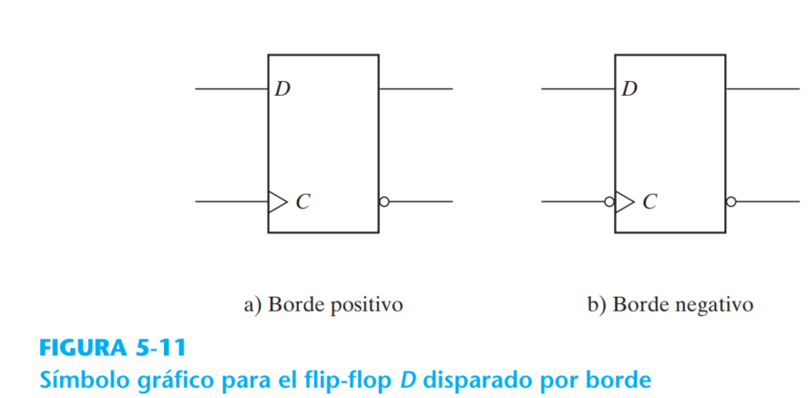

# Circuitos Secuenciales/ Latches y Flips Flops

## Latches 
### Ejemplo 5.1: Latch D con entrada de control síncrona

### Latch JK - Latch T

## Flip Flops

### Ejemplo 5.2 FFD (flanco positivo) y FFD con reset asíncrono

### Ejemplo 5.3 FFT-FFJK usando FFD y compuertas
>Nota: Notar el uso diverso de las expresiones usadas para implmentar la lógica combinacional

~~~v
// Ejemplo 5.3 b)
`include "FFD_reset_async.v"

module FFJK( 
    output Q,
    input clk, J, K, reset_async
);

    /* 
        NOTAR el uso de las EXPRESIONES 
        (cambian la salida en lógica secuencial) 
    */
    // reg D;
    // assign D = (J & ~Q) | (~K & Q);
    // assign D = (J * !Q) + (!K * Q);

    // Instanciar FFD
    FFD_reset_async FFD(
        .qd(Q),
        .clk(clk),
        .data((J * !Q) + (!K * Q)),
        .reset_async(reset_async)
    );
endmodule
~~~
Evaluación de expresiones en Verilog:

1. **`assign mult = (x&~z)|(~y&z);`**

   En esta expresión, se evalúan las operaciones dentro de los paréntesis primero, y luego se realiza la operación OR (`|`) entre los resultados.

   - `x & ~z`: Primero se calcula la operación AND bit a bit entre `x` y el complemento de `z`.
   - `~y & z`: Luego se calcula la operación AND bit a bit entre el complemento de `y` y `z`.
   - Finalmente, se realiza la operación OR (`|`) entre los resultados de las operaciones anteriores.

   La evaluación es secuencial, primero se calculan los resultados de las operaciones internas y luego se realiza la operación final.

2. **`assign mult = (x*~z)+(~y*z);`**

   En esta expresión, primero se multiplican los operandos (`x * ~z` y `~y * z`), y luego se realiza la operación de suma (`+`) entre los resultados.

   - `x * ~z`: Se calcula la multiplicación bit a bit entre `x` y el complemento de `z`.
   - `~y * z`: Se calcula la multiplicación bit a bit entre el complemento de `y` y `z`.
   - Finalmente, se realiza la operación de suma (`+`) entre los resultados de las multiplicaciones anteriores.

   Al igual que en el primer caso, la evaluación es secuencial: primero se calculan los resultados de las multiplicaciones y luego se realiza la suma final.

- a) FFT usando FFD y compuertas

- b) FFJK usando FFD y compuertas

### Ejemplo 5.4 FFJK por modelado funcional

## Máquina de estados

### Ejemplo 5.5 Maquina de estados

- a) 

- b)

Resultado de la simulación

