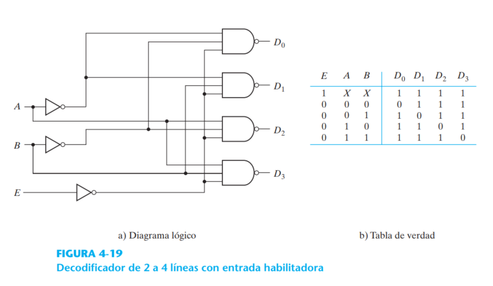
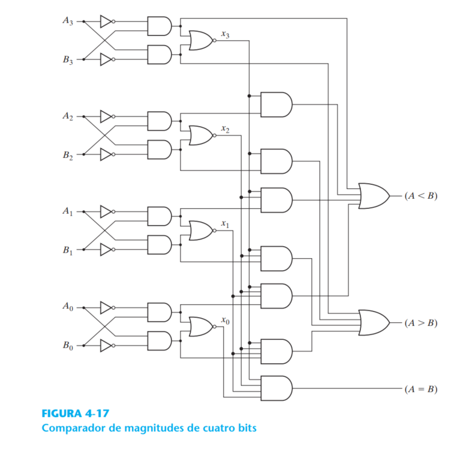

# Modulado de flujo de datos

##  Operdores básicos de verilog

## Ejemplo HDL 4.3 Deccode 2x4 

~~~
// Descripción de flujo de datos del decodificador de 2 a 4

module decode2x4 (A,B,E,D);
    input A ,B, E;
    output [0:3] D;
    assign D[0] = ~(~A & ~B & ~E),
           D[1] = ~(~A & B & ~E),
           D[2] = ~(A & ~B & ~E),
           D[3] = ~(A & B & ~E);
endmodule

~~~

El modulado deflujo de datos utiliza asignaciones continusa y la palabra clave assign.

- **assign**

Es un tipo de datos *net* que se utiliza para representar un aconexión fisica entre elementos del circuito.

Una net define una salida de compuerta declarada por un enunciado output o wire.

## Ejemplo HDL 4.5 Comparador de magnitud de bits  

~~~
// Descripción de flujo de datos de un comparador de 4 bits

module comparador4bits (A, B, ALTB, AGTB, AEQB);
    input [3:0] A, B;
    output ALTB, AGTB, AEQB;
    
    assign ALTB = (A<B),
           AGTB = (A>B), 
           AEQB = (A==B);
endmodule
~~~

- El módulo especifica dos entradas de cuatro bits, A y B, y tres salidas.
- La salida ALTB es 1 lógico si A es menor que B
- La salida AGTB es 1 lógico si A es mayor que B 
- La salida AEQB  es 1 lógico si A es igual que B

Un compilador de síntesis Verilog HDL puede aceptar como entrada esta descripción de módulo y producir la lista de un circuito equivalente a la figura.

## Ejemplo 4.6 MUltiplexor 2x1
> assign OUT = select ? A : B;

Especifica que la salida OUT = A, si select=1, caso contrario OUT =  o sea select=0.

~~~
module multiplexor2x1(A, B, select, OUT);
    input A, B, selecct;
    output OUT;
    
    assign OUT = selecct ? A:B;
    
endmodule
~~~