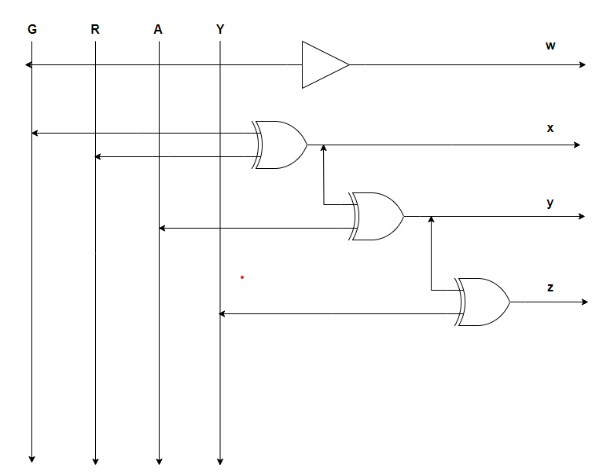

# Problemas pag 161

MC:  Modelado por comportamiento
MNC: Modelado nivel de compuertas
MFD: Modelado de flujo de datos

## 4.1 Considere el circuito combinacional de la figura P4-1.

- a) Deduzca las expresiones booleanas para T1 a T4. Evalúe las salidas F1 y F2 en función de las
cuatro entradas.

- b) Escriba la tabla de verdad con 16 combinaciones binarias de las cuatro variables de entrada. Luego dé en la tabla los valores binarios de T1 a T4 y las salidas F1 y F2.

- c) Grafique en mapas las funciones booleanas de salida obtenidas en la parte b) y demuestre que las expresiones booleanas simplificadas son equivalentes a las obtenidas en la parte a).

## 4.2 Obtenga las expresiones booleanas simplificadas para las salidas F y G en términos de las variables de entrada del circuito de la figura P4-2.

### Funciones del circuito:
- F = (A'D+A)(A'+BC)
- G = (A'+BC)(D´+A)

### Funciones simplificadas con propiedades del algebra booleana:
- F = A'D + BC + ABC
- G = A'D + BCD' +ABC

## 4.3 Para el circuito de la figura
- a) Escriba las funciones booleanas de las cuatro salidas en función de las variables de entrada.
- b) Si el circuito se presenta como tabla de verdad, ¿cuántas filas y columnas tendría la tabla?

## 4.4 Diseño
Diseñar un circuito combinacional con tres entradas y una salida. La salida es 1 cuando el valor binario de las entradas es menos que 3, y es 0 en los demás casos.

## 4.5 Diseño
Diseñe un circuito combinacional con tres entradas, x, y y z, y tres salidas, A, B y C. Cuando la entrada binaria es 0, 1, 2 o 3, la salida binaria es uno más que la entrada. Si la entrada binaria es 4, 5, 6 o 7, la salida binaria es uno menos que la entrada.

Circuito diseñado

Circuito diseñado CORREGIDO

## 4.6 Diseño Circuito Mayoria 
Un circuito de mayoría es un circuito combinacional cuya salida es 1 si las variables de entrada
tienen más unos que ceros. La salida es 0 en caso contrario. Diseñe un circuito de mayoría de tres
entradas.

## 4.7 COnvertir código gray en código binario
Diseñe un circuito combinacional que convierta un código Gray de cuatro bits (tabla 1-6) en un número binario de cuatro bits. Implemente el circuito con compuertas OR exclusivo.

## 4.8 Diseño Conversor
Diseñe un convertidor de código que convierta un dígito decimal del código 8, 4, 22, 21 a BCD

- Correción en la compuerta and 5
