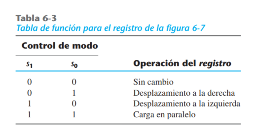

# Circuitos Secuenciales/ Registros y Contadores

## Registros

### Ejemplos 6.1 Registro de desplazamiento Universal

## Contadores

###

## Extras (Ejemplos de otras secciones)

### Registro Simple de 4 bits (con FFD)

### Registro simple con carga paralela de 4 bits
~~~verilog
// An(t+1) =  Sum(3,4,5,7) = Carga*In + A*~Carga
// ----------------------------------------------
// An(t) Carga  In | An(t+1)
// --------------- |--------
//   0    0     0  |   0
//   0    0     1  |   0
//   0    1     0  |   0
//   0    1     1  |   1
//   1    0     0  |   1
//   1    0     1  |   1
//   1    1     0  |   0
//   1    1     1  |   1 
~~~

s

### Registro de desplamaiento en serie de 4 bits
