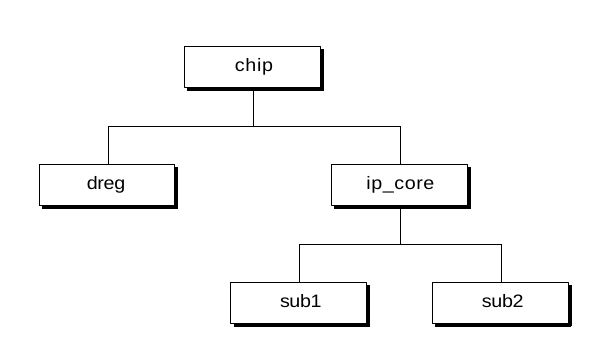

# Jerarquía de diseño
El diseño jerárquico en SystemVerilog implica la organización del diseño de hardware en varios niveles de abstracción, utilizando módulos que se conectan entre sí para formar un sistema completo. Este enfoque permite diseñar sistemas complejos de manera modular, facilitando el manejo, la reutilización y el mantenimiento del código.

## a. Prototipos de modulos

Una instancia de módulo en Verilog es un método sencillo y directo para crear una jerarquía de diseño. 

**Visbilidad de la declaración extern module**

La declaración de módulos externos (extern module) se utiliza para definir la interfaz de un módulo sin proporcionar la implementación en el mismo archivo o contexto. Esto es útil para manejar diseños grandes y complejos, donde los módulos pueden estar implementados en diferentes archivos o incluso definidos por diferentes equipos de diseño.

**Redundancia en la declaración de puertos de modulos**

Si existe una declaración de extern module para un módulo, no es necesario repetir las declaraciones de puertos como parte de la definición del módulo. En su lugar, la definición real del módulo puede simplemente colocar los caracteres .* en la lista de puertos. 

~~~verilog
extern module counter #(parameter N = 15) (
    output logic [N:0] cnt,
    input wire [N:0] d,
    input wire clock, load, resetN
);

module counter ( .* );
    always @(posedge clock, negedge resetN) 
~~~

## b. Etiquetado de endmodule

En SystemVerilog, las declaraciones de finalización con nombre (named ending statements) son una característica que permite que las estructuras de control, como módulos, funciones, tareas, bloques `begin-end`, entre otros, sean más legibles y mantenibles. Esto se logra asignando un nombre opcional a la declaración de inicio, lo que también se incluye en la declaración de finalización correspondiente. Esta práctica es útil especialmente en diseños grandes y complejos para mejorar la claridad del código y evitar errores.

**Ejemplos de Declaraciones de Finalización con Nombre**

1. **Módulos**:
   ```verilog
   module my_module;
      // Código del módulo
   endmodule : my_module
   ```

2. **Funciones**:
   ```verilog
   function automatic int add(int a, int b);
      return a + b;
   endfunction : add
   ```

3. **Tareas**:
   ```verilog
   task automatic display_values;
      $display("Valores mostrados");
   endtask : display_values
   ```

4. **Bloques `begin-end`**:
   ```verilog
   initial : init_block
   begin
      // Código del bloque inicial
   end : init_block
   ```

5. **Bloques `if-else`**:
   ```verilog
   if (condition) begin : true_block
      // Código si la condición es verdadera
   end : true_block
   else begin : false_block
      // Código si la condición es falsa
   end : false_block
   ```

## c. Declaración de módulos anidades

En SystemVerilog, las declaraciones de módulos anidados (nested module declarations) permiten definir módulos dentro de otros módulos. Sin embargo, es importante destacar que esta funcionalidad está más orientada a la organización de código y diseño en simulaciones o entornos de prueba, ya que **no es sintetizable** y no está soportada en todos los simuladores o herramientas de síntesis.

**Modulos locales anidados**

SystemVerilog proporciona una solución simple y elegante para limitar dónde se pueden instanciar los nombres de módulos y evitar posibles conflictos con otros módulos del mismo nombre. La solución es permitir que una definición de módulo esté anidada dentro de otra definición de módulo. **Los módulos anidados no son visibles fuera del alcance de la jerarquía en la que se declaran.**

~~~verilog
module chip (input wire clock);
    dreg i1 (clock);
    ip_core i2 (clock);
endmodule: chip

module dreg (input wire clock);
    ...
endmodule: register

module ip_core (input wire clock);
    sub1 u1 (...);
    sub2 u2 (...);
    
    module sub1(...);
        ...
    endmodule: sub1

    module sub2(...);
        ...
    endmodule: sub2
endmodule: ip_core
~~~



**Las definiciones de modulos anidados se pueden separar en archivos**

Un estilo de modelado muy común con Verilog es colocar el código fuente de cada definición de módulo en un archivo fuente separado. Típicamente, el nombre del archivo es el mismo que el nombre del módulo.

Usando la directiva del compilador **\`include** de Verilog con módulos anidados se pueden eliminar estos posibles inconvenientes. La definición de cada módulo anidado puede ser colocada en un archivo separado, donde es fácil de mantener y reutilizar.  El módulo de nivel superior puede luego incluir las definiciones de los módulos anidados usando directivas **\`include**.

~~~verilog
module ip_core (input logic clock);
    ... 
    ‘include sub1.v
     // sub1 is a nested module
    ‘include sub2.v
     // sub2 is a nested module
    ...
endmodule

// stored in file sub1.v
module sub1(...);
    ...
endmodule

// stored in file sub2.v
module sub2(...);
    ...
endmodule
~~~

### c.1 Visibilidad de los nombres de los modulos anidados 

localmente en el módulo padre, el módulo anidado solo puede ser instanciado por el módulo padre o por el árbol de jerarquía debajo del módulo anidado. 

1. **Visibilidad Local de Módulos Anidados**:
   - Los módulos anidados (`sub1` y `sub2`) solo son visibles dentro del módulo padre (`ip_core`). Esto significa que solo pueden ser instanciados dentro de `ip_core` o por cualquier otro módulo que esté instanciado dentro de `ip_core`.

2. **Restricción de Instanciación**:
   - Un módulo anidado no puede ser instanciado desde ningún otro lugar en la jerarquía de diseño que no sea el módulo padre o su árbol de jerarquía. Por ejemplo, en este caso:
     - `sub1` y `sub2` pueden ser instanciados dentro de `ip_core`.
     - `sub1` y `sub2` pueden ser instanciados por otros módulos que estén dentro de `ip_core`, pero no pueden ser instanciados directamente en otros módulos fuera de `ip_core`.

3. **Comparación con Módulos Globales**:
   - Por otro lado, los módulos que no están anidados, como `chip`, `dreg`, e `ip_core`, están en el **ámbito global de nombres**. Esto significa que pueden ser instanciados en cualquier lugar dentro de la jerarquía de diseño.
   - Ejemplo: `chip`, `dreg`, e `ip_core` pueden ser instanciados en cualquier otro módulo, en cualquier parte de la jerarquía de diseño, sin ninguna restricción.

### c.2 Instanciación de modulos anidados

La única diferencia entre una instancia de un módulo anidado y un módulo regular es que el módulo anidado solo puede ser instanciado en el árbol de jerarquía en o debajo de su módulo padre, mientras que un módulo regular puede ser instanciado en cualquier parte de la jerarquía de diseño.

~~~verilog
module ip_core (input clock);
    sub1 u1 (...);
    
    module sub1 (...);
        sub2 u2 ();
        ...
    endmodule: sub1

    module sub2; // nested module definition
        // sub2 does not have ports, but will look in its source
        // code parent module (ip_core) for identifiers
        sub3 u3 (...);
    endmodule: sub2

    module sub3 (...);
        ...
    endmodule: sub3

endmodule: ip_core
~~~

### c.3 Reglas de búsqueda para modulos anidados

Estas reglas ayudan a mantener el diseño organizado y modular, evitando conflictos de nombres y garantizando que los módulos se utilicen en el contexto apropiado.

- Localidad: Los módulos anidados se buscan primero en el ámbito local del módulo padre.
- Globalidad: Si el nombre del módulo no se encuentra localmente, se busca en el ámbito global.
- Restricciones de Instanciación: Los módulos anidados solo pueden ser instanciados dentro del módulo padre y sus descendientes directos en la jerarquía de diseño.

~~~verilog
module top_module;
    ip_core core_instance();
endmodule

module ip_core (input logic clock);
    sub1 inst_sub1(); // Instanciación válida si sub1 está anidado
endmodule

// en el archivo sub1.v
module sub1(...);
    ...
endmodule
~~~

Aquí, **`sub1`** solo puede ser instanciado dentro de ip_core. La instanciación de sub1 en **`ip_core`** es válida porque **`sub1`** está definido como un módulo anidado dentro de **`ip_core`**. Sin embargo, **`sub1`** no puede ser instanciado directamente en **`top_module`** porque no está en el ámbito global.

## d. Netlist simplificada en instancia de modulos

Las netlists simplificadas de instancias de módulos en SystemVerilog son representaciones que muestran cómo se instancian y conectan los módulos en un diseño sin entrar en detalles internos específicos de cada módulo.

### d.1 Implicit `.name` Port Connections

**Conexiones implícitas de puertos usando `.name`:**

Cuando se utiliza la sintaxis `.name` en SystemVerilog, el nombre del puerto en la instancia de módulo se conecta implícitamente a una señal de nombre idéntico en el entorno en el que se está instanciando el módulo.

**Ejemplo**

Supongamos que se tiene un módulo `adder` con puertos `a`, `b`, y `sum`:

```verilog
module adder(input logic a, b, output logic sum);
    assign sum = a + b;
endmodule
```

Y se instancia en otro módulo:

```verilog
module top_module(input logic a, b, output logic sum);
    adder add1 (.a(a), .b(b), .sum(sum));
endmodule
```

El uso de `.name` para las conexiones implícitas sería:

```verilog
module top_module(input logic a, b, output logic sum);
    adder add1 (.a, .b, .sum); // Conexiones implícitas .name
endmodule
```

Aquí, `add1` es la instancia de `adder`, y los puertos `a`, `b`, y `sum` se conectan automáticamente a las señales `a`, `b`, y `sum` del entorno sin necesidad de especificar los nombres dos veces.

### d.2 Implicit `.*` Port Connection

**Conexiones implícitas de puertos usando `.*`:**

La sintaxis `.*` en SystemVerilog conecta automáticamente todos los puertos del módulo a señales con nombres coincidentes en el entorno en el que se está instanciando el módulo. Es una forma aún más compacta de realizar las conexiones implícitas.

**Ejemplo**

Utilizando el mismo módulo `adder` como ejemplo:

```verilog
module top_module(input logic a, b, output logic sum);
    adder add1 (.*); // Conexiones implícitas .*
endmodule
```

En este caso, el `.*` indica que todos los puertos del módulo `adder` se conectarán automáticamente a señales en `top_module` con nombres coincidentes. Es una forma conveniente de conectar módulos cuando los nombres de las señales coinciden con los nombres de los puertos.

## e. Net aliasing 

SystemVerilog añade una declaración de alias que permite que dos nombres diferentes referencien a la misma red. Definir un alias para una red no copia el valor de una red a alguna otra red.

~~~verilog
wire clock;
wire clk;
alias clk = clock;
~~~

**Alias vs assign**

La declaración de alias no es lo mismo que la asignación continua de assign. Una declaración assign copia continuamente una expresión del lado derecho de la asignación a una red o variable del lado izquierdo. 
Un alias funciona en ambas direcciones en lugar de una sola. Cualquier cambio de valor en el nombre de la red en cualquiera de los lados de la declaración de alias se reflejará en el nombre de la red en el otro lado. Esto se debe a que un alias es efectivamente una red con dos nombres diferentes.

### e.1 Alias rules

- Solo se pueden aliarse los tipos de redes. **Las variables no pueden ser aliadas.**

    - Los tipos de redes en Verilog son: wire, uwire, wand, wor, tri,
triand, trior, tri0, tri1 y trireg.

- El tipo de red aliada debe ser el mismo tipo de red que la red a la que se le está aliando.

- La red aliada y la red a la que se le está aliando deben tener el mismo tamaño de vector. Sin embargo, cabe destacar que las selecciones de bits y partes de redes pueden ser aliadas, siempre y cuando el tamaño del vector en el lado izquierdo y el lado derecho de la declaración de alias sean iguales.

e.2 Declaraciones implicitas NET (pag 246) 
e.3 Usar aliases con .name y .* (pag 247)

## f. Pasando valores a través de puertos de modulos

### f.1 Tipos que se pueden pasar a través de los puertos de los modulos

SystemVerilog elimina casi todas las restricciones sobre los tipos de valores que pueden pasarse a través de los puertos de módulo. Con SystemVerilog:

- Se pueden usar valores de cualquier tipo tanto en el lado receptor como en el transmisor de los puertos del módulo, incluidos valores reales.

- Se pueden pasar por los puertos arrays empaquetados y no empaquetados de cualquier número de dimensiones.

- Se pueden pasar estructuras y uniones de SystemVerilog a través de los puertos del módulo.

### f.2 Restricciones de los puertos de los módulos

**1. La primera restricción:**
Es que un tipo de variable solo puede tener una única fuente que escriba un valor en la variable en cualquier momento dado. Una fuente puede ser:

- un solo puerto de salida o inout de módulo
- un solo puerto de salida o inout primitivo
- una única asignación continua
- cualquier cantidad de asignaciones procedurales

**2. La segunda restricción:** 
Es que SV impone a los valores que se pasan a través de los puertos del módulo es que los tipos desempaquetados deben ser idénticos en la disposición en ambos lados del puerto del módulo. Esto no se aplica a los valores empaquetados. 

## g. Puertos `ref`

Los módulos Verilog pueden tener puertos de entrada (input), salida (output) y bidireccionales (inout). Estos tipos de puertos se utilizan para pasar el valor de un net o variable de una instancia de módulo a otra.

SystemVerilog añade un cuarto tipo de puerto, **llamado puerto ref**. Un puerto ref pasa una referencia jerárquica a una variable a través de un puerto, en lugar de pasar el valor de la variable. 

Pasar una referencia a una variable a otro módulo permite que más de un módulo pueda escribir en la misma variable. 

## h. Mejoras en las declaraciones de piertos

SystemVerilog especifica una **dirección de puerto predeterminada de inout(bidireccional)**. 

**SystemVerilog sigue siendo completamente compatible hacia atrás con Verilog** al agregar una regla que establece que si el primer puerto no tiene dirección ni tipo especificado, entonces se infiere la sintaxis de la lista de puertos de Verilog 1995, y ningún otro puerto en la lista puede tener dirección o tipo especificado dentro de la lista de puertos.

## i. Tipos de parametrizado

Con SystemVerilog, los tipos de red y variables de un módulo pueden ser parametrizados. Los tipos parametrizados se declaran utilizando el par de palabras clave parameter type. **Los tipos parametrizados son sintetizables.**

En el siguiente ejemplo, el tipo de variable utilizado por un sumador está parametrizado. Por defecto, el tipo es shortint. 
El módulo big_chip contiene tres instancias del sumador:
- La instancia i1 utiliza el tipo de variable predeterminado del sumador, lo que lo convierte en un sumador firmado de 16 bits. 
- La instancia i2 redefine el tipo de variable a int, haciendo que esta instancia sea un sumador firmado de 32 bits. 
- La instancia i3 redefine el tipo de variable a int unsigned, lo que hace que esta tercera instancia sea un sumador sin signo de 32 bits.


~~~verilog
module adder #(parameter type ADDERTYPE = shortint)(
    input ADDERTYPE a, b, // redefinable type
    output ADDERTYPE sum,  // redefinable type
    output logic carry
);

    ADDERTYPE temp;
     // local variable with redefinable type
    ... // adder functionality
endmodule

module big_chip( ... );
    shortint a, b, r1;
    int c, d, r2;
    int unsigned e, f, r3;
    wire carry1, carry2, carry3;
    // 16-bit unsigned adder
    adder i1 (a, b, r1, carry1);
    // 32-bit signed adder
    adder #(.ADDERTYPE(int)) i2 (c, d, r2, carry2);
    // 32-bit unsigned adder
    adder #(.ADDERTYPE(int unsigned)) i3 (e, f, r3, carry3);
endmodule
~~~


