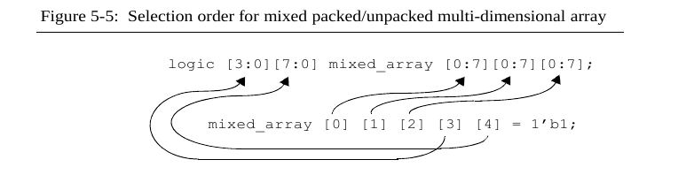

# Arrays - Structs - Unions

Esta sección presenta:
- Structures
- Unions
- Operaciones con structures and unions
- Unpacked arrays
- Packed arrays
- Operacioness on arrays
- Array foreach loop
- Funciones especiales del sistema para trabajar con arrays
- La $bits “sizeof” función del sistema

## a. Structures 

Una estructura es una forma conveniente de agrupar varias piezas de información relacionada. Los miembros de una estructura pueden ser de cualquier tipo de variable, incluidos los tipos definidos por el usuario, y cualquier tipo de constante. 

### a.1 Declaración de structs

**1. Structs anónimas y tipadas (typedef)**

~~~verilog
// Declaración anónima
struct{
    int a, b;
    opcode_t opcode;
    logic [23:0] adrress;
    bit error;
} instruction_world;

// Asignar un valor a una variable de la struct
instruction_world.error = 1'b0;
~~~

~~~verilog
// struct del tipo definidos por el usuario
typedef struct{
    logic [31:0] a, b;
    logic [ 7:0] opcode;
    logic [23:0] address;
} instruction_world_t;
~~~

**2. Structs pueden ser var o net**

Una estructura en su totalidad puede ser declarada como una variable usando la palabra clave var, net, wire, tri.

Declarar una estructura como un tipo var o net es opcional. Si no se especifica, entonces la estructura en su totalidad se considera como una variable.

~~~verilog
var struct{
    logic [31:0] a, b;
    logic [7:0] opcode;
    logic [23:0] address;
} Instruction_word_var;

wire struct{
    logic [31:0] a, b;
    logic [ 7:0] opcode;
    logic [23:0] address;
} Instruction_word_net;
~~~

**3. Diferencias entre usar o no usar var, wire, net en las structs**

**Declaración con `var`**

- **Descripción:**
  - `var` se utiliza para inferir que la estructura es una variable de tipo estructurado.
  - Las variables declaradas con `var` almacenan valores que pueden ser manipulados dentro de un módulo.
  - Estas variables son típicamente utilizadas para cálculos, almacenamiento temporal de datos, y manipulación dentro de procesos secuenciales (`always_ff`, `always_comb`, etc.).

- **Características:**
  - Se comporta como una variable de tipo `logic` o `bit`.
  - No puede ser utilizada para conectarse directamente a puertos de módulos o señales intermodulares sin una conversión explícita.
  - Ideal para operaciones dentro de un módulo o función.

**Declaración con `wire`**

- **Descripción:**
  - `wire` se utiliza para declarar una red (`net`) de tipo estructurado que puede conectar diferentes partes del diseño.
  - Se puede conectar a otros `wires`, a puertos de módulos, o ser manejada por drivers continuos (por ejemplo, asignaciones continuas).
  
- **Características:**
  - Es pasivo; no almacena un valor sino que transporta señales a través del diseño.
  - Puede ser impulsado por múltiples fuentes, como puertas lógicas o salidas de módulos.
  - Se utiliza para interconexiones y buses entre módulos.

**Declaración `anónima`**

- **Descripción:**
  - Cuando no se usa `var` o `wire`, la estructura se declara directamente como una variable de tipo `logic`, la cual puede almacenar y manipular valores en un bloque de procedimiento.
  - Por defecto, es tratada como una variable local dentro del contexto donde se declara (similar a `var`).

- **Características:**
  - Comportamiento similar a `var`, se utiliza principalmente para operaciones internas dentro de un módulo.
  - No puede ser usada como una red (`net`) para interconectar módulos.

**Comparación y Usos**

- **`var`:** Usado para declarar variables locales que pueden ser manipuladas y almacenadas temporalmente dentro de un módulo o función. No se utiliza para interconexiones entre módulos.

- **`wire`:** Usado para interconectar diferentes partes de un diseño, permitiendo que la estructura actúe como un bus o conjunto de señales que viajan entre módulos. Es pasivo y no almacena valores.

- **Sin `var` o `wire`:** Se comporta como una variable local (similar a `var`), útil para cálculos y almacenamiento temporal dentro de un módulo. No es adecuada para interconexiones entre módulos.

### a.2 Asignar valores a la struct

**1. Inicialización de structs**
~~~verilog
typedef struct{
    logic [31:0] a, b;
    logic [ 7:0] opcode;
    logic [23:0] address;
} instruction_world_t;
~~~
Inicialización de una struct
~~~verilog
instruction_word_t IW = '{100, 3, 8'hFF, 0};
~~~

También se puede inicializar con poniendo los miembros de la struct junto con : y el valor a designar. De este modo, los miembros podrían inicializarse en "desorden". 

~~~verilog
IW = '{addres:0, opcode:8'hFF, a:100, b:5};
~~~

Es ilegal mezclar la lista por nombre y la lista por orden en la misma expresión de estructura.

**2. Valores default**

El valor por defecto puede ser especificado para todos los miembros de una estructura usando la **palabra clave default**.

typedef struct {
    real r0, r1;
    int i0, i1;
    logic [ 7:0] opcode;
    logic [23:0] address;
} instruction_word_t;

El valor por defecto asignado a los miembros de una estructura debe ser compatible con el tipo del miembro.  Los valores predeterminados específicos para el tipo serán anulados por cualquier valor explícitamente nombrado para el miembro. 

La siguiente expresión de estructura asignará a r0 un valor de 1.0, a r1 un valor de 3.1415, y a todos los demás miembros de la estructura un valor de 0.

~~~verilog
IW = '{real:1.0, default:0, r1:3.1415 };
~~~

- **real:1.0**: Esto asigna el valor `1.0` a todos los miembros de la estructura que sean del tipo `real`. En este caso, `r0` y `r1` se inicializan a `1.0`.

- **default:0**: Esto asigna el valor `0` a todos los demás miembros de la estructura que no hayan sido específicamente inicializados antes y que sean compatibles con este valor. Por lo tanto, `i0`, `i1`, `opcode`, y `address` se inicializan a `0`.

- **r1:3.1415**: Esto sobrescribe la inicialización anterior del campo `r1`, asignándole un valor de `3.1415` en lugar de `1.0`.

### a.3 Packed and un packed structs

**Por defecto, una estructura es unpacked**. Esto significa que los miembros de la estructura se tratan como variables o constantes independientes que están agrupadas bajo un nombre común.

Una estructura puede ser declarada explícitamente como una **estructura empaquetada, usando la palabra clave packed**. Una estructura empaquetada: 
- Almacena todos los miembros de la estructura como bits contiguos, en un orden especificado. 
- Se almacena como un vector, donde el primer miembro de la estructura es el campo más a la izquierda del vector. 
- El bit más a la derecha del último miembro en la estructura es el bit menos significativo del vector, y se numera como el bit 0.

Los miembros de una estructura empaquetada pueden ser referenciados tanto por el nombre del miembro como mediante una selección de parte del vector representado por la estructura. 


~~~verilog
struct packed {
    logic valid;
    logic [ 7:0] tag;
    logic [31:0] data;
} data_word;
~~~

~~~verilog
// Dos formas diferentes de asignar valores a tag
// miembro de un packed struct
data_word.tag = 8’hf0;
data_word[39:32] = 8’hf0; // same bits as tag
~~~

- **Todos los miembros de una estructura empaquetada deben ser valores integrales**. Un valor integral es un valor que puede ser representado como: 
    - un vector
    - vectores creados utilizando tipos bit o logic 
    - byte
    - int

- **Una estructura no puede ser empaquetada** si alguno de los miembros de la estructura no puede ser representado como un vector, o sea no puede contener;
    - variables real ó shortreal
    - estructuras desempaquetadas
    - uniones desempaquetadas
    - arreglos desempaquetadas

**1. Operaciones con packed structures**

**Debido a que una estructura empaquetada se almacena como un vector**, las operaciones en la estructura completa se tratan como operaciones vectoriales. Por lo tanto, las operaciones matemáticas, operaciones lógicas y cualquier otra operación que pueda realizarse en vectores también pueden realizarse en estructuras empaquetadas.


~~~verilog
typedef struct packed {
    logic valid;
    logic [7:0] tag;
    logic [31:0] data;
} data_word_t;

data_word_t packet_in, packet_out;

always @(posedge clock)
    packet_out <= packet_in << 2;
~~~

El bloque always describe la lógica que se ejecuta en cada flanco positivo del reloj (`clock`):

- **`packet_out <= packet_in << 2;`**: Desplaza (shift left) los bits en `packet_in` dos posiciones a la izquierda, y almacena el resultado en `packet_out`.

**Efecto del Desplazamiento en la Estructura**

- La operación de desplazamiento (`<< 2`) se aplica a toda la estructura `packet_in`. Como la estructura está `packed`, se considera como un único bloque de bits:
  - El bit de `valid` se desplaza a la segunda posición.
  - Los bits de `tag` y `data` se desplazan dos posiciones a la izquierda.
- Esto provoca que los dos bits más significativos de `packet_out` se llenen con ceros (`0`), y los dos bits menos significativos se descarten.

**2. Signedd packed structures**

Las estructuras empaquetadas pueden ser declaradas con las palabras clave **signed** o **unsigned**. Estos modificadores afectan cómo se percibe toda la estructura cuando se utiliza como un vector en operaciones matemáticas o relacionales.

~~~verilog
typedef struct packed signed {
    logic valid;
    logic [7:0] tag;
    logic signed [31:0] data;
} data_word_t;

data_word_t A, B;
always @(posedge clock)
    if ( A < B ) // signed comparison
    ...
~~~

### a.4 Pasar structs a través de los puertos

Se debe hacer que la estructura sea declarada como un tipo definido por el usuario utilizando typedef, lo cual permite que el puerto del módulo o interfaz sea declarado como el tipo de estructura.

~~~verilog
package definitions;

    typedef enum {ADD, SUB, MULT, DIV} opcode_t;

    typedef struct {
        logic [31:0] a, b;
        opcode_t
        opcode;
        logic [23:0] address;
        logic
        error;
    } instruction_word_t;
endpackage

module alu (
    input definitions::instruction_word_t IW,
    input wire clock
);
    ...
endmodule
~~~

### a.5 Pasar structs como argumentos de task y functions

Para poder hacer esto, **la estructura debe ser definida como un tipo definido por el usuario utilizando typedef**, de modo que el argumento de la tarea o función pueda ser declarado como el tipo de estructura.

~~~verilog
module processor(...);
    typedef enum {ADD, SUB, MULT, DIV} opcode_t;
    
    typedef struct { // typedef us local
        logic [31:0] a, b;
        opcode_t opcode;
        logic [23:0] address;
        logic error;
    } instruction_word_t;

    function alu (input instruction_word_t IW);
        ...
    endfunction
endmodule
~~~

Cuando se llama a una tarea o función que tiene una estructura desempaquetada como argumento formal, se debe pasar a la tarea o función una estructura del mismo tipo exacto. Una estructura anónima, incluso si tiene los mismos miembros y nombres de miembros exactos, no es del mismo tipo de estructura.

## b. Unions

La sintaxis de declaración para una unión es similar a la de una estructura, y los miembros de una unión se referencian de la misma manera que los de las estructuras. 

Aunque la sintaxis de declaración es similar, una unión es muy diferente de una estructura. Una estructura puede almacenar varios valores. Es una colección de variables bajo un solo nombre. En cambio, una unión solo puede almacenar un valor. 

Una unión puede ser definida como un tipo utilizando typedef, de la misma manera que las estructuras. 

~~~verilog
union {
    int i;
    int unsigned u;
} data;
~~~

### b.1 Upacked union

Una unión unpacked puede contener cualquier tipo de variable, incluidos real types, estructuras desempaquetadas y arreglos desempaquetados. Son un tipo abstracto útil para modelos de sistemas de alto nivel y a nivel de transacciones. **Las uniones desempaquetadas no son sintetizables.** 

### b.2 Tagged union

Una unión etiquetada contiene un miembro implícito que almacena una etiqueta, la cual representa el nombre del último miembro de la unión en el cual se almacenó un valor. 

~~~union
union tagged {
    int i;
    real r;
} data;
~~~

Cuando se almacena un valor en una unión etiquetada utilizando una expresión etiquetada, la etiqueta implícita almacena automáticamente información sobre en qué miembro se escribió el valor.

~~~verilog
data = tagged i 5; // almaceena el valor de 5 en data.i, y pone el tag implícto
~~~

### b.3 Packed union

En una unión empaquetada, el número de bits de cada miembro de la unión debe ser el mismo. Debido a estas restricciones, las uniones empaquetadas son sintetizables.

Una unión empaquetada solo puede almacenar valores integrales:
- Valores compuestos por 1 o más bits contiguos. 
- Si algún miembro de una unión empaquetada es de tipo de 4 estados, entonces la unión es de 4 estados. 

Una unión empaquetada no puede contener variables: 
- reales o de tipo shortreal, 
- estructuras desempaquetadas, 
- uniones desempaquetadas 
- arreglos desempaquetados.

~~~verilog
typedef struct packed {
    logic [15:0] source_address;
    logic [15:0] destination_address;
    logic [23:0] data;
    logic [ 7:0] opcode;
} data_packet_t;

union packed {
    data_packet_t packet;  // packed structure
    logic [7:0][7:0] bytes; // packed array
} dreg;
~~~


Debido a que la unión está empaquetada, la información se almacenará utilizando el mismo alineamiento de bits, independientemente de la representación de la unión que se utilice.

Esto significa que un valor podría cargarse utilizando el formato de arreglo de bytes (quizás desde un flujo de entrada serial de bytes), y luego el mismo valor puede leerse utilizando el formato de paquete de datos.

**1. Packed, tagged union**

Una unión puede ser declarada tanto como empaquetada como etiquetada. **En este caso, los miembros de la unión pueden tener diferentes tamaños de bits, pero deben seguir siendo tipos integrales** (1 o más bits contiguos).

~~~verilog
union tagged packed {
    logic [15:0] short_word;
    logic [31:0] word;
    logic [63:0] long_word;
} data_word;
~~~

## c. Arrays

### c.1 Unpacked arrays

En SystemVerilog, los unpacked arrays (arreglos no empaquetados) son arreglos en los que cada elemento del arreglo se trata como una entidad separada y no están contiguamente alineados en la memoria. Estos arreglos permiten más flexibilidad, ya que se pueden utilizar en operaciones más complejas, como la manipulación de datos a nivel de conjunto o en estructuras multidimensionales.

~~~verilog
wire [7:0] table [3:0];
~~~


**1. SystemVerilog mejoras para los unpacked arrays**

SystemVerilog extiende las dimensiones de los arrays desempaquetados para incluir el tipo de event de Verilog, y los tipos de SystemVerilog:
- logic, 
- bit
- byte
- int
- longint
- shortreal
- real

También se pueden declarar arrays desempaquetados de tipos definidos por el usuario utilizando typedef, incluyendo tipos que utilizan struct y enum.

~~~verilog
bit [63:0] d_array [1:128]; // array of vector
shortreal cosines [0:89]; // array of floats
typedef enum {Mo, Tu, We, Th, Fr, Sa, Su} week;
week year [1:52]; // array of week typess
~~~

**2. Declaraciones simplificadas para unpacked arrays**

SystemVerilog agrega declaraciones de arrays al estilo C a Verilog, permitiendo que los arrays desempacados se especifiquen con un tamaño de dimensión, en lugar de direcciones de inicio y fin. La declaración de array:

~~~verilog
logic [31:0] data [1024];

// es equivalente a escribir

logic [31:0] data [0:1023];
~~~

### c.2 Packed array

SystemVerilog se refiere a las declaraciones de vectores como arrays empacados. 

~~~verilog
logic [7:0] my_packed_array [0:3];  // Packed array de 4 elementos, cada uno de 8 bits
~~~

**1. Tipado de packed arrays**

Los packed arrays pueden conformarse de:
- logic
- bit o reg 
- otros packed arrays 
- packed structs
- packed union
- net type of verilog
    - wire, uwirem wand
    - tri, triand, trior, tri, tri1 o trireg

~~~verilog
typedef struct packed{
    logic [7:0] crc;
    logic [63:0 data];
} data_word;

data_word [7:0] darray; // 1-D packed array of packed structs
~~~

**2. Referenciado de packed arrays**

Un array empacado puede ser referenciado como un todo, como selecciones de bits o como selecciones de partes. Los arrays empacados multidimensionales también pueden ser referenciados en rebanadas. Una rebanada es una o más dimensiones contiguas de un array.

~~~verilog
logic [3:0][7:0] data; // 2-D packed array
wire [31:0] out = data; // whole array
wire sign = data[3][7]; // bit-select
wire [3:0] nib = data [0][3:0]; // part-select
byte high_byte;
assign high_byte = data[3]; // 8-bit slice
logic [15:0] word;
assign word = data[1:0]; // 2 slices
~~~


**3. Operaciones con packed arrays**

Debido a que los arrays empacados se almacenan como vectores, cualquier operación legal que se pueda realizar en un vector Verilog también se puede realizar en arrays empacados. 
Se puede hacer operaciones de:
- seleccion de bits y selecciones de partes del array empacado, 
- de concatenación
- matemáticas
- a nivel de bits
- lógicas

### c.3 Using packed and unpacked arrays

**1. Usar Unpacked Arrays para Modelar**

- **Memorias**: Arrays para modelar memorias como RAMs y ROMs.
- **Arrays de Tipos Abstractos**: Arrays de `byte`, `int`, `integer`, `real`, estructuras unpacked, uniones unpacked y otros tipos que no son de bits.
- **Acceso Elemento a Elemento**: Arrays donde típicamente se selecciona un solo elemento a la vez, como en RAMs y ROMs.

```verilog
module ROM (...);
    byte mem [0:4095]; // unpacked array of bytes
    assign data = select? mem[address] : 'z;
    ...
endmodule
```
**Usar Unpacked Arrays para Modelar**

- **Memorias**: Arrays para modelar memorias como RAMs y ROMs.
- **Arrays de Tipos Abstractos**: Arrays de `byte`, `int`, `integer`, `real`, estructuras unpacked, uniones unpacked y otros tipos que no son de bits.
- **Acceso Elemento a Elemento**: Arrays donde típicamente se selecciona un solo elemento a la vez, como en RAMs y ROMs.

```verilog
module ROM (...);
    byte mem [0:4095]; // unpacked array of bytes
    assign data = select? mem[address] : 'z;
    ...
endmodule
```

**2. Usar Packed Arrays para Crear**

- **Vectores con Subcampos**: Vectores compuestos de tipos de 1-bit (igual que en Verilog).
- **Acceso a Subcampos del Vector**: Vectores donde sea útil acceder a subcampos del vector.

**Usar Packed Arrays para Crear**

- **Vectores con Subcampos**: Vectores compuestos de tipos de 1-bit (igual que en Verilog).
- **Acceso a Subcampos del Vector**: Vectores donde sea útil acceder a subcampos del vector.

```verilog
logic [39:0][15:0] packet; // 40 palabras de 16 bits
packet = input_stream;    // asignar a todas las palabras
data = packet[24];        // seleccionar 1 palabra de 16 bits
tag = packet[3][7:0];     // seleccionar parte de 1 palabra
```

### c.4  Initializing arrays at declaration

**1. Inicialización de Packedd array**

Los arrays empaquetados pueden inicializarse en la declaración mediante una asignación simple, al igual que los vectores en Verilog. La asignación puede ser un valor constante, una concatenación de valores constantes o una replicación de valores constantes.

~~~verilog
logic [3:0][7:0] a = 32’h0; // vector assignment
logic [3:0][7:0] b = {16’hz,16’h0}; // concatenate operator
logic [3:0][7:0] c = {16{2’b01}}; // replicate operator
~~~

**2. Inicilización de Unpacked array**

Los arrays sin empaquetar se pueden inicializar en la declaración, utilizando una lista de valores encerrados entre llaves '{' y '}' para cada dimensión del array. Esta sintaxis es similar a asignar una lista de valores a un array en C, pero con el apóstrofo añadido antes de la llave de apertura '{'. 

~~~verilog
int d [0:1][0:3] = '{ '{7,3,0,5}, '{2,0,1,6} };
// d[0][0] = 7
// d[0][1] = 3
// d[0][2] = 0
// d[0][3] = 5
// d[1][0] = 2
// d[1][1] = 0
// d[1][2] = 1
// d[1][3] = 6
~~~

SystemVerilog proporciona un atajo para declarar una lista de valores. Una lista interna para una dimensión de un array puede repetirse cualquier número de veces usando un factor de replicación similar a Verilog. 

~~~verilog
int e [0:1][0:3] = ’{ 2{7,3,0,5} };
// e[0][0] = 7
// e[0][1] = 3
// e[0][2] = 0
// e[0][3] = 5
// e[1][0] = 7
// e[1][1] = 3
// e[1][2] = 0
// e[1][3] = 5
~~~

**`Nota:`**  Los números sin tamaño y los valores reales no están permitidos en los operadores de concatenación y replicación.

**2.1 Valores default para unpacked arrays**

El valor por defecto se especifica dentro de llaves '{ }' utilizando la palabra clave default, la cual va separada del valor por dos puntos. El valor asignado al array debe ser compatible con el tipo del array. Un valor es compatible si puede ser convertido al tipo especificado.

~~~verilog
int a1 [0:7][0:1023] = ’{default:8’h55};
~~~

### c.5 Assigning values to arrays

**1. Asignar valores a Unpacked array**
Se pueden asignar :
- un valor a un solo elemento.
- un valor a un bit-select o part-select de un solo elemento. 
- a todo el array una lista de valores.
- a una porción del array una lista de valores.

~~~verilog
byte a [0:3][0:3];

a[1][0] = 8’h5;  // assign to one element

a = ’{’{0,1,2,3}, // assign a list of values to the full array
      ’{4,5,6,7},
      ’{7,6,5,4},
      ’{3,2,1,0}} 

a[3] = ’{’hF, ’hA, ’hC, ’hE}; // assign list of values to slice of the array
~~~

**2. Asignar valores a Packed array**

Se pueden asignar:
- a un elemento del array.
- al array completo (vector).
- a un part-select del array
- a una porción (multiples subcampos continuos) de un arreglo

~~~verilog
logic [1:0][1:0][7:0] a; // 3-D packed array

a[1][1][0] = 1’b0; // assign to one bit

a = 32’hF1A3C5E7; // assign to full array

a[1][0][3:0] = 4’hF; // assign to a part select

a[0] = 16’hFACE; // assign to a slice

a = {16’bz, 16’b0}; // assign concatenation
~~~

### c.6 Copying arrays 

**1. Asignar packed arrays a packed arrays**

Dado que los arrays empaquetados son tratados como vectores, los arrays pueden tener diferentes tamaños y tipos. Se utilizan las reglas estándar de asignación de Verilog para vectores para truncar o extender los arrays si hay una discrepancia en los tamaños de los arrays.

~~~verilog
bit [1:0][15:0] a; // 32 bit 2-state vector
logic [3:0][ 7:0] b; // 32 bit 4-state vector
logic [15:0] c; // 16 bit 4-state vector
logic [39:0] d; // 40 bit 4-state vector

b = a; // assign 32-bit array to 32-bit array
c = a; // upper 16 bits will be truncated
d = a; // upper 8 bits will be zero filled
~~~

**2. Asignar unpacked arrays a unpacked arrays**

Los arrays desempaquetados solo pueden asignarse directamente a otros  arrays desempaquetados **si ambos tienen exactamente el mismo número de dimensiones, tamaños de elementos y son del mismo tipo.** De otra forma si los dos arrays no fuesen idénticos, la asignación se debería realizar utilizando la conversión de secuencia de bits. 

~~~verilog
logic [31:0] a [2:0][9:0];
logic [0:31] b [1:3][1:10];

a = b; // assign unpacked array to unpacked array
~~~

**3. Asignar unpacked arrays a packed arrays**
Los unpacked arrays se pueden asignar a arrays packed utilizando una conversión de secuencia de bits. 

**4. Asignar packed arrays a unpacked arrays**
Los packed arrays se pueden asignar a arrays unpacked utilizando una conversión de secuencia de bits. 

### c.7 Copying arrays and structures using bit-stream castings (conversión de secuencia de bits)

Una conversión de secuencia de bits (bits-stream) **convierte temporalmente un array desempaquetado en una secuencia de bits en forma de vector.**
Se pierde la identidad de los elementos separados dentro del array: el vector temporal es simplemente una secuencia de bits. Este vector temporal luego se puede asignar a otro array, que puede ser tanto un array empaquetado como un array desempaquetado. El número total de bits representados por los arrays de origen y destino debe ser el mismo. Sin embargo, el tamaño de cada elemento en los dos arrays puede ser diferente.

Bit-stream casting proporciona un mecanismo para:

- asignar un array desempaquetado a otro array desempaquetado con una disposición diferente
- asignar un array desempaquetado a un array empaquetado
- asignar un array empaquetado a un array desempaquetado
- asignar una estructura a un array empaquetado o desempaquetado
- asignar un array de tamaño fijo o dinámico a otro array de tamaño dinámico
- asignar una estructura a otra estructura con una disposición diferente.

~~~verilog
typedef int data_t [3:0][7:0]; // unpacked type

data_t a;               // unpacked array

int b [1:0][3:0][3:0];  // unpacked array

a = data_t’(b); //assign unpacked array to
                // unpacked array of a
                // different layout
~~~

### c.8 Arrays of arrays

En SystemVerilog, los arrays de arrays permiten definir estructuras multidimensionales, lo que es útil **para modelar matrices o arreglos más complejos**. Estos pueden ser packed arrays o unpacked arrays. 

**1. Unpacked array multidimensional**
~~~verilog
logic [7:0] mem_array [0:3][0:4];  // Unpacked array de 4x5 elementos de 8 bits
mem_array[2][3] = 8'hFF;  // Asignar el valor FF al elemento en la posición (2, 3)
~~~

**2. Packed array multidimensional**
~~~verilog
logic [7:0][0:3] packed_array;  // Packed array de 4 elementos de 8 bits cada uno
packed_array[2] = 8'hA5;  // Asignar el valor A5 al tercer elemento
~~~

**3. Indexación de arrays de arrays**

Cuando se indexan arrays de arrays, las dimensiones desempaquetadas se hacen referencia primero, desde la dimensión más a la izquierda hasta la más a la derecha. Las dimensiones empaquetadas (campos vectoriales) se hacen referencia en segundo lugar, desde la dimensión más a la izquierda hasta la más a la derecha. 



### c.9  Using user-defined types with arrays

Los tipos definidos por el usuario pueden ser utilizados como elementos de un array. 

~~~verilog
typedef int unsigned uint;
uint u_arrray [0:127]; // arreglo de tipos definidos por el usuario
~~~

Los tipos definidos por el usuario también pueden ser definidos a partir de una definición de array. Estos tipos de usuario pueden luego ser utilizados en otras definiciones de array, creando un array compuesto.

~~~verilog
typedef logic [3:0] nibble; // packed array 
nibble [31:0] big_word;

// lo anterior sería equivalente a 
logic [31:0] [3:0] big_word;
~~~

Otro ejemplo:

~~~verilog
typedef logic [3:0] nibble; // packed array
typedef nibble nib_array [0:3]; // unpacked
nib_array compound_array [0:7]; // unpacked

// lo anterior sería equivalente a 
logic [3:0] compound_array [0:7][0:3];
~~~

### c.10  Passing arrays through ports and to tasks and functions

SystemVerilog extiende Verilog permitiendo que los arrays de cualquier tipo y número de dimensiones se pasen a través de puertos o como argumentos de tarea/función.

~~~verilog
module CPU(...);
    ...
    logic [7:0] lookup_table [0:255];
    lookup i1 (
        .LUT(lookup_table)
    );
    ...
endmodule

module lookup (output logic [7:0] LUT [0:255]);
    ...
    initial load(LUT); //task call
    
    task load (inout logic [7:0] t [0:255]);
        ...
    endtask
endmodule
~~~

### c.11 Arrays of structures and unions

~~~verilog
typedef struct packed {
     // packed structure
    logic [31:0] a;
    logic [ 7:0] b;
} packet_t;

packet_t [23:0] packet_array; // packed array of 24 structures
~~~

~~~verilog
typedef struct {
    int a;
    real b;
} data_t;

// unpacked structure
data_t data_array [23:0]; // unpacked array of 24 structures
~~~

### c.12 Arrays in structures and unions

~~~verilog
struct packed {
     // packed structure
    logic parity;
    logic [3:0][ 7:0] data; // 2-D packed array
} data_word;

struct {    // unpacked structure
    logic data_ready;
    logic [7:0] data [0:3]; // unpacked array
} packet_t;
~~~

### c.13 Synthesis guidelines

Los arrays y las asignaciones que involucran arrays son sintetizables. Específicamente:

- Declaraciones de arrays: Tanto los arrays desempaquetados como los empaquetados son sintetizables.

- Asignación de valores a arrays: La síntesis admite asignar valores a elementos individuales de un array, selecciones de bits o partes de un elemento del array, slices de array o arrays completos. También es sintetizable la asignación de listas de valores literales a arrays, incluidos los literales que utilizan la palabra clave default.

- Copia de arrays: La síntesis admite arrays empaquetados asignados directamente a otros arrays empaquetados. También admite arrays desempaquetados asignados directamente a arrays desempaquetados del mismo diseño. Es sintetizable la asignación de cualquier tipo de array a cualquier tipo de array utilizando casting de bit-stream.

- Arrays en estructuras y uniones: El uso de arrays dentro de estructuras y uniones es sintetizable. Las uniones deben estar empaquetadas, lo que significa que los arrays dentro de la unión también deben ser empaquetados.

- Arrays de estructuras o uniones: Los arrays de estructuras y los arrays de uniones son sintetizables (las uniones deben estar empaquetadas). Una estructura o unión debe estar tipada (usando typedef) para poder definir un array de esa estructura o unión.

- Paso de arrays: Los arrays pasados a través de puertos de módulo, o como argumentos a una tarea o función, son sintetizables.

## d. foreach array looping construct

El bucle foreach en SystemVerilog se utiliza para iterar a través de los elementos de un array, ya sea packed o unpacked. Es una forma conveniente de recorrer todos los elementos de un array sin tener que especificar los límites de iteración manualmente.

**Sintáxis:**
~~~verilog
foreach (array_name[index]) begin
    // Código a ejecutar para cada elemento del array
end
~~~

Ejemplo:
~~~verilog
int multi_array [0:3][0:3]; // Un array 4x4

// Inicializando el array
foreach (multi_array[i,j]) begin
    multi_array[i][j] = i + j;
end
~~~

## e. Array querying system functions

Tener en cuenta que las dimensiones comienzan con el número 1, empezando desde la dimensión desempaquetada más a la izquierda. Después de la dimensión desempaquetada más a la derecha, el número de dimensión continúa con la dimensión empacada más a la izquierda y termina con la dimensión empacada más a la derecha. 

- **`$dimensions(array_name)`**: Retorna el número de dimensiones en el array (retorna 0 si el objeto no es un array)
- **`$left(array_name, dimension)`**: Retorna el número del bit más significativo (msb) de la dimensión especificada. 
    ~~~verilog
    logic [1:2][7:0] word [0:3][4:1];
    $left(word,1) will return 0
    $left(word,2) will return 4
    $left(word,3) will return 1
    $left(word,4) will return 7
    ~~~
- **`$right(array_name, dimension)`**: Retorna el número del bit menos significativo (lsb) de la dimensión especificada. 
- **`$low(array_name, dimension)`**: Retorna el número del bit más bajo de la dimensión especificada, que puede ser el msb o el lsb.
- **`$high(array_name, dimension)`**: Retorna el número del bit más alto de la dimensión especificada, que puede ser el msb o el lsb. 
- **`$size(array_name, dimension)`**: Retorna el número total de elementos en la dimensión especificada (igual a $high - $low + 1). 
- **`$increment(array_name, dimension)`**: Retorna 1 si $left es mayor o igual que $right, y -1 si $left es menor que $right.

### e.1 Synthesis guidelines

**Estas funciones de consulta de arrays son sintetizables**, siempre que el array tenga un tamaño fijo y el argumento del número de dimensión sea una constante, o no se especifique en absoluto. 
Esto es una excepción a la regla general de que los compiladores de síntesis no admiten el uso de tareas o funciones del sistema. El bucle foreach también es sintetizable, siempre que el array tenga un tamaño fijo.

## f. The $bits “sizeof” system function

La función $bits se utiliza para obtener el tamaño de una variable, tipo dato o array.

~~~verilog
bit [63:0] a;
$bits(a); // devuelve el valor de 64
~~~

**`NOTA: `**La función del sistema $bits es sintetizable, siempre que el argumento de $bits no sea un array de tamaño dinámico.

## g. Dynamic arrays, associative arrays, sparse arrays and strings

Los arrays de tamaño dinámico, que no son sintetizables, se utilizan principalmente en rutinas de verificación y modelado a niveles altos. 

SystemVerilog añade tipos de arrays dinámicos a Verilog.
- Dynamic arrays
- Associative arrays
- Sparse arrays
- Strings (character arrays)