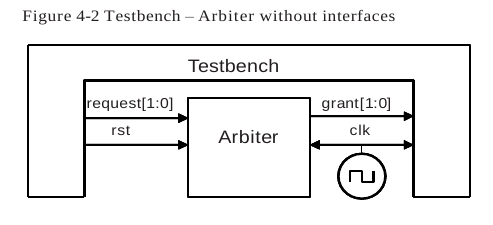
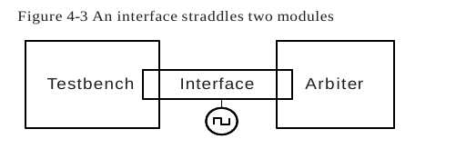
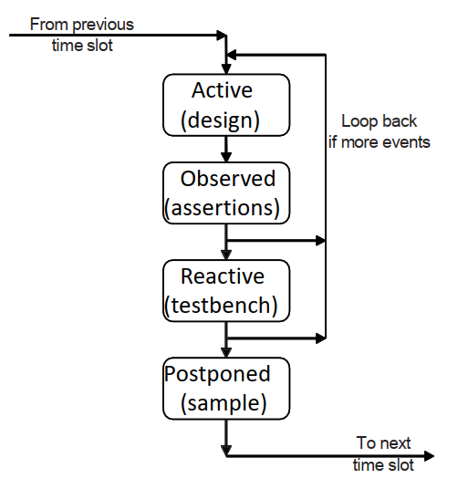
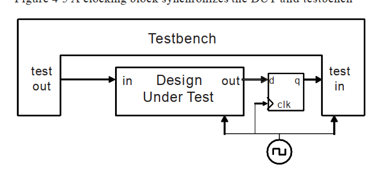
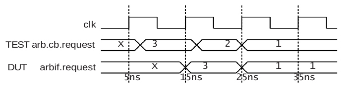

# Conectando el testbench con el diseño

Hay varios pasos necesarios para verificar un diseño: generar estímulos, capturar respuestas, determinar la corrección y medir el progreso. 

## a. Separando el testbench del diseño

En proyectos ideales, se tienen dos equipos: uno para diseñar y otro para verificar. Sin embargo, en la realidad, a veces una persona debe hacer ambos roles. El diseñador crea el código según la especificación, mientras que el verificador busca errores en ese diseño. SystemVerilog ayuda a separar el testbench del diseño usando el *program block*, evitando problemas de temporización. A medida que los diseños se vuelven más complejos, las conexiones entre bloques también se complican, lo que puede generar errores. Para evitarlo, SystemVerilog usa *interfaces*, que facilitan la conexión y manejo de señales en el diseño.

### a.1 Comunicación entre el tb y el dut

Conexión común entre modulos.



### a.2 Comunicación con puertos

Los siguientes fragmentos de código muestran los elementos para conectar un bloque RTL a un testbench. 

~~~verilog
module arb_port (
    output logic [1:0] grant,
    input logic [1:0] request,
    input logic rst,
    input logic clk
);
    ...

    always @(posedge clk or posedge rst) begin
        if (rst)
        grant <= 2'b00;
    else
        ...
    end
endmodule
~~~

El testbench se mantiene en un módulo para separarlo del diseño. Típicamente, se conecta al diseño mediante puertos.

~~~verilog
module test (
    input logic [1:0] grant,
    output logic [1:0] request,
    output logic rst,
    input logic clk
);
    
    initial begin
        @(posedge clk)
         request <= 2'b01;
        $display("@%0t: Drove req=01", $time);
        repeat (2) @(posedge clk);
        if (grant != 2'b01)
        $display("@%0t: a1: grant != 2'b01", $time);
    ...
    $finish;
    end
endmodule
~~~

El top netlist, conecta el tb con el dut, e incluía un generador reloj simple

~~~verilog
module top;
    logic [1:0] grant, request;
    bit clk, rst;
    
    always #5 clk = ~clk;
        arb_port a1 (grant, request, rst, clk); // sample 4.1
        test t1 (grant, request, rst, clk);     // sample 4.2
endmodule
~~~

## b. Contrucción de la interface

Las interfaces contienen la conectividad, sincronización y, opcionalmente, la funcionalidad de la comunicación entre dos o más bloques.

### b.1 Usando interfaces para simplificar las conexiones

La primera mejora en el ejemplo del arbiter es agrupar los cables en una interface



~~~verilog
interface arb_if(input bit clk);
    logic [1:0] grant, request;
    logic rst;
endinterface
~~~

El nombre de la instancia de la interface, arbif debe mantenerse lo más corto posible ya que vas a escribirlo mucho en el diseño y el testbench. I
El DUT arbiter se muestra a continuación:

~~~verilog
module arb (arb_if arbif);
...
always @(posedge arbif.clk or posedge arbif.rst)
    begin
    if (arbif.rst)
        arbif.grant <= 2'b00;
    else
        arbif.grant <= next_grant;
    ...
    end
endmodule
~~~

**Las señales de la interface siempre deben ser impulsadas utilizando asignaciones no bloqueantes.**

~~~verilog
module test (arb_if arbif);
    ...
    initial begin
        // reset code left out
        @(posedge arbif.clk);
            arbif.request <= 2'b01;
            $display("@%0t: Drove req=01", $time);
            repeat (2) @(posedge arbif.clk);
        if (arbif.grant != 2'b01)
            $display("@%0t: a1: grant != 2'b01", $time);
        $finish;
    end
endmodule : test
~~~

Todos estos modulos se instancian y se conectan en el top module:

~~~verilog
module top;
    bit clk;
    always #5 clk = ~clk;
    arb_if arbif(clk);  // From Sample 4.4
    arb a1 (arbif);     // From Sample 4.5
    test t1(arbif);     // From Sample 4.6
endmodule : top
~~~

Esta característica del lenguaje reduce enormemente la posibilidad de errores de cableado.

Se debe de asegurar de declarar tus interfaces fuera de módulos y bloques de programa. 

~~~verilog
module bad_test(arb_if arbif);
include "MyTest.sv" // Legal include
include "arb_if.sv" // BAD:Interface hidden in module
...
~~~

### b.2 Conectando interfaces y puertos

Si se tienes un diseño legado en Verilog-2001 con puertos que no se pueden cambiar para usar una interface, **simplemente se puede conectar las señales de la interface a los puertos individuales**.

En el siguiente ejemplo se conecta el arbiter original a la interface.
~~~verilog
module top;
    bit clk;
    always #5 clk = ~clk;
    arb_if arbif(clk);
    arb_port a1 (.grant(arbif.grant),
        .request(arbif.request),
        .rst(arbif.rst),
        .clk(arbif.clk));
    test t1(arbif);
endmodule : top
~~~

### b.3 Agrupando señales en una interface usando Modports

La construcción modport en una interface te permite agrupar señales y especificar direcciones. El MONITOR modport permite conectar un módulo monitor.

~~~verilog
interface arbiter_if (input bit clk);
    logic [1:0] grant, request;
    logic rst;

    modport TEST (output request, rst,
                  input grant, clk);
    
    modport DUT (input request, rst, clk,
                 output grant);
    
    modport MONITOR (input request, grant, rst, clk);
endinterface
~~~

~~~verilog
// Arbiter model with interface using modports
module arb (arb_if.DUT arbif);
...
endmodule

// Testbench with interface using modports
module test (arb_if.TEST arbif);
...
endmodule
~~~

### b.4 Usando Modports con el diseño de un Bus

No todas las señales necesitan ir en cada interface. Considerando un bus CPU-memoria modelado con una interface. La CPU es el maestro del bus y maneja un subconjunto de las señales, como request, command y address. La memoria es un esclavo y recibe esas señales y maneja ready. Tanto el maestro como el esclavo manejan datos. El arbiter del bus solo observa request y grant, e ignora todas las demás señales. Así que la interface tendría tres modport: 
    - uno para el maestro, 
    - uno para el esclavo y 
    - uno para el arbiter, 
    - además de un modport opcional para el monitor.

### Ejemplo de Interface con Modports en un Bus CPU-Memoria

```verilog
interface cpu_mem_bus_if(input logic clk);
    // Señales del bus
    logic [31:0] address;  // Dirección de memoria
    logic [31:0] data;     // Datos a leer/escribir
    logic request;         // Señal de solicitud del CPU
    logic command;         // Comando (lectura/escritura)
    logic ready;           // Señal que indica que la memoria está lista
    logic grant;           // Señal que indica la concesión del arbiter
    logic rst;             // Señal de reinicio

    // Modport para la CPU (Maestro)
    modport MASTER (
        output request, command, address, data,
        input ready, grant, clk, rst
    );

    // Modport para la Memoria (Esclavo)
    modport SLAVE (
        input request, command, address, clk, rst,
        inout data, // Inout porque ambos manejan datos
        output ready
    );

    // Modport para el Arbiter
    modport ARBITER (
        input request, clk, rst,
        output grant
    );

    // Modport opcional para el Monitor
    modport MONITOR (
        input request, command, address, data, ready, grant, clk, rst
    );
endinterface
```

*Explicación*

1. **Señales del Bus**:
   - `address`: La dirección de memoria que la CPU quiere acceder.
   - `data`: Los datos a leer o escribir. Es `inout` porque tanto la CPU como la memoria lo usan.
   - `request`: Señal que la CPU usa para solicitar acceso al bus.
   - `command`: Comando enviado por la CPU (por ejemplo, leer o escribir).
   - `ready`: Señal que indica que la memoria está lista para leer o escribir.
   - `grant`: Señal que el arbiter usa para conceder acceso a la CPU.
   - `rst`: Señal de reinicio.

2. **Modport MASTER** (CPU):
   - La CPU maneja `request`, `command`, `address`, y `data`.
   - Recibe las señales `ready` y `grant` del arbiter y la memoria.
   
3. **Modport SLAVE** (Memoria):
   - La memoria recibe `request`, `command`, y `address` desde la CPU.
   - Maneja `data` (inout) y genera la señal `ready` cuando está lista para operar.
   
4. **Modport ARBITER**:
   - El arbiter solo observa `request` y maneja `grant`.
   - No interactúa con las otras señales del bus.

5. **Modport MONITOR** (opcional):
   - Observa todas las señales del bus sin intervenir en ellas.
   - Útil para verificar el comportamiento del sistema durante la simulación.

### b.5 Creando un Monitor Interface

```verilog
module monitor (
    arb_if.MONITOR arbif
);

    always @(posedge arbif.request[0]) begin
        $display("@%0t: request[0] asserted", $time);
        @(posedge arbif.grant[0]);
        $display("@%0t: grant[0] asserted", $time);
    end

    always @(posedge arbif.request[1]) begin
        $display("@%0t: request[1] asserted", $time);
        @(posedge arbif.grant[1]);
        $display("@%0t: grant[1] asserted", $time);
    end

endmodule
```

### Explicación

- **Módulo `monitor`**: Este módulo está diseñado para monitorear las señales `request` y `grant` de un arbiter. 
- **`always @(posedge arbif.request[0])`**: Cuando `request[0]` se activa (flanco positivo), se imprime un mensaje con la hora actual de simulación.
- **`@(posedge arbif.grant[0])`**: El código espera a que `grant[0]` se active y luego imprime otro mensaje.
- **`always @(posedge arbif.request[1])`**: Similar al bloque anterior, pero para `request[1]` y `grant[1]`.

### c.6 Interface trade-offs (compromisos)

Las interfaces son una herramienta poderosa para organizar y simplificar la comunicación entre diferentes módulos. Sin embargo, como cualquier característica, su uso conlleva ciertos compromisos y consideraciones que deben ser evaluados según el contexto del diseño.

**Ventajas**
- Una interface es ideal para la reutilización del diseño. Cuando dos bloques se comunican con un protocolo especificado usando más de dos señales, considera usar una interface.
- La interface toma el cúmulo de señales que declaras una y otra vez en cada módulo o programa y lo coloca en un lugar central, reduciendo la posibilidad de errores en la conexión de señales.
- Para agregar una nueva señal, solo tienes que declararla una vez en la interface, no en los módulos de nivel superior, lo que nuevamente reduce errores.

**Desventajas**
- Ahora se debe usar el nombre de la interface además del nombre de la señal, lo que puede hacer que los módulos sean más detallados.
- Si estás conectando dos bloques de diseño con un protocolo único que no será reutilizado, las interfaces pueden requerir más trabajo que simplemente conectar los puertos.
- Es difícil conectar dos interfaces diferentes. Una nueva interface (bus_if) puede contener todas las señales de una existente (arb_if), además de nuevas señales (address, data, etc.). 

## c. Temporalidad del Estímulo (Stimulus timing)

El temporizado entre el testbench y el diseño debe ser cuidadosamente orquestado. A nivel de ciclo, necesitas impulsar y recibir las señales síncronas en el momento adecuado en relación con el reloj. 

### c.1 Controlando las señales sincronas de timing usando bloques de reloj

En la verificación funcional de diseños digitales, especialmente cuando se trabaja con señales síncronas, es esencial controlar el tiempo de los estímulos aplicados al Diseño Bajo Prueba (DUT). SystemVerilog ofrece varias formas de controlar el timing de las señales, siendo los bloques de reloj una técnica comúnmente utilizada para manejar señales síncronas de manera precisa.

Los bloques de reloj se usan principalmente en testbenches pero también te permiten crear modelos síncronos abstractos.

Las expresiones de reloj tipicas son:
- `@(posedge clk)`: para un reloj de borde único
- `@(clk)`: para un reloj DDR (Double data rate - Doble tasa de datos)

~~~verilog
// Definición de la interfaz 'arb_if' con señales y bloques de clocking
interface arb_if(input bit clk);
    logic [1:0] grant, request;  // Señales de la interfaz
    logic rst;  // Señal de reset

    // Bloque de clocking para sincronización en el flanco positivo del reloj
    clocking cb @(posedge clk);
        output request;  // Señal de salida controlada por el testbench
        input grant;     // Señal de entrada capturada desde el DUT
    endclocking

    // Declaración de modport para el Testbench
    modport TEST (
        clocking cb,   // Uso del bloque de clocking
        output rst     // Señal de salida de reset controlada por el testbench
    );

    // Declaración de modport para el DUT
    modport DUT (
        input request, rst,  // Señales de entrada desde el testbench
        output grant         // Señal de salida para el testbench
    );
endinterface

// Módulo de prueba (testbench)
module test(arb_if.TEST arbif);
    initial begin
        // Asignación inicial de señal usando el bloque de clocking
        arbif.cb.request <= 0;
        
        // Espera un ciclo de reloj definido por el bloque de clocking
        @arbif.cb;
        
        // Muestra el valor de la señal 'grant' sincronizada con el reloj
        $display("@%0t: Grant = %b", $time, arbif.cb.grant);
    end
endmodule
~~~

### c.2 Logic vs wire en una Interface

Este libro recomienda declarar las señales de tu interface como `logic`, mientras que VMM sugiere usar `wire`. La diferencia principal es facilidad de uso vs. reutilización:

1. **Facilidad de uso con `logic`:**
   - Si en tu testbench impulsas una señal asíncrona con una asignación procedimental, la señal debe ser del tipo `logic`. Un `wire` solo puede ser impulsado mediante una asignación continua.
   - Las señales en un bloque de reloj (clocking block) son siempre síncronas y pueden ser `logic` o `wire`.

2. **Reutilización con `wire` (enfoque VMM):**
   - Usar `logic` puede ser problemático si la interface se reutiliza y una señal tiene múltiples drivers estructurales, lo que generará errores.
   - Si se utiliza `wire`, esto es más flexible para el futuro, ya que no requiere cambios en el código de prueba si la interfaz necesita ser reutilizada con señales que tienen múltiples drivers. 

Ejemplo:
```verilog
interface asynch_if();
  logic l;
  wire w;
endinterface

module test(asynch_if ifc);
  logic local_wire;
  assign ifc.w <= local_wire;
  initial begin
    ifc.l <= 0; // Drive async logic directly ...
    local_wire <= 1; // Drive wire through assign
  end
endmodule
```
En el ejemplo, la señal `logic` puede ser impulsada directamente, mientras que la señal `wire` necesita una asignación adicional.

El enfoque de VMM es prevenir la necesidad de reescribir código cuando se reutiliza el testbench, lo cual sigue los principios de reutilización a largo plazo.

### c.3 Problemas de timing en Verilog y como evitarlo

En un testbench de Verilog, es crucial que el entorno de prueba esté separado del diseño no solo a nivel lógico, sino también a nivel temporal. Esto es especialmente importante para evitar problemas de temporización y condiciones de carrera cuando se trabaja con señales síncronas.

#### 1. **Simulación del Comportamiento de un Probador de Hardware:**
   - En un entorno de hardware real, un probador interactúa con el chip de la siguiente manera:
     - **Entrada del probador:** Se captura en el flanco activo del reloj en los elementos de almacenamiento del DUT (Device Under Test).
     - **Propagación de señales:** Después del flanco, las señales se propagan a través de la lógica hasta el siguiente almacenamiento.
     - **Restricción de tiempo:** Todo esto debe ocurrir dentro de un ciclo de reloj.

   - Un testbench debe imitar este comportamiento:
     - Debe impulsar señales justo en o después del flanco activo del reloj.
     - Debe muestrear las salidas del DUT lo más tarde posible antes del siguiente flanco activo.

#### 2. **Problemas con el Timing en Verilog Puro:**
   - Si tanto el DUT como el testbench se implementan solo con módulos Verilog, es casi imposible lograr el timing correcto debido a la sincronización de señales y condiciones de carrera.
   - **Problemas de sincronización:** 
     - Si el testbench impulsa las entradas del DUT justo en el flanco del reloj, el tiempo de propagación del reloj podría variar ligeramente entre diferentes señales del DUT.
     - Esto puede hacer que algunas señales del DUT obtengan valores del ciclo anterior, mientras que otras obtengan valores del ciclo actual, causando un comportamiento inconsistente e impredecible.

#### 3. **Intentos de Solución con Retrasos (#0 y #1):**
   - **Retraso #0:**
     - Forzar un hilo de código Verilog a detenerse y reprogramarse después de otro código usando `#0` puede resolver temporalmente el problema.
     - **Problemas con #0:** 
       - En diseños grandes con múltiples hilos que utilizan `#0`, el orden de ejecución es indeterminado.
       - El comportamiento puede ser impredecible entre diferentes simulaciones, haciendo que el código sea inestable y no portable.

   - **Retraso #1:**
     - Usar `#1` (un retraso mayor) después del flanco del reloj puede estabilizar la lógica, ya que el código RTL no tiene temporización precisa aparte de los flancos de reloj.
     - **Problemas con #1:**
       - La interpretación del `#1` depende de la precisión del tiempo del módulo (puede ser 1 ns, 10 ps, etc.), lo que resulta en inconsistencias.
       - Si hay una mezcla de código RTL sin retrasos y código de puertas con retrasos, el uso de `#1` puede ser problemático.

#### 4. **Conclusión:**
   - **Evita usar `#0` y `#1` para resolver problemas de temporización**, ya que ambos pueden causar comportamientos indeterminados y código no portable.
   - Es crucial manejar la sincronización del testbench y el DUT de una manera que respete los tiempos de propagación y asegure la coherencia en la simulación. Utilizar técnicas más avanzadas, como interfaces y bloques de reloj (clocking blocks) en SystemVerilog, puede ayudar a evitar estos problemas.

### c.4 Testbench - Diseño de condiciones de carrera
El siguiente ejemplo muestra una posible condición de carrera entre el testbench y el diseño. 

~~~verilog
module memory(
    input  wire       start, 
    input  wire       write,
    input  wire [7:0] addr,
    inout  wire [7:0] data
);
    logic [7:0] mem[256];

    always @(posedge start) begin
        if (write)
            mem[addr] <= data;
        // ...
    end
endmodule

module test(
    output logic       start, 
    output logic       write,
    output logic [7:0] addr, 
    output logic [7:0] data
);
    initial begin
        // Initialize signals
        start = 0;
        write = 0;
        #10;
        addr = 8'h42;
        data = 8'h5A;
        start = 1;
        write = 1;
        // ...
    end
endmodule
~~~

Claro, te explico el problema de las condiciones de carrera en este contexto y cómo se relaciona con el muestreo de señales en Verilog:

### **Condición de Carrera**

Una **condición de carrera** ocurre cuando el orden en que se aplican o cambian las señales en un diseño puede afectar el comportamiento de ese diseño. En el ejemplo dado:

1. **El Problema**: Cuando el testbench envía una señal de `start`, las demás señales (`write`, `addr`, `data`) pueden no estar actualizadas aún. Esto puede causar que la memoria, que está esperando la señal de `start`, reaccione antes de que las otras señales se actualicen correctamente. 

2. **Solución Propuesta**: Una manera de mitigar esto es usar **asignaciones no bloqueantes** (`<=`) para las señales en el testbench. Las asignaciones no bloqueantes permiten que las señales sean actualizadas en un momento futuro, lo que puede ayudar a sincronizar las actualizaciones de las señales. Sin embargo, esto solo resuelve parcialmente el problema ya que tanto el testbench como el diseño podrían estar usando asignaciones no bloqueantes, lo que aún puede resultar en una condición de carrera entre ambos.

### **Muestreo de Salidas del Diseño**

El problema de muestreo se refiere a capturar los valores de las señales en el momento correcto:

1. **El Problema**: Cuando deseas capturar el valor de las salidas del diseño, necesitas hacerlo justo antes del flanco activo del reloj. Si capturas el valor justo en el flanco del reloj, es posible que algunos valores hayan cambiado ya, lo que significa que no capturarías el valor correcto.

2. **Solución**: Deberías muestrear las señales en **Tstup** (un tiempo antes del flanco del reloj), asegurándote de capturar el valor más actualizado y estable. Por ejemplo, si el siguiente flanco del reloj es a las 100 ns, debes muestrear en un tiempo antes de los 100 ns para asegurar que los valores sean los correctos y estén estables justo antes del flanco del reloj.

### **Resumen**

- **Condición de Carrera**: Ocurre cuando el orden de aplicación de señales puede causar problemas si no están sincronizadas correctamente. Usar asignaciones no bloqueantes puede ayudar, pero no siempre soluciona el problema completamente.

- **Muestreo Correcto**: Debes capturar las salidas del diseño en un momento justo antes del flanco del reloj (Tstup) para evitar leer valores desactualizados.

### c.5 Program Block y regiones de timing

La raíz del problema es la mezcla de eventos del diseño y del testbench durante el mismo intervalo de tiempo, aunque incluso en RTL puro puede ocurrir el mismo problema.



Claro, aquí tienes una explicación simplificada:

### Regiones de Tiempo en SystemVerilog

1. **Región Activa:**
   - **Qué ocurre:** Durante esta región, se ejecuta el código del diseño, como el código RTL y el de puertas, así como el generador de reloj.
   - **Qué incluye:** Aquí es donde se realizan las operaciones principales del diseño, como las actualizaciones de los registros y el procesamiento de la lógica.

2. **Región Observada:**
   - **Qué ocurre:** En esta región, se evalúan las afirmaciones o comprobaciones sobre el diseño.
   - **Qué incluye:** Aquí se revisa si el diseño está funcionando como se espera, a menudo mediante aserciones que verifican condiciones.

3. **Región Reactiva:**
   - **Qué ocurre:** Durante esta región, se ejecuta el código del testbench. Este código interactúa con el diseño y puede generar estímulos o capturar resultados.
   - **Qué incluye:** Aquí se realizan las tareas del testbench, como aplicar señales y verificar salidas.

4. **Región Postergada:**
   - **Qué ocurre:** En esta región, se muestrean las señales al final del intervalo de tiempo, después de que el diseño ha completado su actividad.
   - **Qué incluye:** Esta es una etapa de solo lectura donde se capturan los valores de las señales después de que todo el diseño y el testbench han hecho su trabajo.

### Ejemplo y Contexto

En el ejemplo proporcionado, se usa el bloque de reloj `@arbif.cb` para esperar al flanco positivo del reloj. Esta espera se realiza durante la región Activa, permitiendo que el diseño y el testbench sincronicen adecuadamente.

- **Código en Testbench:**
  El testbench debe estar dentro de un bloque `program`, que es un bloque específico de SystemVerilog para definir pruebas. Este bloque debe ser declarado como `automatic` para funcionar correctamente, similar a las funciones en otros lenguajes de programación que usan pilas.

- **Uso de Programación Orientada a Objetos (OOP):**
  Para construir un testbench dinámico y estructurado, se recomienda usar OOP, que permite crear y manejar objetos de manera jerárquica. Esto facilita la gestión de pruebas complejas y la reutilización del código.

~~~verilog
program automatic test (arb_if.TEST arbif);
    // Este bloque `program` define un test automático usando la interfaz `arb_if` en el modport `TEST`.

    initial begin
        // Este bloque `initial` se ejecuta al inicio de la simulación.

        // Establece el valor de `request` en la inter faz `arbif` a 2'b01.
        arbif.cb.request <= 2'b01;
        // Muestra un mensaje indicando que `request` se estableció en 2'b01.
        $display("@%0t: Drove req=01", $time);

        // Espera dos ciclos de reloj definidos por el bloque de reloj `cb` en `arbif`.
        repeat (2) @arbif.cb;

        // Verifica si el valor de `grant` es igual a 2'b01 después de los dos ciclos de reloj.
        if (arbif.cb.grant != 2'b01)
            // Si `grant` no es igual a 2'b01, muestra un mensaje de error.
            $display("@%0t: a1: grant != 2'b01", $time);
    end
endprogram : test
~~~

### c.6 Especificando delays entre el diseño y el testbench

- **Figura:** Imagina que el bloque de reloj inserta un sincronizador entre el diseño y el testbench. Esto ayuda a visualizar cómo se manejan los retrasos y la sincronización entre las señales del testbench y las del diseño, asegurando que todo funcione de manera coherente.



En la simulación de hardware, es crucial controlar cuándo se aplican los estímulos y se leen las respuestas para evitar problemas de sincronización y condiciones de carrera. Aquí es donde entra en juego el **temporalizador** entre el diseño y el testbench.

#### **Temporización por Defecto del Bloque de Reloj**

1. **Retraso de #1step:**
   - **Qué significa:** Este retraso se usa para muestrear las entradas del diseño. El retraso de `#1step` asegura que las señales se muestreen al final del intervalo de tiempo anterior, justo antes de cualquier nueva actividad del diseño.
   - **Cuándo ocurre:** Las entradas se muestrean en la región Postergada del intervalo de tiempo anterior. Esto significa que obtienes los valores de salida justo antes de que el reloj cambie.

2. **Retraso de #0:**
   - **Qué significa:** Este retraso se usa para manejar las salidas del diseño. Un retraso de `#0` significa que las salidas se actualizan inmediatamente en la región Activa del intervalo de tiempo actual.
   - **Cuándo ocurre:** Las salidas del diseño son gestionadas inmediatamente en la región Activa del mismo intervalo de tiempo.

#### **Bloque Program y Sincronización**

- **Bloque Program:** Se ejecuta en la región Reactiva del intervalo de tiempo. Este bloque puede volver a activar la región Activa durante el mismo intervalo de tiempo para interactuar con el diseño.
- **Sincronización:** El bloque de reloj actúa como un sincronizador entre el diseño y el testbench. Piensa en él como un puente que asegura que las señales del testbench se sincronicen adecuadamente con el diseño, insertando un sincronizador para evitar problemas de sincronización.


## d. Muestreo y manejo de señales (Interface Driving and sampling)
Para las siguientes secciones se usan la interface del arbiter y el modulo de nivel superior. 

- Interface del arbiter
Se muestra el código del `interface` `arb_if` y el módulo `test`:

```verilog
interface arb_if(input bit clk);
    // Signal declarations
    logic [1:0] grant, request;
    logic rst;

    // Clocking block definition
    clocking cb @(posedge clk);
        output request;   // Clocking block output for 'request' signal
        input grant;      // Clocking block input for 'grant' signal
    endclocking

    // Modport for the testbench
    modport TEST (
        clocking cb,    // Use clocking block 'cb' for synchronization
        output rst      // 'rst' signal is output for testbench
    );

    // Modport for the Design Under Test (DUT)
    modport DUT (
        input request,  // 'request' signal is input for DUT
        input rst,      // 'rst' signal is input for DUT
        output grant    // 'grant' signal is output for DUT
    );
endinterface

// Trivial test module
module test(arb_if.TEST arbif);
    initial begin
        // Set 'request' signal to 0 using clocking block
        arbif.cb.request <= 0;
        
        // Wait for an active edge in the clocking block
        @arbif.cb;
        
        // Display the current time and value of 'grant' signal
        $display("@%0t: Grant = %b", $time, arbif.cb.grant);
    end
endmodule
```

**Explicación:**

1. **Interface `arb_if`**:
   - Define una interfaz llamada `arb_if` que utiliza un reloj `clk` como entrada.
   - Declara señales internas `grant`, `request` (ambas de 2 bits), y `rst`.
   
2. **Clocking Block `cb`**:
   - El bloque de sincronización `clocking` se define con el `posedge` del reloj `clk`.
   - Dentro del bloque de sincronización:
     - `output request;` especifica que la señal `request` es una salida controlada por el testbench.
     - `input grant;` especifica que la señal `grant` es una entrada que puede ser muestreada por el testbench.
   
3. **Modports `TEST` y `DUT`**:
   - `modport TEST`: Define un modport para el testbench. Utiliza el bloque de sincronización `cb` y expone `rst` como una señal de salida.
   - `modport DUT`: Define un modport para el Design Under Test (DUT). Define `request` y `rst` como entradas y `grant` como salida.

4. **Módulo `test`**:
   - El módulo `test` usa la interfaz `arb_if` con el modport `TEST`.
   - El bloque `initial` inicia la prueba:
     - `arbif.cb.request <= 0;` utiliza el bloque de sincronización para asignar el valor `0` a la señal `request`.
     - `@arbif.cb;` espera hasta el siguiente flanco activo de `clk` (definido por `cb`).
     - `$display(...)` muestra el tiempo actual (`$time`) y el valor de la señal `grant`.

**Notas Adicionales:**
- **Uso de Clocking Blocks**: Los bloques de sincronización (`clocking blocks`) permiten una sincronización controlada de señales entre el testbench y el DUT, reduciendo las condiciones de carrera.
- **Modports**: Los modports definen qué señales son accesibles para el testbench (`TEST`) y el DUT (`DUT`), proporcionando una interfaz clara y segura para la comunicación.
- **Test Trivial**: Este test es bastante sencillo y está diseñado para demostrar cómo interactuar con señales utilizando un `clocking block` en un testbench SystemVerilog. Para pruebas más avanzadas, se pueden agregar más lógica y aserciones.

- Modulo de nivel superior
```verilog
module top;
    // Declare a bit signal for the clock
    bit clk;
    
    // Generate a clock signal with a period of 10 time units
    always #5 clk = ~clk;

    // Instantiate the interface 'arbif' with 'clk' as input
    arb_if arbif(clk);

    // Instantiate the 'arb_port' module and connect the ports to the signals in 'arbif'
    arb_port a1 (
        .grant (arbif.grant),   // Connect grant output from 'arbif' to grant input of 'a1'
        .request (arbif.request), // Connect request input from 'arbif' to request input of 'a1'
        .rst (arbif.rst),       // Connect rst input from 'arbif' to rst input of 'a1'
        .clk (arbif.clk)        // Connect clk input from 'arbif' to clk input of 'a1'
    );

    // Instantiate the test 't1' using the interface 'arbif'
    test t1(arbif);
endmodule : top
```

**Explicación:**

1. **`bit clk;`**:  
   Declara una señal de tipo `bit` para el reloj (`clk`). En SystemVerilog, `bit` es un tipo de datos de dos estados (0 y 1).

2. **`always #5 clk = ~clk;`**:  
   Un bloque `always` que genera una señal de reloj alternando su valor cada 5 unidades de tiempo. Esto crea un reloj con un período de 10 unidades de tiempo.

3. **`arb_if arbif(clk);`**:  
   Instancia la interfaz `arb_if` llamada `arbif` y conecta la señal `clk` como su reloj de entrada. La interfaz `arb_if` debe estar previamente definida y debe tener un puerto de reloj.

4. **`arb_port a1 (...)`**:  
   Instancia un módulo llamado `arb_port` llamado `a1` y conecta sus puertos a los elementos de la interfaz `arbif`. Los nombres de los puertos del módulo `arb_port` son `grant`, `request`, `rst`, y `clk`.  
   - `.grant (arbif.grant)`: Conecta la salida `grant` de la interfaz `arbif` al puerto `grant` del módulo `a1`.
   - `.request (arbif.request)`: Conecta la entrada `request` de la interfaz `arbif` al puerto `request` del módulo `a1`.
   - `.rst (arbif.rst)`: Conecta la entrada `rst` de la interfaz `arbif` al puerto `rst` del módulo `a1`.
   - `.clk (arbif.clk)`: Conecta la entrada `clk` de la interfaz `arbif` al puerto `clk` del módulo `a1`.

5. **`test t1(arbif);`**:  
   Instancia el módulo `test` llamado `t1` y le pasa la interfaz `arbif` como argumento. Esto permite que el módulo `test` acceda a las señales y los métodos definidos dentro de la interfaz `arbif`.

**Notas Adicionales:**
- Este diseño muestra cómo instanciar una interfaz y usarla para conectar señales entre módulos y bloques de prueba (`test`). El uso de interfaces y modports es fundamental en SystemVerilog para manejar el flujo de datos y sincronización entre diferentes partes de un diseño y su testbench.
- El bloque `always` es la forma más común de generar una señal de reloj en un testbench. Asegura que todas las operaciones sincronizadas con el reloj se ejecuten de manera coherente.

#### d.1 Sincronización de la interface 

Se pueden usar los constructos de Verilog @ y wait para sincronizar con las señales en un testbench. 

```verilog
program automatic test(bus_if.TB bus);
    // Bloque inicial para el testbench
    initial begin
        // Espera el próximo flanco activo en el bloque de sincronización
        @bus.cb;
        // Continúa en el flanco activo dentro del clocking block
        
        // Espera 3 flancos activos consecutivos en el bloque de sincronización
        repeat (3) @bus.cb;
        
        // Continúa en cualquier flanco (activo o inactivo) de 'grant' dentro del clocking block
        @bus.cb.grant;
        
        // Espera el próximo flanco de subida (posedge) de 'grant'
        @(posedge bus.cb.grant);
        
        // Espera el próximo flanco de bajada (negedge) de 'grant'
        @(negedge bus.cb.grant);
        
        // Espera hasta que la expresión 'bus.cb.grant == 1' se haga verdadera
        // No habrá demora si ya es verdadera
        wait (bus.cb.grant == 1);
        
        // Espera hasta el próximo flanco de subida de 'grant' o flanco de bajada de 'rst'
        @(posedge bus.cb.grant or negedge bus.rst);
    end
endprogram
```

**Explicación:**

1. **Declaración del Programa**:
   - `program automatic test(bus_if.TB bus);`:
     - Define un bloque `program` llamado `test` con la interfaz `bus_if` y el modport `TB`.
     - La palabra clave `automatic` asegura que las variables locales dentro del `program` se comporten como variables automáticas, similares a las variables de pila en C/C++.

2. **Bloque Inicial `initial`**:
   - Este bloque ejecuta las instrucciones del testbench secuencialmente.

3. **Control de Tiempo y Sincronización**:
   - `@bus.cb;`:
     - Espera hasta el próximo flanco activo (posedge) en el bloque de sincronización (`clocking block`) `cb`.
   - `repeat (3) @bus.cb;`:
     - Espera tres flancos activos consecutivos en el bloque de sincronización `cb`.
   - `@bus.cb.grant;`:
     - Espera hasta el siguiente cambio (flanco activo o inactivo) de la señal `grant` dentro del `clocking block`.
   - `@(posedge bus.cb.grant);` y `@(negedge bus.cb.grant);`:
     - Espera hasta el siguiente flanco de subida (posedge) o de bajada (negedge) de la señal `grant`.
   - `wait (bus.cb.grant == 1);`:
     - Espera hasta que la condición `bus.cb.grant == 1` sea verdadera. Si ya es verdadera, no habrá demora.
   - `@(posedge bus.cb.grant or negedge bus.rst);`:
     - Espera hasta que ocurra el próximo flanco de subida de `grant` o el flanco de bajada de `rst`.

**Notas Importantes:**

- **Clocking Blocks (`cb`)**: Utiliza un bloque de sincronización para manejar la sincronización de señales de entrada y salida en el testbench.
- **Sincronización Precisa**: El uso de `@(posedge ...)`, `@(negedge ...)`, y `wait (...)` permite una sincronización precisa de las señales, lo cual es crítico en la verificación de diseños de hardware.
- **Regiones de Tiempo**: Asegúrate de entender cómo las regiones Activa, Observada, Reactiva y Postergada afectan la ejecución del código en el testbench.

Este ejemplo ilustra diferentes formas de controlar el flujo de tiempo y las condiciones de espera en un entorno de testbench para un diseño de hardware.

#### d.2 Interface de una señal de muestra

Cuando se lee una señal en un bloque de sincronización (`clocking block`), se obtiene el valor de esa señal justo antes del último flanco de reloj, es decir, desde la región **Postergada** (Postpone). Esto significa que cualquier cambio que ocurra en el diseño justo en el flanco de reloj no se reflejará en el testbench hasta el próximo ciclo de reloj.

1. **Bloque de Programa `test`**:

   ```verilog
   program test(arb_if.TEST arbif);
   initial begin
       $monitor("@%0t: grant=%h", $time, arbif.cb.grant);
       #50ns $display("End of test");
   end
   endprogram
   ```

   - El bloque `program` llamado `test` utiliza una interfaz (`arb_if`) con el modport `TEST`.
   - Utiliza `$monitor` para imprimir continuamente el valor de `arbif.cb.grant` cada vez que cambia. Esto muestra el valor de la señal `grant` sincronizada en el bloque de sincronización `cb` justo antes del flanco del reloj.
   - Después de 50 ns, se imprime "End of test" utilizando `$display`.

2. **Módulo `arb` que genera señales**:

   ```verilog
   module arb(arb_if.DUT arbif);
   initial begin
       #7 arbif.grant = 1;  // Cambia grant a 1 en 7 ns
       #10 arbif.grant = 2; // Cambia grant a 2 en 17 ns
       #8 arbif.grant = 3;  // Cambia grant a 3 en 25 ns
   end
   endmodule
   ```

   - El módulo `arb` impulsa la señal `grant` a diferentes valores en momentos específicos:
     - A 1 en 7 ns
     - A 2 en 17 ns
     - A 3 en 25 ns

**Comportamiento de las Señales y Regiones de Tiempo**

- **Región Postergada (Postpone)**: Cuando se lee una señal desde un bloque de sincronización (`clocking block`), se obtienes la muestra de la señal justo antes del último flanco de reloj. Esto ocurre en la región **Postergada** (Postpone) del intervalo de tiempo.

- **Región Activa (Active)**: Durante la simulación, la región Activa es donde se ejecuta la lógica del diseño, incluyendo cualquier cambio en las señales como `arbif.grant`.


**Ejemplo con las Ondas de Tiempo**

- **Flanco de Reloj en 25 ns**:
  - En el ejemplo proporcionado, la señal `grant` cambia a 3 exactamente en el flanco de reloj en 25 ns.
  - Debido a la forma en que funciona la región Postergada, este cambio no será visible en el testbench (es decir, en el bloque de sincronización `cb`) hasta el siguiente ciclo de reloj.
  - Por lo tanto, si el siguiente flanco de reloj ocurre a los 35 ns, el valor de `arbif.cb.grant` no reflejará el cambio a 3 hasta ese momento.

**Resumen del Comportamiento Observado**

- **Antes del Flanco del Reloj en 25 ns**:
  - La señal `arbif.cb.grant` muestra el valor anterior (2) justo antes del flanco de reloj.

- **En el Flanco del Reloj en 25 ns**:
  - Aunque `arbif.grant` cambia a 3 en el módulo `arb`, este cambio no se refleja inmediatamente en el testbench porque el valor en el bloque de sincronización solo se actualiza después del flanco de reloj.

- **Después del Flanco del Reloj en 35 ns**:
  - El valor de `arbif.cb.grant` en el testbench finalmente se actualiza a 3.

**Conclusión**

La sincronización de señales a través de los bloques de sincronización en SystemVerilog asegura que los valores se capturen de manera consistente antes de los flancos del reloj, lo que evita condiciones de carrera y proporciona un comportamiento predecible en los testbenches. Sin embargo, es importante comprender cómo los diferentes cambios de señales y los momentos de muestreo afectan la visibilidad de los valores en la simulación.


#### d.3 Impulso de señales de interface (Interface Signal Drive)

Recalca la importancia del uso adecuado de los `modports` con bloques de reloj (`clocking blocks`) en SystemVerilog.

El siguiente ejemplo muestra un programa de prueba (`test program`) que utiliza una interfaz (`interface`) con un bloque de reloj (`clocking block`) para interactuar con un arbiter en SystemVerilog.

**Código del Testbench**

```verilog
program automatic test (arb_if.TEST arbif);
initial begin
    arbif.cb.request <= 2'b01;
    $display("@%0t: Drove req=01", $time);
    repeat (2) @arbif.cb;
    if (arbif.cb.grant != 2'b01)
        $display("@%0t: grant != 2'b01", $time);
end
endprogram : test
```

**Explicación del Código**

1. **Declaración del Programa de Prueba (`program`)**:
   - El programa de prueba se declara como `automatic`, lo cual es una buena práctica para asegurar que el programa funcione de manera similar a las rutinas en lenguajes basados en pila.

2. **Asignación y Visualización**:
   - `arbif.cb.request <= 2'b01;`: Esta línea asigna el valor `2'b01` a la señal `request` en el bloque de reloj `cb` de la interfaz `arbif`.
   - `$display("@%0t: Drove req=01", $time);`: Muestra un mensaje con el tiempo de simulación actual.

3. **Sincronización y Verificación**:
   - `repeat (2) @arbif.cb;`: Espera dos flancos activos del reloj en el bloque de reloj `cb`. Esto permite que la señal `request` se propague y sea evaluada.
   - `if (arbif.cb.grant != 2'b01)`: Verifica si la señal `grant` en el bloque de reloj `cb` no es igual a `2'b01`. Si no es así, se muestra un mensaje de error.

**Importancia de los `modports` con `clocking blocks`**

Cuando se usa `modports` con bloques de reloj, es crucial especificar correctamente las señales usando el nombre completo del bloque de reloj (`cb`) junto con el nombre de la interfaz (`arbif`). 

- **Uso Correcto**:
  - `arbif.cb.request`: Aquí, `arbif` es la interfaz y `cb` es el bloque de reloj dentro de esa interfaz. Esta es la forma correcta de referirse a las señales dentro del bloque de reloj.

- **Uso Incorrecto**:
  - `arbif.request`: Esto es incorrecto porque no estás especificando que la señal `request` se encuentra dentro del bloque de reloj `cb`. Este error es común y puede causar problemas en la simulación si se omite el nombre del bloque de reloj.

**Error Común**

El error más común es olvidar especificar el bloque de reloj cuando se hace referencia a las señales. Si se omite el nombre del bloque de reloj y solo se usa el nombre de la interfaz seguido de la señal (por ejemplo, `arbif.request` en lugar de `arbif.cb.request`), el simulador no sabrá que estás accediendo a una señal dentro del bloque de reloj, lo que puede llevar a errores y comportamientos inesperados en tu simulación.

#### d.4 Impulsar Señales de Interfaz a Través de un Bloque de Reloj (Driving Interface Signals Through a Clocking Block)

Siempre se debe conducir señales de interfaz en un `clocking block` usando una asignación sincrónica con el operador `<=`. Esto asegura que el cambio de señal en el diseño esté sincronizado con los bordes del reloj, evitando problemas de sincronización entre el testbench y el diseño.

```verilog
program test(arb_if.TEST arbif);
initial begin
    # 7 arbif.cb.request <= 3; // @ 7ns
    #10 arbif.cb.request <= 2; // @ 17ns
    # 8 arbif.cb.request <= 1; // @ 25ns
    #15 finish;
end
endprogram

module arb(arb_if.DUT arbif);
initial
    $monitor("@%0t: req=%h", $time, arbif.request);
endmodule
```

1. **Sincronización de Señales:**
   - Cuando el testbench cambia `arbif.cb.request` a las 100 ns, el cambio se sincroniza con el borde del reloj especificado en el `clocking block` (en este caso, `@(posedge clk)`).
   - Si cambias `arbif.cb.request` en 101 ns, entre los bordes del reloj, el diseño no verá el cambio hasta el siguiente borde del reloj debido al retraso predeterminado de #0 en el `clocking block`.

2. **Asignaciones Bloqueantes vs. No Bloqueantes:**
   - En el ejemplo, `arbif.grant` es conducido por un módulo usando una asignación bloqueante, lo que puede llevar a problemas de sincronización si no se usa adecuadamente con el borde del reloj.
   - En contraste, el testbench debe usar asignaciones no bloqueantes (`<=`) dentro del `clocking block` para asegurar que los cambios se propaguen correctamente en sincronización con el reloj.

3. **Ejemplo 4.22:**
   - El código muestra cómo la señal `arbif.cb.request` se cambia en diferentes momentos durante un ciclo de reloj. Los cambios hechos en el medio del ciclo pueden no ser capturados por el DUT (Device Under Test) si se realizan fuera de la sincronización del reloj.

4. **Evitar la Pérdida de Valores:**
   - Conducir señales de un bloque de reloj de manera asíncrona (fuera del borde del reloj) puede provocar pérdida de valores. Por eso, es mejor usar asignaciones dentro del borde del reloj o usar retrasos de ciclo (`##2`) para asegurar que las señales se conduzcan en el momento adecuado. 

5. **Uso de Retrasos:**
   - Si necesitas esperar varios ciclos de reloj antes de cambiar una señal, puedes usar `repeat (2) @bus.cb;` o `##2` para introducir un retraso antes de la asignación. El retraso de ciclo (`##2`) requiere que esté precedido por una asignación dentro del `clocking block`, ya que necesita saber qué reloj usar para calcular el retraso.



```verilog
##2 arbif.cb.request <= 0; // Wait 2 cycles then assign
##3;
 // Illegal - must be used with an assignment
```

Esto asegura que las señales se sincronicen correctamente con el reloj y evita errores debidos a la falta de sincronización entre el testbench y el diseño.

#### d.5 Señales bidireccionales en la interface

El LRM de SystemVerilog no es claro sobre cómo conducir una señal bidireccional asincrónica usando una interfaz. Dos soluciones posibles son utilizar una **referencia cruzada de módulo** y **asignación continua o usar una interfaz virtual**, como se muestra en el Capítulo 10.

### d.6 Bloques always no son permitidos dentro de `program`

En SystemVerilog, no se permiten bloques `always` dentro de un `program`. Esto se debe a que los `programs` están diseñados para simular testbenches de manera secuencial, similar a cómo funcionan los programas en C. Los bloques `always` en Verilog están destinados a describir la lógica de hardware que se ejecuta continuamente en respuesta a eventos, como los flancos del reloj, lo que no encaja bien con la estructura de los `programs`.

Un `program` se ejecuta de manera controlada: comienza con la inicialización, sigue con la estimulación y respuesta, y termina automáticamente cuando el último bloque `initial` finaliza, similar a un `$finish`. Si se usaran bloques `always`, estos seguirían ejecutándose indefinidamente, lo que complicaría la gestión del fin de la simulación. En su lugar, si necesitas un comportamiento continuo, puedes usar un bloque `initial` con un bucle `forever` para lograr un efecto similar, manteniendo así la estructura controlada y secuencial del `program`.


#### d.7 Generador de reloj

El generador de reloj debería estar en un módulo en lugar de en un bloque `program`.

**Razón Principal:**
- **Diseño vs. Verificación**: El reloj es una parte fundamental del diseño, ya que controla el ritmo con el que se actualizan las señales y los estados dentro del diseño. Los módulos están diseñados para manejar la lógica de hardware de manera precisa, lo que incluye la generación de relojes y el manejo de desvíos en la señal de reloj. Los generadores de reloj en los módulos permiten un control más exacto sobre los tiempos y la propagación del reloj a través del diseño.

**Problemas con Generadores de Reloj en `program`:**
- **Condiciones de Carrera**: Si colocas un generador de reloj en un bloque `program`, como en el ejemplo `Sample 4.25`, podrías enfrentar condiciones de carrera. Esto ocurre porque el `program` opera en la región Reactiva, y cualquier señal que se genere allí se propaga al diseño en la región Activa. Esto puede resultar en comportamientos indeseados si la propagación de señales no se sincroniza correctamente.

**Ejemplo Incorrecto:**
```verilog
program bad_generator (output bit clk, out_sig);
initial
forever #5 clk <= ~clk; // Genera flancos del reloj
initial
forever @(posedge clk)
out_sig <= ~out_sig; // Cambia out_sig en cada flanco del reloj
endprogram
```
En este ejemplo, `clk` y `out_sig` se generan en la región Reactiva, lo que puede causar condiciones de carrera.

**Mejor Práctica:**
- **Uso de Módulos**: Debes colocar el generador de reloj en un módulo para evitar estas condiciones. Esto asegura que el reloj se genere y propague de manera controlada en la región Activa.

**Ejemplo Correcto:**
```verilog
module clock_generator (output bit clk);
initial
forever #5 clk = ~clk; // Genera flancos del reloj de manera correcta
endmodule
```
En este ejemplo, el generador de reloj está en un módulo, generando flancos a partir del tiempo 0, evitando así las condiciones de carrera.

**Verificación de Temporización:**
- **Verificación Funcional vs. Análisis de Temporización**: La verificación funcional, que se realiza a nivel de `program`, se enfoca en el comportamiento del diseño, no en el tiempo exacto de las señales. Para el análisis de temporización detallado, se recomienda usar herramientas de análisis de temporización estática.

En resumen, coloca siempre el generador de reloj en un módulo para manejarlo adecuadamente y evita problemas de sincronización y condiciones de carrera en la simulación.

## e. Conectando todo

Hasta ahora se tiene un diseño descrito en un módulo, un banco de pruebas en un bloque program e interfaces que conectan todo. 
EL siguiente modulo de nivel superior instancia y conecta todas las piezas

**Ejemplo 4.27: módulo de nivel superior**
~~~verilog
module top;
    bit clk;
    always #5 clk = ~clk;
    
    arb_if arbif(.*);
    arb a1 (.*);
    test t1(.*);
endmodule : top
~~~

### e.1 Se debe conectarla interface en la lista de puerto

En SystemVerilog, cuando usas una interfaz en la lista de puertos de un módulo o programa, el compilador requiere que esta interfaz esté completamente conectada. Aquí está la razón y el detalle:

### Razón para la Conexión Completa de Interfaces

1. **Interfaz Completa**: Una interfaz en SystemVerilog agrupa varias señales y modports bajo un mismo nombre. Cuando se utiliza una interfaz en una lista de puertos, el compilador necesita saber cómo conectar estas señales y modports a instancias concretas de la interfaz. Si no se proporciona una conexión completa, el compilador no puede construir correctamente la interfaz ni las conexiones necesarias, lo que impide la compilación.

2. **Complejidad Adicional**: Las interfaces pueden incluir bloques de sincronización, modports y otras características que complican la conexión. El compilador no puede inferir automáticamente cómo conectar estas partes, por lo que requiere que la conexión sea explícita y completa para asegurar que todas las señales y características de la interfaz estén correctamente instanciadas y conectadas.

### Ejemplos:

- **Módulo con Señales Individuales (Ejemplo 4.28)**:
  ```verilog
  module uses_a_port(inout bit not_connected);
  ...
  endmodule
  ```
  En este caso, el compilador puede manejar señales individuales que no están conectadas a otras instancias o módulos porque simplemente se crean cables internos.

- **Módulo con Interfaz (Ejemplo 4.29)**:
  ```verilog
  module uses_an_interface(arb_ifc.DUT ifc);
  initial ifc.grant = 0;
  endmodule
  ```
  Aquí, el compilador no puede procesar el módulo porque `ifc` es una interfaz que requiere una conexión completa. Sin una instancia concreta de la interfaz y una conexión adecuada, el compilador no puede resolver las conexiones internas.

- **Conexión Completa de la Interfaz (Ejemplo 4.30)**:
  ```verilog
  module top;
  bit clk;
  always #10 clk = !clk;
  arb_ifc ifc(clk); // Instancia de la interfaz con reloj
  uses_an_interface u1(ifc); // Conexión completa de la interfaz
  endmodule
  ```
  En este ejemplo, el módulo `top` crea una instancia de la interfaz `arb_ifc` y la conecta completamente al módulo `uses_an_interface`. Esto asegura que todas las señales y modports necesarios están conectados, permitiendo al compilador construir la interfaz y realizar la compilación correctamente.

### Resumen

En resumen, para que el compilador de SystemVerilog procese módulos o programas que usan interfaces, se debe proporcionar una instancia completa y conectada de la interfaz. Esto asegura que todas las señales y modports en la interfaz estén correctamente resueltos y conectados, permitiendo una compilación exitosa.

## f. Top level Scope (\$unit/\$root - ámbito de nivel superior)

En SystemVerilog, cuando se necesita que ciertos elementos en la simulación sean accesibles desde cualquier parte del diseño o del banco de pruebas, se pueden definirl en el **"ámbito de nivel superior"**. Este ámbito es el espacio fuera de cualquier módulo, programa, interfaz, paquete o primitivo, y se refiere a todos los archivos fuente que se compilan juntos.

**Ámbito de Nivel Superior**

El **"ámbito de nivel superior"** (o $unit) incluye:
- **Parámetros y variables globales**: Puedes definir parámetros, constantes, y tipos de datos en este nivel para que sean accesibles en cualquier parte del diseño o testbench.
- **Ejemplo**: En el código proporcionado, se define un parámetro `TIMEOUT` y una constante `time_out_msg` en el ámbito de nivel superior. Estos pueden ser utilizados en cualquier parte de la jerarquía de diseño o verificación:

```verilog
// root.sv
`timescale 1ns/1ns
parameter int TIMEOUT = 1_000_000;
const string time_out_msg = "ERROR: Time out";
```

**Referencias Absolutas y Relativas**

- **Referencias Absolutas**: Utilizan el nombre `$root` para referirse de manera inequívoca a elementos en el ámbito de nivel superior. Es similar a usar la ruta absoluta en un sistema de archivos.
  
  ```verilog
  $display("clk=%b", $root.t1.clk);
  ```

- **Referencias Relativas**: Se refieren a elementos desde el punto de vista del ámbito actual. Por ejemplo, si el módulo está instanciado explícitamente, puedes usar el nombre `t1` directamente.
  
  ```verilog
  $display("clk=%b", t1.clk);
  ```

**Ejemplo de Código**

En el **Ejemplo 4.31**, se define un parámetro y una constante en el ámbito de nivel superior, y un programa que usa estos valores:

```verilog
// root.sv
`timescale 1ns/1ns
parameter int TIMEOUT = 1_000_000;
const string time_out_msg = "ERROR: Time out";
module top;
  test t1();
endmodule

program automatic test;
  ...
  initial begin
    #TIMEOUT;
    $display("%s", time_out_msg);
    $finish;
  end
endprogram
```

**Referencias Cruzadas**

Para evitar problemas de ambigüedad o errores de referencia, se recomienda usar instanciaciones explícitas y macros para manejar rutas jerárquicas, lo que facilita la referencia a elementos en módulos de nivel superior:

```verilog
`timescale 1ns/1ns
parameter TIMEOUT = 1_000_000;
top t1(); // Explicitly instantiate top-level module

module top;
  bit clk;
  test t1(.*);
endmodule

`define TOP $root.t1

program automatic test;
  ...
  initial begin
    // Absolute reference
    $display("clk=%b", $root.t1.clk);
    $display("clk=%b", TOP.clk); // With macro
    // Relative reference
    $display("clk=%b", t1.clk);
  end
endprogram
```

En resumen, **el ámbito de nivel superior** es útil para definir elementos accesibles en toda la simulación, y el uso de referencias absolutas o relativas ayuda a gestionar correctamente estos elementos en el diseño y la verificación.

## g. Interacciónes program - modules

En SystemVerilog, la interacción entre bloques de programa y módulos está diseñada para mantener una separación clara entre el banco de pruebas y el diseño.

**Interacción entre Programas y Módulos**

1. **Visibilidad Unidireccional**:
   - **Programa a Módulo**: Un bloque de programa puede leer y escribir señales en los módulos. También puede llamar a rutinas (funciones y tareas) en los módulos para realizar varias acciones, como establecer valores en señales internas. Esta capacidad es útil para controlar y verificar el diseño desde el banco de pruebas.
   - **Módulo a Programa**: Un módulo no tiene visibilidad directa sobre un bloque de programa. Esto significa que el diseño (módulo) no puede acceder a ni depender de nada en el banco de pruebas. La razón de esto es que el banco de pruebas debe ser capaz de observar y controlar el diseño sin que el diseño necesite saber cómo está configurado el banco de pruebas.

2. **Carga por la Puerta Trasera (Backdoor Load)**:
   - Aunque un bloque de programa puede cambiar el estado de un módulo, SystemVerilog no define cómo forzar directamente señales desde el bloque de programa. Para hacer esto, debes escribir una tarea en el diseño que pueda ser llamada desde el bloque de programa para forzar señales. Esto evita la manipulación directa del diseño desde el banco de pruebas y mantiene la separación entre ambos.

   ```verilog
   // En el diseño
   task force_signal(input bit value);
     my_signal = value;
   endtask

   // En el bloque de programa
   program test;
     initial begin
       my_design.force_signal(1);
     end
   endprogram
   ```

3. **Encapsulamiento de la Comunicación**:
   - Es una buena práctica usar funciones en el módulo para obtener información sobre el DUT (Dispositivo Bajo Prueba). En lugar de leer directamente las señales del diseño, puedes utilizar funciones en el módulo para encapsular esta comunicación. Esto ayuda a mantener la sincronización entre el banco de pruebas y el diseño, y permite manejar cambios en el código del diseño sin que el banco de pruebas necesite ser modificado.

   ```verilog
   // En el diseño
   function bit get_status();
     return status_signal;
   endfunction

   // En el bloque de programa
   program test;
     initial begin
       bit status = my_design.get_status();
       $display("Status: %b", status);
     end
   endprogram
   ```

**Resumen**

- **El bloque de programa** tiene la capacidad de leer y escribir señales en los módulos, y puede llamar a rutinas en estos módulos.
- **El módulo** no puede acceder directamente a los bloques de programa. Esto mantiene una separación entre el banco de pruebas y el diseño.
- **Para forzar señales** desde un bloque de programa, debes usar tareas definidas en el diseño.
- **Usa funciones en el módulo** para obtener información del DUT en lugar de leer señales directamente. Esto facilita la sincronización entre el banco de pruebas y el diseño.

Esta estructura ayuda a mantener el banco de pruebas independiente del diseño, lo que es esencial para una verificación efectiva y para evitar dependencias indeseadas entre el banco de pruebas y el diseño.

## h. Aserciones

Las aserciones en SystemVerilog son herramientas que permiten verificar si ciertas condiciones se cumplen durante la simulación de un diseño. Actúan como comprobaciones automáticas para asegurar que el diseño se comporta como se espera, y te avisan si algo sale mal.

### h.1 Aserciones inmediatas

En este fragmento se compara el uso de sentencias `if` y aserciones en SystemVerilog para verificar el estado de las señales en un banco de pruebas. Aquí te

- **Usando una Sentencia `if`**

    Se puede utilizar una sentencia `if` para comprobar el valor de una señal y tomar acciones si el valor no es el esperado. 
    En el siguiente ejemplo, se espera que la señal de concesión (`grant`) se asiente con un valor específico dos ciclos después de que la solicitud (`request`) haya sido afirmada:

    ```verilog
    // Configuración de la solicitud
    bus.cb.request <= 1;

    // Esperar dos ciclos
    repeat (2) @bus.cb;

    // Verificar el valor de la concesión usando una sentencia if
    if (bus.cb.grant != 2'b01) begin
        $display("Error, grant != 1");
    end

    // Resto del test
    ```

    En este código:
    - Se afirma la señal `request`.
    - Se espera dos ciclos usando `repeat`.
    - Se verifica el valor de `grant` usando una sentencia `if`. Si `grant` no es igual a `2'b01`, se imprime un mensaje de error.

- **Usando una Aserción**

    Las aserciones permiten realizar verificaciones de manera más compacta y estructurada. En el siguiente ejemplo, se utiliza una aserción para verificar que la señal `grant` sea igual a `2'b01` dos ciclos después de afirmar `request`:

    ```verilog
    // Configuración de la solicitud
    bus.cb.request <= 1;

    // Esperar dos ciclos
    repeat (2) @bus.cb;

    // Verificar el valor de la concesión usando una aserción
    a1: assert (bus.cb.grant == 2'b01);

    // Resto del test
    ```

    En este código:
    - Se afirma la señal `request`.
    - Se espera dos ciclos usando `repeat`.
    - Se utiliza una aserción (`assert`) para verificar que `grant` sea igual a `2'b01`. Si `grant` no es igual a `2'b01`, se generará un mensaje de error en la simulación.

    **Mensaje de Error de la Aserción**

    Si la aserción falla, el simulador mostrará un mensaje de error que indica dónde y cuándo falló la aserción:

    ```bash
    "test.sv", 7: top.t1.a1: started at 55ns failed at 55ns
    Offending '(bus.cb.grant == 2'b01)'
    ```

    Este mensaje indica que la aserción `a1` en la línea 7 del archivo `test.sv` comenzó a verificar `bus.cb.grant` a los 55 ns, pero falló inmediatamente.

**Comparación**

- **Sentencias `if`**: Se utilizan para verificaciones simples y para manejar casos específicos. Son más flexibles pero requieren manejo manual de errores.
- **Aserciones**: Son más compactas y permiten verificar condiciones de manera estructurada, con mensajes de error automáticos si las condiciones no se cumplen. Son útiles para comprobar relaciones temporales y comportamientos complejos en el diseño.

Las aserciones pueden ser más eficaces para verificar comportamientos complejos a lo largo del tiempo, mientras que las sentencias `if` son útiles para verificaciones más simples y directas.

### h.2 Personalizando las aserciones

En SystemVerilog, las aserciones inmediatas (`assert`) pueden ser extendidas con cláusulas opcionales `then` y `else` para proporcionar mensajes personalizados o realizar acciones adicionales si la condición de la aserción falla o pasa. Aquí está una explicación detallada:

### Aserciones Inmediatas con Mensajes Personalizados

1. **Aserción Básica**

   Una aserción inmediata verifica una condición en un momento específico de la simulación. Si la condición no se cumple, el simulador produce un mensaje de error predeterminado. Por ejemplo:

   ```verilog
   a1: assert (bus.cb.grant == 2'b01);
   ```

   Si `bus.cb.grant` no es igual a `2'b01`, el simulador imprimirá un mensaje de error predeterminado.

2. **Uso de la Cláusula `else`**

   Puedes usar la cláusula `else` para proporcionar un mensaje de error personalizado cuando la condición de la aserción falla. Esto te permite ofrecer una explicación más clara sobre qué salió mal. Por ejemplo:

   ```verilog
   a1: assert (bus.cb.grant == 2'b01)
       else $error("Grant not asserted");
   ```

   Si la señal `grant` no tiene el valor esperado (`2'b01`), el simulador imprimirá el mensaje de error personalizado `"Grant not asserted"`. El mensaje predeterminado también se incluye, mostrando la línea de código donde la aserción falló y el tiempo en que ocurrió.

   **Ejemplo de Error:**

   ```
   "test.sv", 7: top.t1.a1: started at 55ns failed at 55ns
   Offending '(bus.cb.grant == 2'b01)'
   Error: "test.sv", 7: top.t1.a1: at time 55 ns
   Grant not asserted
   ```

   Este mensaje indica que la aserción en la línea 7 del archivo `test.sv` falló a los 55 ns, y el mensaje de error personalizado es `"Grant not asserted"`.

3. **Uso de la Cláusula `then`**

   La cláusula `then` se utiliza para realizar una acción si la aserción es exitosa. Por ejemplo:

   ```verilog
   a1: assert (bus.cb.grant == 2'b01)
       then grants_received++;
   ```

   En este caso, si la condición es verdadera (es decir, `bus.cb.grant` es igual a `2'b01`), se incrementa el contador `grants_received`. 

   Puedes combinar ambas cláusulas para manejar tanto el caso en que la aserción pasa como el caso en que falla:

   ```verilog
   a1: assert (bus.cb.grant == 2'b01)
       then grants_received++
       else $error("Grant not asserted");
   ```

   Aquí, si la condición se cumple, se incrementa `grants_received`, y si no, se imprime el mensaje de error personalizado.

### Funciones para Imprimir Mensajes

SystemVerilog proporciona cuatro funciones para imprimir mensajes dentro de las aserciones:

- **`$info`**: Imprime un mensaje informativo.
- **`$warning`**: Imprime un mensaje de advertencia.
- **`$error`**: Imprime un mensaje de error y marca la aserción como fallida.
- **`$fatal`**: Imprime un mensaje fatal y detiene la simulación.

Estas funciones están diseñadas para ser usadas dentro de aserciones y no en el código procedural, aunque futuras versiones de SystemVerilog podrían cambiar esta restricción.

### Resumen

Las aserciones inmediatas con cláusulas `then` y `else` permiten personalizar los mensajes de error y realizar acciones adicionales según si la aserción pasa o falla. Esto proporciona una manera más flexible y descriptiva de manejar y diagnosticar problemas en la simulación.

### h.3 Aserciones concurrentes

Las **aserciones concurrentes** en SystemVerilog permiten verificar condiciones a lo largo del tiempo, es decir, pueden monitorear y comprobar cómo las señales cambian a lo largo de múltiples ciclos de reloj. Son útiles para verificar comportamientos temporales complejos que no se pueden capturar con aserciones inmediatas.

Las aserciones concurrentes están diseñadas para verificar relaciones entre señales a lo largo del tiempo. Se utilizan para asegurar que ciertas condiciones se mantengan o se cumplan durante un período específico. Se definen dentro de bloques `sequence` y `property`, y se evalúan en relación con eventos temporales.

#### 1. **Secuencias (`sequence`)**

Una **secuencia** define un patrón de eventos que deben ocurrir en una secuencia específica. Puedes pensar en una secuencia como un conjunto de condiciones que deben ser verificadas a lo largo del tiempo. 

**Sintaxis básica de una secuencia:**

```verilog
sequence seq_name;
    // Definir el patrón de eventos aquí
endsequence
```

**Ejemplo:**

```verilog
sequence request_then_grant;
    // La señal 'request' debe ser afirmada seguida de 'grant' en el siguiente ciclo de reloj
    @(posedge clk) request ##1 grant;
endsequence
```

Aquí, `##1` significa que `grant` debe ser afirmado un ciclo de reloj después de que `request` lo sea.

#### 2. **Propiedades (`property`)**

Una **propiedad** define una condición que puede ser verificada usando una secuencia. Se utiliza para especificar lo que se quiere comprobar sobre las señales en relación con la secuencia definida.

**Sintaxis básica de una propiedad:**

```verilog
property prop_name;
    // Usar una secuencia para definir la propiedad
endproperty
```

**Ejemplo:**

```verilog
property request_grant_property;
    // Verifica que la secuencia 'request_then_grant' se cumpla
    request_then_grant;
endproperty
```

#### 3. **Aserciones Concurrentes**

Las **aserciones concurrentes** utilizan las propiedades para verificar si las secuencias se cumplen. Puedes usar `assert`, `assume`, y `cover` para evaluar las propiedades en la simulación.

**Sintaxis básica de una aserción concurrente:**

```verilog
assert property (prop_name);
```

**Ejemplo:**

```verilog
// Define la secuencia
sequence request_then_grant;
    @(posedge clk) request ##1 grant;
endsequence

// Define la propiedad que usa la secuencia
property request_grant_property;
    request_then_grant;
endproperty

// Usa la aserción para verificar la propiedad
assert property (request_grant_property);
```

### Mensajes de Error y Personalización

Al igual que con las aserciones inmediatas, puedes personalizar los mensajes de error y éxito en aserciones concurrentes.

**Ejemplo con mensaje de error personalizado:**

```verilog
// Define la secuencia
sequence request_then_grant;
    @(posedge clk) request ##1 grant;
endsequence

// Define la propiedad que usa la secuencia
property request_grant_property;
    request_then_grant;
endproperty

// Usa la aserción para verificar la propiedad con un mensaje personalizado
assert property (request_grant_property)
    else $error("Request was not followed by Grant as expected");
```

### Resumen

- **Secuencias (`sequence`)**: Definen patrones de eventos a lo largo del tiempo.
- **Propiedades (`property`)**: Usan secuencias para definir condiciones que deben ser verificadas.
- **Aserciones Concurrentes**: Evalúan propiedades para verificar que las condiciones se cumplan durante la simulación.

Las aserciones concurrentes son poderosas para verificar comportamientos temporales complejos y ayudan a asegurar que los diseños funcionen correctamente a lo largo del tiempo.

## EJEMPLO complejo sección 4.9-4.13 (i-l) pag 109 en adelante
## i. Modo de transferencia asincrono (ATM) de cuatro puertos

## j. El puerto ref

## k. Final de la simulación

## l. Directed Test for the LC3 Fetch Block