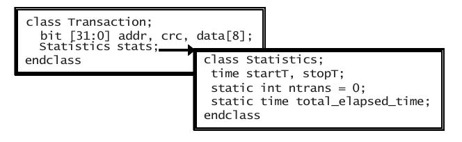
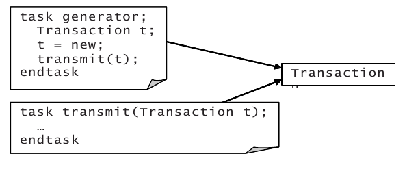
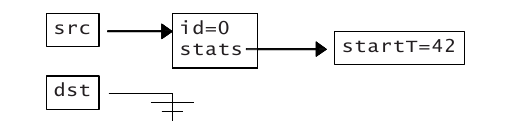
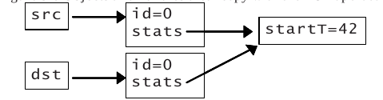
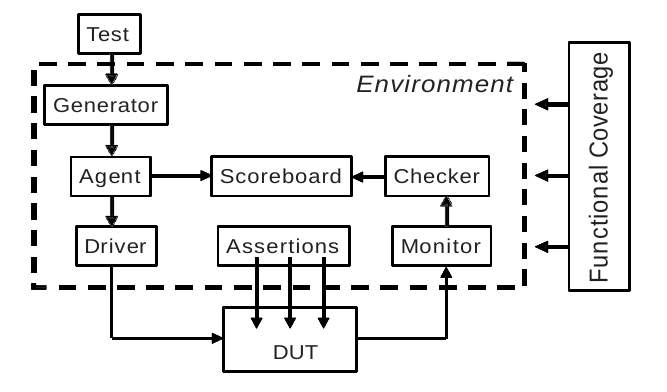

# Programación orientada a objetos en SystemVerilog

En SystemVerilog, la **Programación Orientada a Objetos (POO)** extiende las capacidades del lenguaje al incorporar conceptos de software como clases, herencia, polimorfismo, encapsulación y abstracción. Estos conceptos permiten escribir testbenches y modelos de verificación de una manera más estructurada, reutilizable y fácil de mantener.

## a. Breve introducción 

**¿Qué es la Programación Orientada a Objetos (POO) en SystemVerilog?**

POO en SystemVerilog es un enfoque de diseño que organiza el código en **objetos**. Los objetos son instancias de **clases**, que actúan como plantillas que definen tanto los **atributos** (datos) como los **métodos** (funciones) que los objetos pueden usar.

**Beneficios de la POO en SystemVerilog**

1. **Reutilización del código**: Puedes definir clases base genéricas y reutilizarlas en diferentes partes del banco de pruebas.
2. **Mantenimiento más sencillo**: El código está más organizado y es más fácil de actualizar o mejorar.
3. **Extensibilidad**: Puedes añadir nuevas funcionalidades extendiendo las clases existentes mediante **herencia**.
4. **Polimorfismo**: Permite que diferentes clases se usen de manera intercambiable, facilitando la creación de bancos de pruebas modulares y adaptables.

**Conceptos Clave de la POO en SystemVerilog**

1. **Clases**: Una clase es una plantilla que define un conjunto de datos (propiedades) y funciones (métodos) que operan sobre esos datos.
   
   ```verilog
   class MiClase;
       // Propiedad (atributo)
       int valor;

       // Método (función)
       function void mostrar_valor();
           $display("Valor es: %0d", valor);
       endfunction
   endclass
   ```

2. **Objetos**: Un objeto es una instancia de una clase. Se crea usando la palabra clave `new`.

   ```verilog
   MiClase objeto;  // Declaración de un objeto de tipo MiClase
   objeto = new();  // Creación del objeto usando new
   ```

3. **Encapsulación**: Los datos y métodos se agrupan en una clase, controlando el acceso a ellos mediante especificadores de acceso (`local`, `protected`, `public`).

   ```verilog
   class MiClase;
       protected int valor;  // Solo accesible desde la clase y sus subclases
       public function void set_valor(int v);  // Método público
           valor = v;
       endfunction
   endclass
   ```

4. **Herencia**: Permite crear una nueva clase que herede propiedades y métodos de una clase existente. Utiliza la palabra clave `extends`.

   ```verilog
   class ClaseBase;
       int base_atributo;
   endclass

   class ClaseDerivada extends ClaseBase;
       int derivado_atributo;
   endclass
   ```

5. **Polimorfismo**: Permite que diferentes clases se usen de manera intercambiable. Se logra mediante el uso de herencia y funciones virtuales.

   ```verilog
   virtual class Animal;
       virtual function void sonido();
       endfunction
   endclass

   class Perro extends Animal;
       function void sonido();
           $display("Guau!");
       endfunction
   endclass

   class Gato extends Animal;
       function void sonido();
           $display("Miau!");
       endfunction
   endclass
   ```

   Aquí, `Perro` y `Gato` son subclases de `Animal` y pueden usarse donde se espere un objeto `Animal`.

**Ejemplo Básico**

A continuación, se muestra un ejemplo básico de cómo usar la POO en SystemVerilog para crear una clase de transacción simple para un banco de pruebas de verificación:

```verilog
class Transaccion;
    rand bit [7:0] direccion;
    rand bit [31:0] datos;

    function void imprimir();
        $display("Transacción: Dirección=%0h, Datos=%0h", direccion, datos);
    endfunction
endclass

// Uso de la clase en el testbench
initial begin
    Transaccion tx = new();
    if (tx.randomize()) begin  // Generación aleatoria de los datos
        tx.imprimir();
    end
end
```

En este ejemplo, la clase `Transaccion` tiene propiedades `direccion` y `datos` que se pueden randomizar. La función `imprimir` se utiliza para mostrar los datos de la transacción.

## b. Think of nouns, not verbs

La idea de **"Pensar en Sustantivos, no en Verbos"** en el contexto de la Programación Orientada a Objetos (POO) y el diseño de testbenches en SystemVerilog se refiere a cambiar el enfoque de cómo se estructura el testbench, centrándose en **los datos** (sustantivos) en lugar de **las acciones** (verbos). Este enfoque ayuda a crear un diseño más limpio, mantenible y fácil de entender.

- **Agrupación de Datos y Código en Clases**

    En POO, el enfoque está en **agrupar datos y código juntos** en lugar de tenerlos separados. Esto se logra mediante el uso de **clases**, donde cada clase representa un "sustantivo" o entidad en el sistema, que tiene atributos (datos) y métodos (funciones que operan sobre esos datos).

    Por ejemplo, en un testbench, una **transacción** es un concepto clave (un "sustantivo"). Una transacción puede tener varios atributos, como dirección, datos, tipo de operación, etc. En lugar de pensar en términos de "crear una transacción", "transmitir una transacción" o "verificar una transacción" (verbos), el diseño del testbench debe girar en torno a la transacción misma como objeto principal.

- **Estructurar el Testbench Alrededor de Transacciones**

    El objetivo de un testbench es aplicar estímulos al diseño bajo prueba (DUT, Device Under Test) y luego verificar si el resultado es correcto. Las **transacciones** representan los datos que fluyen dentro y fuera del DUT. Por lo tanto, la mejor manera de organizar el testbench es alrededor de estas transacciones y las operaciones que se realizan sobre ellas.

    En lugar de escribir código para crear, enviar y verificar transacciones directamente (enfoque orientado a verbos), el testbench debe estar organizado en **clases** que representen las entidades principales involucradas en este flujo de datos:

    - **Generador (Generator)**: Crea transacciones.
    - **Driver**: Toma las transacciones del generador y las aplica al DUT.
    - **Monitor**: Observa las respuestas del DUT y captura las transacciones resultantes.
    - **Scoreboard**: Verifica que las transacciones capturadas coincidan con las expectativas.

- **Diseño Modular del Testbench**

    La recomendación es dividir el testbench en **módulos** o **bloques**, cada uno con una responsabilidad específica, y definir claramente cómo se comunican entre sí:

    - **Generator**: Se encarga de **crear transacciones** y pasarlas al siguiente bloque.
    - **Driver**: Interactúa con el DUT aplicando las transacciones.
    - **Monitor**: Captura las transacciones de salida del DUT.
    - **Scoreboard**: Verifica que las transacciones coincidan con los datos esperados.

    Al pensar en términos de **sustantivos** (transacciones, generador, driver, monitor, scoreboard), el testbench se vuelve más estructurado y orientado a datos, y cada componente tiene una responsabilidad clara.

## c. Clases 

Una clase encapsula los datos junto con las rutinas que los manipulan

EL siguiente ejemplo muestra una clase para un paquete genérico. El paquete contiene un dirección, un CRC y un arreglo de valores de datos. 

~~~verilog
// Ejemplo 5.1
class Transaction;
  // Variables de la transacción
  bit [31:0] addr, crc;
  bit [31:0] data[8];

  // Método para mostrar la transacción
  function void display();
    $display("Transaction: %h", addr);
  endfunction : display

  // Método para calcular el CRC
  function void calc_crc();
    crc = addr ^ data.xor();
  endfunction : calc_crc
endclass : Transaction
~~~

Se seguirá la siguiente nomenclatura para la codificación:
- `Nombres de clases:` Letra inicial en mayúscula y se evita en uso del guión bajo. 
- `Constantes:` Toda la palabra en mayúscula. Ej: CELL_SIZE.
- `Variables:` Toda la palabra en minúscula. Ej: trans_type.

**c.1 Donde se puede definir una clase?**

Se puede definir una clase en un program, module, package o fuera de cualquiera de estos. 

## c. Terminología de POO en SV

- `Class:` Un bloque básico que contiene rutinas y variables. El análogo en Verilog es un módulo.

- `Object:` Una instancia de una clase. En Verilog, necesitas instanciar un módulo para usarlo.

- `Handle:` Un puntero a un objeto. En Verilog, usas el nombre de una instancia cuando te refieres a señales y métodos desde fuera del módulo. Un handle en OOP es como la dirección del objeto, pero se almacena en un puntero que solo puede referirse a un tipo.

- `Property:` Una variable que contiene datos. En Verilog, esto es una señal como un registro o un wire.

- `Method:` El código procedimental que manipula variables, contenido en tareas y funciones. Los módulos en Verilog tienen tareas y funciones, además de bloques initial y always.

- `Prototype:` El encabezado de una rutina que muestra el nombre, tipo y lista de argumentos. El cuerpo de la rutina contiene el código ejecutable.

En Verilog, construyes diseños complejos creando módulos e instanciándolos jerárquicamente. En OOP, creas clases e instancias (creando objetos) para crear una jerarquía similar.

## d. Creando objetos
En el siguiente ejemplo, 5.2, `tr` es un handle (puntero a ojbeto) que apunta a un objeto de tipo Transaction, o simplemente se llama como Transaction handle. 

~~~verilog
// Ejemplo 5.2
Transaction tr; // Declare a handle
tr = new(); // Allocate a Transaction object
~~~

Cuando se declara el handle tr, se inicializa con el valor especial null. A continuación, se llama a la `función new()` para construir el objeto Transaction. La función new asigna espacio para el Transaction, inicializa las variables a su valor por defecto (0 para variables de 2 estados y X para las de 4 estados), y devuelve la dirección dondese almacena el objeto.

### d.1 Constructor `new` presonalizado

El constructor `new` hace más que asignar memoria; también inicializa los valores. Se puede definir una función new personalizada para establecer valores propios por defecto. 
NO SE DEBE especificar un valor de retorno para el constructor, ya que este devuelbe un handle a un objeto del mismo tipo que la clase. 

El Ejemplo 5.3 establece addr y data en valores fijos, pero deja crc en su valor predeterminado de X.

~~~verilog
// Ejemplo 5.3 
class Transaction;
  // Variables de la transacción
  logic [31:0] addr, crc;
  logic [31:0] data[8];

  // Constructor de la clase
  function new();
    addr = 3;
    foreach (data[i]) begin
      data[i] = 5;
    end
  endfunction : new
endclass : Transaction
~~~

Se pueden usar argumentos con valores predeterminados para hacer un constructor más flexible, como se muestra en el Ejemplo 5.4. Ahora se puede especificar el valor para addr y data cuando llamas al constructor, o utilizar los valores predeterminados.

~~~verilog
// Ejemplo 5.4 
class Transaction;
  // Variables de la transacción
  logic [31:0] addr, crc;
  logic [31:0] data[8];

  // Constructor de la clase con argumentos predeterminados
  function new(logic [31:0] a = 3, logic [31:0] d = 5);
    addr = a;
    foreach (data[i]) begin
      data[i] = d;
    end
  endfunction : new
endclass : Transaction

// Bloque inicial para crear una instancia de la clase Transaction
initial begin
  Transaction tr;
  tr = new(10); // `data` usa el valor predeterminado de 5
end
~~~

### d.2 Declaración y llamda del constructor

En SystemVerilog, es una buena práctica separar la declaración de un objeto de su inicialización mediante el constructor.
Cuando se trabaja con clases en SystemVerilog, se puede declarar e inicializar un objeto de la siguiente manera:

```verilog
// Declaración e inicialización combinada
Driver d = new();
```

En este caso, se declara e inicializa `d` en una sola línea usando el constructor `new()`. Aunque esto puede parecer conveniente y más conciso, tiene algunas desventajas:

1. **Orden de Ejecución**:
   - **Problema**: El constructor `new()` se llama inmediatamente al momento de la declaración, antes de que se inicie el primer bloque procedural (por ejemplo, `initial` o `always` blocks). Esto puede ser problemático si se necesita inicializar los objetos en un orden específico o si dependes de ciertas condiciones que solo están disponibles en bloques procedimentales.
   - **Solución**: Puedes declarar el objeto primero y luego inicializarlo explícitamente en un bloque procedural donde tienes control completo sobre cuándo y cómo se realiza la inicialización.

   ```verilog
   // Declaración separada
   Driver d;

   initial begin
     // Inicialización en un bloque procedural
     d = new();
   end
   ```

2. **Control de Inicialización**:
   - **Problema**: Al llamar al constructor en la declaración, se pierde el control sobre el momento exacto en que se realiza la inicialización. Esto puede ser crucial si la inicialización de objetos depende de ciertas condiciones o debe ocurrir en un momento específico durante la simulación.
   - **Solución**: Declarar el objeto sin inicializarlo y luego inicializarlo dentro de un bloque procedural te permite tener un control más preciso sobre el momento y las condiciones bajo las cuales se inicializa el objeto.

3. **Almacenamiento Automático vs. Estático**:
   - **Problema**: Si no se usa el almacenamiento automático, el objeto se inicializa al inicio de la simulación, no cuando se entra en un bloque procedural. Esto puede llevar a comportamientos inesperados si el objeto necesita ser inicializado en un momento específico durante la simulación.
   - **Solución**: Si el objeto debe ser inicializado en un bloque procedural, asegúrate de declararlo con almacenamiento automático o de inicializarlo en un bloque procedural para garantizar que se comporte como se espera.


### d.3 Diferencias entre `new()` y `new[]`

- `new():` se llama para construir un solo objeto y puede recibir múltiples valores como argumentos. 
- `new[]:` construye un arreglo con múltiples elementos y solo puedo recibir un valor como argumento. 

### d.4 Obteniendo los handles de los objetos

Los handles se declarany un objeto se contruye. A lo largo de una simulación, un handle puede apuntar a muchos objetos. 

En el siguiente ejemplo, t1 apunta a un objeto. 

~~~verilog
// Ejemplo 5.6
class Transaction;
  bit [31:0] data;
endclass : Transaction

module example;
  Transaction t1, t2;

  initial begin
    t1 = new();  // t1 apunta al primer objeto Transaction
    t2 = t1;     // t2 también apunta al primer objeto Transaction

    t1.data = 10; // Modifica el campo 'data' del primer objeto

    t1 = new();   // Crea un segundo objeto y t1 ahora apunta al nuevo objeto
    // t2 sigue apuntando al primer objeto, que ahora tiene data = 10

    $display("t1.data = %0d", t1.data); // Muestra el valor del campo 'data' del segundo objeto
    $display("t2.data = %0d", t2.data); // Muestra el valor del campo 'data' del primer objeto
  end
endmodule : example
~~~

### e. Designación de objetos (eliminación)
La recolección de basura es el proceso de liberar automáticamente los objetos que ya no están referenciados.

SystemVerilog:
- no permite ninguna modificación de un handle ni usar un handle de un tipo para referirse a un objeto de otro tipo. 
- permite que un handle solo apunte a objetos de un tipo, 

~~~verilog
// Ejemplo 5.7
Transaction t;  // Create a handle
t = new();  // Allocate a new Transaction
t = new();  // Allocate a second one, free the first
t = null;   // Deallocate the second
~~~

## f. Uso de los objetos

En la OOP estricta, el único acceso a las variables en un objeto debería ser a través de sus métodos públicos como `get()` y `put()`. El problema con esta metodología es que fue escrita para aplicaciones de software grandes con una vida útil de una década o más. 
Aunque los métodos `get()` y `put()` son adecuados para compiladores, interfaces gráficas de usuario (GUIs) y APIs, para el uso en sv para verificación, sería útil apegarse a **variables públicas que puedan ser accedidas directamente en cualquier parte del testbench**.

~~~verilog
// Ejemplo 5.8
Transaction t;  // Declare a handle to a Transaction
t = new();      // Construct a Transaction object
t.addr = 32h42; // Set the value of a variable
t.display();    // Call a routine
~~~

## g. Variables `statics` vs `global`

Cada objeto tiene sus propias variables locales que no se comparten con ningún otro objeto. Si tienes dos objetos Transaction, cada uno tiene sus propias variables addr, crc y data. Sin embargo, a veces necesitas una variable que sea compartida por todos los objetos de un cierto tipo. Por ejemplo, podrías querer llevar un conteo continuo del número de transacciones que se han creado.

### g.1 Variable estáticas (`static`)
Se puede crear una variable estática dentro de una clase. Esta variable se comparte entre todas las instancias de la clase, pero su alcance está limitado a la clase.

En el siguiente ejemplo, solo hay una copia de la variable estática count, sin importar cuántos objetos Transaction se creen. Se puede pensar que count está almacenado con la clase (al ser estática) y no con el objeto. La variable id no es estática, por lo que cada Transaction tiene su propia copia. 

~~~verilog
// Ejemplo 5.9 
class Transaction;
  static int count = 0; // Número de objetos creados
  int id;               // ID único para cada instancia

  function new();
    id = count++;       // Asigna ID y aumenta la cuenta
  endfunction
endclass

Transaction t1, t2;
initial begin
  t1 = new();  // 1ra instancia, id=0, count=1
  t2 = new();  // 2da instancia, id=1, count=2
  $display("Second id=%d, count=%d", t2.id, t2.count);
end
~~~

### g.2 Acceso a la variable estática a través del nombre de la clase
Para acceder a la variable no se necesita un handle, se puede usar el nombre de la clase seguido de `::`, el operador de resolución de ámbito de clase.
~~~verilog
// Ejemplo 5.10
class Transaction;
  static int count = 0; // Number of objects created
  ...
endclass

initial begin
  run_test();
  $display("%d transactions were created", Transaction::count); // Reference static w/o handle
end
~~~

**Inicialización de variables `static`**

Una variable estática generalmente se inicializa en la declaración. No se puede inicializarla fácilmente en el constructor de la clase, ya que este se llama para cada nuevo objeto. Se necesitaría otra variable estática para actuar como una bandera, indicando si la variable original había sido inicializada. Si se tiene una inicialización más elaborada, se podría usar un bloque initial. Solo se debe asegúrar de que las variables estáticas estén inicializadas antes de que se construya el primer objeto.

**Problemas con la Inicialización en el Constructor**

Si se intentas inicializar una variable estática en el constructor de la clase, ocurrirán varios problemas:

- `Reinicialización Repetida`: Cada vez que se crea un nuevo objeto, el constructor se ejecuta y, por lo tanto, la variable estática se reinicializaría. Esto no es deseable porque generalmente quieres que las variables estáticas mantengan su valor entre las instancias.
- `Necesidad de una Bandera Adicional`: Para evitar la reinicialización, necesitarías usar otra variable estática como bandera para verificar si la variable original ya ha sido inicializada. Este método es propenso a errores y aumenta la complejidad del código.

### g.3 Métodos statics


~~~verilog
// Ejemplo 5.11
class Transaction;
  static Config cfg; // A handle with static storage
  MODE_E mode;

  function new();
    mode = cfg.mode;
  endfunction
endclass

Config cfg;
initial begin
  cfg = new(MODE_ON);
  Transaction::cfg = cfg;
  // ...
end
~~~

**En SystemVerilog:**
- se puede crear un método estático dentro de una clase que pueda leer y escribir variables estáticas, incluso antes de que se haya creado la primera instancia. 
- no permite que un método estático lea o escriba variables no estáticas, como id. 

~~~verilog
// Ejemplo 5.12
class Transaction;
  static Config cfg;
  static int count = 0;
  int id;

  // Static method to display static variables.
  static function void display_statics();
    $display("Transaction cfg.mode=%s, count=%0d", cfg.mode.name(), count);
  endfunction
endclass

Config cfg;
initial begin
  cfg = new(MODE_ON);
  Transaction::cfg = cfg;
  Transaction::display_statics();
end
~~~

**Explicación del Código**

1. **Clase `Transaction`**:
   - `static Config cfg;`:
     - `cfg` es una variable estática que guarda un handle de tipo `Config`. Al ser estática, esta variable es compartida por todas las instancias de la clase `Transaction`.
   - `static int count = 0;`:
     - `count` es otra variable estática que se utiliza para contar o realizar un seguimiento de las instancias de `Transaction` o para cualquier otro propósito requerido. Inicialmente, se establece en 0.
   - `int id;`:
     - `id` es una variable de instancia, lo que significa que cada objeto `Transaction` tendrá su propio valor `id`.
   
2. **Método Estático `display_statics`**:
   - `static function void display_statics();`:
     - Este es un método estático que se utiliza para mostrar las variables estáticas `cfg` y `count`.
   - `$display("Transaction cfg.mode=%s, count=%0d", cfg.mode.name(), count);`:
     - Esta línea imprime el valor del modo de configuración (`cfg.mode.name()`) y el valor actual de `count`. Dado que es un método estático, se puede llamar sin necesidad de crear una instancia de `Transaction`.

3. **Bloque `initial`**:
   - `Config cfg;`:
     - Se declara una variable `cfg` de tipo `Config`.
   - `cfg = new(MODE_ON);`:
     - Se crea una nueva instancia de `Config` y se asigna a `cfg`. El constructor toma un argumento `MODE_ON`, que presumiblemente es un valor definido en algún lugar del código.
   - `Transaction::cfg = cfg;`:
     - Se asigna el objeto `cfg` a la variable estática `cfg` de la clase `Transaction`. Todas las instancias de `Transaction` tendrán acceso a este objeto `cfg`.
   - `Transaction::display_statics();`:
     - Llama al método estático `display_statics()` para mostrar los valores de las variables estáticas `cfg` y `count`.

### Puntos Clave

1. **Uso de Variables y Métodos Estáticos**:
   - Las variables estáticas (`static`) pertenecen a la clase y no a instancias individuales de la clase. Por lo tanto, cualquier modificación de una variable estática es visible para todas las instancias.
   - Los métodos estáticos pueden ser llamados sin crear una instancia de la clase. Estos métodos solo pueden acceder a otras variables o métodos estáticos.

2. **Configuración Compartida a través de `cfg`**:
   - El código muestra cómo un objeto de configuración (`cfg`) puede ser compartido entre todas las instancias de una clase. Esto es útil cuando necesitas que todas las instancias de la clase `Transaction` trabajen con la misma configuración.

3. **Mostrar Información Global del Sistema**:
   - El método `display_statics()` es una forma conveniente de mostrar información global sobre la configuración y el estado del sistema (como la cantidad de objetos creados).

Este patrón de uso de métodos y variables estáticas es común en la programación orientada a objetos para compartir datos o configuraciones globales entre múltiples instancias de una clase.

## h. Métodos de la clase

Un método en una clase es simplemente una tarea o función definida dentro del
ámbito de la clase. SystemVerilog llama al método correcto basado en el
tipo del manejador (handle).

~~~verilog
class Transaction;
  bit [31:0] addr, crc, data[8];
  
  function void display();
    $display("@%0t: TR addr=%h, crc=%h", $time, addr, crc);
    $write("\tdata[0-7]=");
    foreach (data[i]) 
      $write(data[i]);
    $display();
  endfunction
endclass : Transaction

class PCI_Tran;
  bit [31:0] addr, data; // Use realistic names
  
  function void display();
    $display("@%0t: PCI: addr=%h, data=%h", $time, addr, data);
  endfunction
endclass : PCI_Tran

Transaction t;
PCI_Tran pc;

initial begin
  t = new();          // Construct a Transaction
  t.display();        // Display a Transaction
  
  pc = new();         // Construct a PCI transaction
  pc.display();       // Display a PCI Transaction
end

~~~


## i. Métodos fuera de la clase

Para poder hacer el método fuera de la clase, se debe copiar la primera línea del método, con el nombre y los argumentos, y agrega la **palabra clave extern** al principio. Luego, toma todo el método y muévelo después del cuerpo de la clase, y añade el nombre de la clase y dos puntos (:: el operador de alcance) antes del nombre del método.

~~~verilog
class Transaction;
  bit [31:0] addr, crc, data[8];
  // La palabra clave extern es vital para poder 
  // crear la función fuera de la clase
  extern function void display();
endclass : Transaction

// Es necesario usar el operador de resolución
// con el nombre de la clase
function void Transaction::display();
  $display("@%0t: Transaction addr=%h, crc=%h", $time, addr, crc);
  $write("\tdata[0-7]=");
  foreach (data[i]) 
    $write(data[i]);
  $display();
endfunction : display


class PCI_Tran;
  bit [31:0] addr, data; // Use realistic names
  extern function void display();
endclass : PCI_Tran

function void PCI_Tran::display();
  $display("@%0t: PCI: addr=%h, data=%h", $time, addr, data);
endfunction : display
~~~

## j. Reglas de alcance (scoping rules)

Las **reglas de alcance** se refieren a cómo se manejan los nombres de las variables y otras entidades en el código, determinando dónde se pueden usar y cómo se resuelven los conflictos de nombres en diferentes partes de un programa.

1. **Ámbito de un Bloque de Código**: Un **ámbito** es una región del código donde las variables y otros identificadores son visibles y pueden ser utilizados. Los ejemplos de bloques de código que crean un ámbito incluyen módulos, programas, tareas, funciones, clases, bloques `begin-end`, y bucles `for` y `foreach`.

2. **Variables de Ámbito Local**: Puedes declarar variables dentro de un bloque, y estas serán locales a ese bloque. Esto significa que las variables solo son accesibles dentro del bloque donde se declaran.

3. **Ámbito de Bucles**: En SystemVerilog, los bucles `for` y `foreach` crean automáticamente un ámbito para que las variables de índice sean locales a ese bucle. Esta característica permite evitar conflictos de nombres y hacer que el código sea más claro y mantenible.

4. **Ámbito de Bloques sin Nombre**: Una característica nueva en SystemVerilog es la capacidad de declarar variables dentro de bloques `begin-end` sin nombre. Esto puede ser útil en algunas situaciones para crear variables locales de manera más controlada.

5. **Nombres Relativos y Absolutos**: Un nombre puede ser **relativo** al ámbito actual o **absoluto**, comenzando con `$root`. SystemVerilog buscará en los ámbitos actuales y superiores hasta encontrar una coincidencia para un nombre relativo. Si quieres ser claro y específico, utiliza `$root` al principio del nombre para referirte al ámbito global.

6. **Uso de Nombres en Diferentes Ámbitos**: Un mismo nombre, como `limit` en tu ejemplo, puede utilizarse en diferentes ámbitos: como variable global, variable de programa, variable de clase, variable de tarea, y variable local dentro de un bloque `initial`. Cada instancia de `limit` es distinta y se refiere a una entidad diferente dependiendo del ámbito en que se use.

### Ejemplo y Aplicación

El uso de diferentes nombres de variable en distintos ámbitos permite una mejor organización y legibilidad del código, y evita errores que puedan surgir de la reutilización de nombres. Sin embargo, en un código real, se recomienda usar nombres más significativos para cada variable, lo que ayuda a entender mejor el propósito de cada una en su contexto respectivo.

~~~verilog
// Ejemplo 5.16
int limit;

program automatic p;
  int limit;
  
  class Foo;
    int limit, array[];
    
    // Accessing different scopes
    //////$root.limit
    $root.p.limit
    $root.p.Foo.limit
    // $root.p.Foo.print.limit
    
    function void print(int limit);
      for (int i = 0; i < limit; i++)
        $display("%m: array[%0d] = %0d", i, array[i]);
    endfunction
  endclass
  
  initial begin
    int limit = $root.limit; // **see note above
    Foo bar;
    bar = new();
    bar.array = new[limit];
    bar.print(limit);
  end
endprogram
~~~

### j.1 Uso de `this` en systemverilog

Cuando se usa un nombre de variable en SystemVerilog, el compilador sigue un conjunto de **reglas de alcance** para determinar a qué variable se esta refiriendo. Estas reglas consisten en buscar primero en el ámbito actual (local) y luego en los ámbitos superiores (padres) hasta encontrar la definición de la variable.

**Problema de Ambigüedad en Constructores**

En situaciones donde se está profundamente dentro de un método de una clase, es posible que se desee referirse de manera inequívoca a un atributo o variable miembro de la clase, especialmente cuando se ha utilizado el mismo nombre para una variable local (argumento de una función o método) y para un miembro de la clase.

Este tipo de ambigüedad es común en los **constructores**, donde el programador puede usar el mismo nombre para un argumento de función que para un atributo de la clase. Por ejemplo, en el constructor de una clase, podrías tener un parámetro de entrada con el mismo nombre que un atributo de la clase que deseas inicializar.

**Solución con la Palabra Clave `this`**

La palabra clave `this` en SystemVerilog se utiliza para **eliminar la ambigüedad** y dejar claro que te refieres al atributo de la instancia de la clase actual, en lugar de a una variable local con el mismo nombre. Al usar `this`, se puede distinguir entre la variable miembro de la clase y el argumento local.

**Ejemplo Explicado**

En el siguiente código, se muestra cómo usar `this` para asignar un valor a una variable de clase cuando hay ambigüedad con un nombre de variable local:

```verilog
class Scoping;
  string oname; // Variable miembro de la clase

  function new(string oname); // Constructor con un argumento del mismo nombre
    this.oname = oname; // class oname = local oname
  endfunction
endclass
```

- **`string oname;`**: Declara un atributo miembro de la clase `Scoping` llamado `oname`.
- **`function new(string oname);`**: Define un constructor para la clase `Scoping` que recibe un argumento `oname`.
- **`this.oname = oname;`**: Aquí es donde la palabra clave `this` se utiliza para eliminar la ambigüedad:
  - `this.oname` se refiere al atributo `oname` de la instancia actual de la clase `Scoping`.
  - `oname` (sin `this.`) se refiere al argumento local del constructor.

### Ventajas del Uso de `this`

- **Claridad**: Usar `this` mejora la legibilidad del código al hacer explícito a qué variable o atributo te refieres.
- **Evita Errores**: Previene errores de asignación accidental al aclarar las referencias a las variables miembro de la clase.
- **Buenas Prácticas**: Es una buena práctica de programación en lenguajes orientados a objetos como SystemVerilog, donde la sobrecarga de nombres puede ocurrir frecuentemente.

## k. Clases anidadas

Una clase puede contener una instancia de otra clase, utilizando un manejador para un objeto. 




~~~verilog
// Ejemplo 5.20
class Statistics;
  time startT, stopT; // Transaction times
  static int ntrans = 0; // Transaction count
  static time total_elapsed_time = 0;

  function time how_long;
    how_long = stopT - startT;
    ntrans++;
    total_elapsed_time += how_long;
  endfunction

  function void start;
    startT = $time;
  endfunction
endclass
~~~
// Sample 5.21: Encapsulating the Statistics class

~~~verilog
// Ejemplo 5.21: encapsulamiento de la clase statatics
class Transaction;
  bit [31:0] addr, crc, data[8];
  Statistics stats; // Statistics handle

  function new();
    stats = new(); // Make instance of stats
  endfunction

  task create_packet();
    // Fill packet with data
    stats.start();
    // Transmit packet
  endtask
endclass
~~~

El ejemplo anterior destaca el uso de la clase `Statistics` para encapsular el cálculo de tiempos y contar transacciones dentro de una clase externa más grande llamada `Transaction`. A continuación, se explican algunos detalles importantes del código:

- **Jerarquía y referencia a miembros de clase**
   La clase más externa, `Transaction`, puede referirse a los elementos de la clase `Statistics` utilizando la sintaxis jerárquica habitual. Por ejemplo, dentro de la clase `Transaction`, puedes acceder a la variable `startT` de la clase `Statistics` a través del manejador `stats`:
   ```verilog
   stats.startT
   ```

- **Instanciación de objetos**
   Uno de los aspectos más importantes es la correcta **instanciación** del objeto `Statistics` dentro de la clase `Transaction`. Si no instancias este objeto, el manejador `stats` será nulo, y cualquier intento de llamar a métodos, como `stats.start()`, provocará un fallo en la simulación.
   
   En el código, la instanciación del objeto `Statistics` se realiza en el constructor de `Transaction`:
   ```verilog
   function new();
     stats = new(); // Crear instancia de stats
   endfunction
   ```
   Esto asegura que el manejador `stats` esté correctamente inicializado antes de ser usado en otros métodos o tareas, como `create_packet()`.

- **Modularización y manejo de complejidad**
   A medida que tus clases crezcan en tamaño y complejidad, puede ser difícil gestionar la organización y claridad del código. Si las declaraciones de variables y métodos de una clase ocupan más de una página, es una señal de que deberías considerar **dividir la clase en varias clases más pequeñas**. Esta técnica se llama **refactorización** y es crucial para mejorar la mantenibilidad y escalabilidad del código.

   Por ejemplo, en el caso de la clase `Transaction`, si la cantidad de estadísticas o funciones relacionadas con el manejo de datos creciera significativamente, podrías dividir la clase en:
   - Una clase dedicada a la gestión de datos.
   - Una clase para la transmisión de paquetes.
   - Otra clase para el control de estadísticas.

- **Uso de clases base y herencia**
   Un buen indicio de que es necesario **refactorizar** es cuando encuentras **código repetitivo o similar en varios lugares** dentro de una misma clase. Este código repetitivo podría extraerse en una función o en una **clase base**. Por ejemplo:
   - Si el cálculo del tiempo o la cuenta de transacciones se vuelve algo común en varias partes del código, podrías crear una **clase base** que encapsule esas funcionalidades.
   - Luego, podrías hacer que otras clases hereden de esta clase base, reutilizando el código de manera más eficiente y evitando la duplicación.

   El **Capítulo 8** menciona más detalles sobre **herencia de clases**, lo que permite organizar y estructurar el código en una jerarquía lógica, haciendo el código más modular y reutilizable.


### k.1 Problemas con el orden de compilación

El tema del **orden de compilación** se refiere a cómo el compilador procesa el código en SystemVerilog (o en otros lenguajes), especialmente cuando una clase hace referencia a otra que aún no ha sido definida en el código. Esto puede llevar a problemas de compilación, ya que el compilador no sabría cómo manejar un tipo de dato (clase) que no ha encontrado antes.

### ¿Cuál es el problema?

Si se tiene una clase que usa o declara un manejador de otra clase que aún no ha sido definida, el compilador generará un error porque no sabe cómo interpretar esa referencia. Por ejemplo, en el siguiente fragmento:

```verilog
class Transaction;
  Statistics stats;
  ...
endclass
```

Aquí, `Transaction` está usando una instancia de `Statistics`, pero si `Statistics` no ha sido definida antes de la clase `Transaction`, el compilador no sabrá qué es `Statistics`, lo que causará un error.

### Solución con `typedef`

Para solucionar este problema de compilación, puedes usar una declaración **forward** de la clase utilizando `typedef`. Este tipo de declaración le indica al compilador que **más adelante** se definirá la clase `Statistics`, permitiéndole continuar compilando sin problemas. 

El código corregido sería:

```verilog
// Ejemplo 5.22
typedef class Statistics;
 // Declaración forward de la clase Statistics

class Transaction;
  Statistics stats; 
  // Ahora el compilador sabe que stats es del tipo Statistics
  ...
endclass

class Statistics;
  ...
endclass
```

**Explicación**

1. **`typedef class Statistics;`**: Esta línea le dice al compilador que habrá una clase llamada `Statistics` más adelante en el código. No necesita conocer los detalles de la clase en este punto, solo que es un tipo de dato válido que podrá usar.

2. **Clase `Transaction`**: Ahora el compilador puede procesar la clase `Transaction`, porque sabe que `stats` es del tipo `Statistics`, aunque la clase `Statistics` aún no esté completamente definida.

3. **Definición de la clase `Statistics`**: Posteriormente, se define la clase `Statistics` como se haría normalmente, sin causar problemas de compilación.

**Importancia**

Este patrón es especialmente útil cuando tienes dependencias circulares o cuando tienes una estructura de código grande y las clases pueden no estar definidas en el mismo archivo o en el mismo orden de compilación. El uso de `typedef` o declaraciones forward permite organizar el código de manera más flexible sin tener que preocuparse excesivamente por el orden exacto de las definiciones.

## l. Objetos dinámicos

### l.1 Ojetos como argumentos de los métodos

Para leer un modificar un objeto a través del método, se necesita pasar el handle del objeto, no el objeto en sí. 



#### **a) Paso por Valor vs. Paso por Referencia**

1. **Paso por valor (sin `ref`)**: Cuando pasas un argumento a una tarea o función **sin** el modificador `ref`, SystemVerilog copia el valor de ese argumento. Esto significa que cualquier modificación realizada en el argumento dentro de la tarea **no** afectará al valor original en el bloque que llamó a esa tarea.

2. **Paso por referencia (con `ref`)**: Cuando usas `ref` para un argumento, estás pasando la dirección de la variable (o su referencia), lo que permite que la tarea modifique directamente el valor original. Esto es útil cuando quieres que una tarea pueda alterar el valor de una variable en el contexto de quien la llama.

**Ejemplo Explicado**

```verilog
// Transmit a packet onto a 32-bit bus
task transmit(Transaction t);
    CBbus.rx_data <= t.data;
    t.stats.startT = $time;
    ...
endtask

Transaction t;
initial begin
    t = new();
    t.addr = 42;
    transmit(t);
end
```

1. **Asignación de `t`**: En el bloque `initial`, se crea un nuevo objeto `Transaction` llamado `t`. Luego, se asigna el valor `42` a `t.addr`.

2. **Llamada a `transmit(t)`**: Se llama a la tarea `transmit`, pasándole el manejador del objeto `Transaction` `t`.

3. **Modificación dentro de `transmit`**: Dentro de la tarea, se accede al objeto `Transaction` usando el manejador `t`. Se pueden leer y escribir valores del objeto, como `t.data` o `t.stats.startT`.

   - **Lectura y escritura en el objeto**: Como `t` es un manejador (apunta a un objeto), cualquier modificación en los atributos del objeto se verá reflejada fuera de la tarea, ya que se está modificando el **objeto** que `t` apunta.
   
   - **Manejador vs. Objeto**: Aunque el manejador `t` apunta al objeto, la tarea `transmit` no puede modificar el manejador en sí (la dirección a la que apunta). Si intentara asignar un nuevo valor a `t` dentro de `transmit`, esa modificación no se reflejaría fuera de la tarea, ya que el manejador fue pasado **por valor** (sin `ref`).

#### **b) Confusión Común: Manejador vs. Objeto**

- **Manejador**: Es como una "referencia" o "puntero" al objeto. Pasar un manejador **sin** `ref` significa que la tarea no puede cambiar el manejador en sí, pero sí puede modificar el objeto al que apunta.

- **Objeto**: Es la instancia real de la clase. La tarea puede modificar el contenido del objeto, y esos cambios serán visibles fuera de la tarea, incluso si el manejador fue pasado sin `ref`.

#### c) ¿Cuándo usar `ref`?

- Usa `ref` si quieres que la tarea pueda modificar el **manejador** (cambiar qué objeto está referenciando).
- Si solo quieres modificar el contenido del objeto, puedes pasar el manejador sin `ref`.

**Resumen**

- **Sin `ref`**: Se pasa una copia del manejador. La tarea puede modificar el objeto al que apunta el manejador, pero no puede modificar el propio manejador.
- **Con `ref`**: Se pasa el manejador por referencia, lo que permite modificar tanto el manejador como el objeto al que apunta.
  
Este mecanismo de paso de argumentos es crucial para entender cómo los métodos y tareas interactúan con los datos en SystemVerilog, especialmente al trabajar con objetos y clases.


#### d) Modificando un handle en un task

Existe un error común en SystemVerilog relacionado con el uso incorrecto del paso de argumentos, particularmente cuando se trabaja con **manejadores** o **handles** de objetos.

**Manejo Incorrecto de Manejadores**

El problema en el siguiente ejemplo ocurre cuando se intenta modificar un **manejador** (referencia a un objeto) dentro de una función o tarea, pero sin el modificador `ref`. Si no se usa `ref`, SystemVerilog pasa una **copia** del manejador como argumento a la función, lo que significa que cualquier cambio en ese manejador no será reflejado fuera de la función. 

```verilog
// Ejemplo 5.24
function void create(Transaction tr); // Bug, missing ref
    tr = new();
    tr.addr = 42;
    // Initialize other fields
endfunction

Transaction t;
initial begin
    create(t);
    $display(t.addr);
end
```

**¿Qué está pasando?**

1. **Llamada a `create(t)`**: El manejador `t` se pasa a la función `create`, pero no con `ref`. Esto significa que **se pasa una copia** del manejador `t` a la función.
   
2. **`tr = new();` en `create`**: Dentro de la función, se asigna un nuevo objeto `Transaction` a la variable `tr`. Sin embargo, como `tr` es una copia del manejador `t`, la variable `t` en el bloque `initial` no se actualiza con el nuevo objeto. Fuera de la función, `t` sigue siendo `null`.

3. **Resultado**: Cuando se intenta acceder a `t.addr` después de la llamada a `create`, falla, porque `t` nunca fue actualizado (sigue siendo `null`).

### Solución: Uso de `ref`

Para corregir este error, debes usar el modificador `ref` en el argumento `tr`. Esto asegura que se pase la **referencia** al manejador, de manera que los cambios hechos al manejador dentro de la función sean visibles fuera de ella.

En el ejemplo corregido (Sample 5.25):

```verilog
function void create(ref Transaction tr); 
    tr = new(); // Now this updates the original handle
    tr.addr = 42;
    // Initialize other fields
endfunction

Transaction t;
initial begin
    create(t);  // t is now updated correctly
    $display(t.addr);  // Will correctly display the address
end
```

**¿Qué cambia?**

1. **`ref` en el argumento `tr`**: Ahora, la función recibe una referencia directa al manejador `t`, no una copia.
   
2. **Modificación del manejador**: Al hacer `tr = new();`, ahora se actualiza el **manejador original** `t` en el bloque `initial`.

3. **Resultado**: Después de llamar a `create`, `t` apunta a un objeto válido de tipo `Transaction`, y el acceso a `t.addr` funcionará correctamente.

### Resumen

- **Sin `ref`**: Si no se usa `ref`, se pasa una **copia** del manejador, por lo que los cambios hechos al manejador dentro de la función no afectan el manejador original en el bloque que llamó a la función. Esto es útil si quieres modificar solo los datos del objeto al que apunta el manejador, pero no cambiar el manejador en sí.
  
- **Con `ref`**: Si se usa `ref`, el manejador que se pasa a la función o tarea es **el mismo** que en el bloque de llamada, por lo que cualquier cambio al manejador afecta directamente el bloque llamador. Esto es necesario cuando quieres que el manejador apunte a un nuevo objeto, como en este caso.

El uso incorrecto de `ref` puede causar errores difíciles de depurar, especialmente cuando el manejador parece no estar actualizado como se espera. Por eso, es importante saber cuándo y cómo utilizarlo correctamente.


### e) Arrays of handles

Al escribir *testbenches* en SystemVerilog, es común la necesidad de manejar múltiples objetos, como transacciones o paquetes de datos. Una forma eficiente de hacerlo es utilizando **arreglos de manejadores**. Estos manejadores no son los objetos en sí mismos, sino referencias que apuntan a los objetos. Por lo tanto, es necesario instanciar cada objeto de manera individual antes de usarlo. A continuación, se explica con más detalle el funcionamiento de los arreglos de manejadores.

En el Ejemplo 5.28, se muestra cómo almacenar diez transacciones de bus en un arreglo de manejadores:

```verilog
// Ejemplo 5.28
task generator();
    Transaction tarray[10];  // Arreglo de 10 manejadores de transacciones
    foreach (tarray[i]) 
    begin
        tarray[i] = new();   // Crear un nuevo objeto en cada posición del arreglo
        transmit(tarray[i]); // Usar el objeto a través del manejador
    end
endtask
```

#### Detalles Importantes:

1. **Arreglo de Manejadores**: El arreglo `tarray` está compuesto por manejadores de objetos, es decir, referencias que apuntan a instancias de la clase `Transaction`. No se deben confundir los manejadores con los objetos; los manejadores son simplemente direcciones de memoria que apuntan a los objetos.

2. **Instanciación de Objetos**: Al declarar un arreglo de manejadores, los elementos del arreglo no apuntan a ningún objeto hasta que se instancian explícitamente con `new()`. En el código, esto se hace en la línea `tarray[i] = new();` dentro de un bucle `foreach`. Cada elemento del arreglo se convierte en un manejador que apunta a una instancia del objeto `Transaction`.

3. **Uso de Objetos**: Después de instanciar los objetos, se pueden utilizar llamando a métodos o funciones sobre los manejadores, como se hace en la llamada `transmit(tarray[i]);`. Esto pasa el objeto referenciado por `tarray[i]` a la tarea `transmit`.

#### Conceptos Clave:

- **No hay arreglos de objetos, solo de manejadores**: Aunque se pueda hablar de "arreglos de objetos", técnicamente en SystemVerilog lo que existe son **arreglos de manejadores** que apuntan a objetos. No hay una manera directa de instanciar todos los objetos de un arreglo en una sola línea; cada objeto debe construirse individualmente usando `new()`.
  
- **Manejadores nulos o compartidos**: Como los manejadores son simplemente referencias, algunos de ellos pueden no apuntar a ningún objeto (quedando *nulos*), o varios manejadores podrían apuntar al mismo objeto. Esto implica que debes ser cuidadoso al trabajar con arreglos de manejadores, asegurándote de que apunten a objetos válidos y evitando compartir manejadores de manera no intencional.

#### Resumen:

- Un **arreglo de manejadores** no contiene objetos en sí, sino referencias a objetos.
- Cada objeto en el arreglo debe ser instanciado individualmente con `new()`.
- Los manejadores pueden estar *nulos* o compartir la referencia de un mismo objeto, lo que requiere un manejo cuidadoso al usarlos.
  

## m) Copia de objetos

### m.1 Copia de un objeto con el operador `new`

Copiar un objeto con el operador new es fácil y confiable. Se asigna memoria para el nuevo objeto y todas las variables del objeto existente se copian. 

El siguiente ejemplo realiza una copia superficial, similar a una fotocopia del original, que transcribe ciegamente los valores de origen a destino. Si la clase contiene un manejador (handle) a otra clase, solo se copia el valor del manejador, no el objeto al que apunta.

~~~verilog
// Ejemplo 5.29
class Transaction;
    bit [31:0] addr, crc, data[8];
endclass

Transaction src, dst;

initial begin
    src = new();       // Crear el primer objeto
    dst = new src;     // Hacer una copia usando el operador new
end
~~~


```verilog
class Transaction;
    bit [31:0] addr, crc, data[8];
    static int count = 0;
    int id;
    Statistics stats; // Manejador que apunta al objeto Statistics
    
    // Constructor
    function new();
        stats = new();
        id = count++;
    endfunction
endclass

// Crear objetos Transaction y Statistics
Transaction src, dst;

initial begin
    src = new();              // Crear un objeto Transaction
    src.stats.startT = 42;    // Resultado como en la Figura 5-5

    dst = new src;            // Copiar src en dst usando el operador new
    // Resultado como en la Figura 5-6

    dst.stats.startT = 96;    // Cambia stats para dst y src
    $display(src.stats.startT); // Imprime "96", ver Figura 5-7
end
```

### Explicación:

- **Clase `Transaction`**: 
  - Contiene atributos como `addr`, `crc` y un arreglo `data[8]`.
  - También tiene un atributo estático `count` que se utiliza para contar el número de instancias.
  - Un manejador `stats` que apunta a un objeto de tipo `Statistics`.
  - El constructor inicializa `stats` y asigna un `id` único a cada transacción.
  
- **Creación de objetos**: 
  - Se crean dos instancias de la clase `Transaction` (`src` y `dst`), donde la variable `src.stats.startT` se asigna un valor.

  

- **Copia de objetos**: 
  - Se copia el objeto `src` en `dst` usando `new src`.
  - Se copia el objeto `Transaction` pero no el objeto `Statics`. Solo se    copian los valores de las variables y los manejadores.
  - Cualquier cambio en `dst.stats.startT` afecta tanto a `src` como a `dst`, debido a que ambos objetos están compartiendo el mismo manejador `stats`.

  


### m.2 Función de copia propia

Para realizar una copia de una clase que no tiene referencias a otras clases, escribir una función de copia es sencillo.


Aquí tienes el código formateado en `~verilog`:

```verilog
// Ejemplo 5.31
class Transaction;
  bit [31:0] addr, crc, data[8];  // No Statistic handle
  
  function Transaction copy();
    copy = new();       // Construct destination
    copy.addr = addr;   // Fill in data values
    copy.crc = crc;     
    copy.data = data;   // Array copy
  endfunction
endclass

// Sample 5.32 Using a copy function
Transaction src, dst;

initial begin
  src = new();      // Create first object
  dst = src.copy(); // Make a copy of the object
end
```

### m.3 Función deep copy 

Cuando se crea una función de copia personalizada para una clase, es necesario actualizarla cada vez que se agregan nuevas variables. Si se olvida agregar una variable en la función de copia, podría llevar mucho tiempo depurar el problema para encontrar el valor faltante.

En el siguiente ejemplo, se muestra cómo se define una función de copia profunda en una clase compleja. La función `copy()` se utiliza para crear una copia completa del objeto, asegurando que todos los campos sean copiados correctamente, incluyendo las instancias de las clases contenidas.

**Ejemplo 5.33**: Clase compleja con función de copia profunda

```verilog
class Transaction;
  bit [31:0] addr, crc, data[8];
  Statistics stats; // Handle points to Statistics object
  static int count = 0;
  int id;

  function new();
    stats = new();
    id = count++;
  endfunction

  function Transaction copy();
    copy = new();
    // Construct destination object
    copy.addr = addr;
    // Fill in data values
    copy.crc = crc;
    copy.data = data;
    copy.stats = stats.copy(); // Call Statistics::copy
  endfunction
endclass
```

La función `new()` es llamada por `copy()`, y por lo tanto, cada objeto recibe un ID único. Se debe agregar un método `copy()` para la clase `Statistics` y cualquier otra clase en la jerarquía.

**Ejemplo 5.34**: Declaración de la clase Statistics

```verilog
class Statistics;
  time startT, stopT; // Transaction times
  // ...

  function Statistics copy();
    copy = new();
    copy.startT = startT;
    copy.stopT = stopT;
  endfunction
endclass
```

Ahora, cuando se realiza una copia del objeto `Transaction`, el nuevo objeto `dst` tendrá su propia instancia de `Statistics`, como se muestra en el siguiente ejemplo.

**Ejemplo 5.35**: Copiando una clase compleja con el operador new

```verilog
Transaction src, dst;

initial begin
  src = new(); // Create first object
  src.stats.startT = 42; // Set start time
  dst = new src; // Copy src to dst with deep copy
  dst.stats.startT = 96; // Changes stats for dst only
  $display(src.stats.startT); // "42", See Figure 5-8
end
```

En este código, `src` se crea e inicializa, y se hace una copia profunda en `dst`. Los cambios realizados en `dst` no afectan a `src`, lo que se confirma con la visualización del valor de `startT` de `src`.


### m.4 Empaquetando objetos para y desde arreglos usando operadores streaming/transmisión

#### a) Operadores de transmisión

En SystemVerilog, los operadores de transmisión son utilizados para empacar y desempaquetar datos en y desde arreglos de bytes. Estos operadores permiten convertir datos entre tipos de datos de SystemVerilog y formatos de byte que pueden ser transmitidos o almacenados.

Aquí están los operadores de transmisión más comunes en SystemVerilog:

1. **`{}` (Concatenación)**: 
   - Utilizado para agrupar múltiples variables en un solo arreglo de bits.
   - Ejemplo:
     ```systemverilog
     byte data = {var1, var2, var3};
     ```

2. **`>>` (Desempaquetar de izquierda a derecha)**:
   - Utilizado para extraer bits de un arreglo de bytes y asignarlos a variables individuales.
   - Ejemplo:
     ```systemverilog
     var1 = data >> 16;
     var2 = data >> 8;
     var3 = data;
     ```

3. **`<<` (Empacar de derecha a izquierda)**:
   - Utilizado para empacar valores en un arreglo de bytes.
   - Ejemplo:
     ```systemverilog
     data = (var1 << 16) | (var2 << 8) | var3;
     ```

4. **`pack` y `unpack` (Funciones de empaquetado y desempaquetado)**:
   - Utilizadas en el contexto de objetos y arreglos personalizados para convertir datos entre su representación interna y un formato de byte.
   - Ejemplo de `pack`:
     ```systemverilog
     function void pack(output byte packed_data[]);
         packed_data = {var1, var2, var3};
     endfunction
     ```
   - Ejemplo de `unpack`:
     ```systemverilog
     function void unpack(input byte packed_data[]);
         var1 = packed_data[0:7];
         var2 = packed_data[8:15];
         var3 = packed_data[16:23];
     endfunction
     ```

5. **`$bits()`**:
   - Función utilizada para obtener el tamaño en bits de una variable o expresión.
   - Ejemplo:
     ```systemverilog
     int size = $bits(data);
     ```

Estos operadores y funciones son esenciales para el empaquetado y desempaquetado de datos, especialmente en sistemas que requieren transmitir datos en formato de byte por protocolos específicos.


#### b) Objetos empaquetados y desemapaquetados

Cuando se trabaja con protocolos que transmiten datos en formato de byte, como el ATM, es necesario empaquetar y desempaquetar datos de manera eficiente. En el contexto de SystemVerilog, esto implica usar operadores de transmisión para convertir entre formatos de datos internos y arreglos de bytes que se pueden transmitir o almacenar. Aquí se explica cómo se hace esto con ejemplos en el código proporcionado.

### Explicación General

**Empaquetado (Packing):**
- Cuando se envía una transacción, se debe convertir el objeto en una secuencia de bytes.
- Para hacer esto, se agrupan las variables del objeto en un arreglo de bytes usando funciones diseñadas para ese propósito.
- Es importante no empaquetar el objeto completo tal como está, ya que podría incluir propiedades adicionales que no se desean transmitir (por ejemplo, metadatos, marcas de tiempo).

**Desempaquetado (Unpacking):**
- Después de recibir una secuencia de bytes, se debe reconstruir el objeto de la transacción.
- Esto implica convertir el arreglo de bytes de nuevo en las variables del objeto.

### Ejemplo de Código: Clase `Transaction`

```verilog
class Transaction;
  bit [31:0] addr, crc, data[8]; // Datos reales
  static int count = 0; // Meta-datos
  int id;

  // Constructor
  function new();
    id = count++;
  endfunction

  // Muestra el contenido del objeto
  function void display();
    $write("Tr: id=%0d, addr=%x, crc=%x", id, addr, crc);
    foreach(data[i]) $write(" %x", data[i]);
    $display;
  endfunction

  // Empaqueta el objeto en un arreglo de bytes
  function void pack(ref byte bytes[40]);
    bytes = { >> {addr, crc, data}};
  endfunction

  // Desempaqueta un arreglo de bytes en un nuevo objeto
  function Transaction unpack(ref byte bytes[40]);
    { >> {addr, crc, data}} = bytes;
  endfunction
endclass : Transaction
```

### Uso de las Funciones `pack` y `unpack`

```verilog
Transaction tr, tr2;
byte b[40];

initial begin
  // Crear y llenar el objeto con valores
  tr = new();
  tr.addr = 32'ha0a0a0a0;
  tr.crc = '1;
  foreach (tr.data[i])
    tr.data[i] = i;

  // Empaquetar el objeto en un arreglo de bytes
  tr.pack(b);
  $write("Pack results: ");
  foreach (b[i])
    $write("%h", b[i]);
  $display;

  // Crear un nuevo objeto y desempaquetar los bytes en él
  tr2 = new();
  tr2.unpack(b);
  tr2.display();
end
```

### Desglose del Código

1. **Definición de la Clase `Transaction`:**
   - **Variables**: `addr`, `crc`, y `data` se definen como variables de datos; `count` y `id` como meta-datos.
   - **Método `new`**: Inicializa el objeto y asigna un ID único.
   - **Método `display`**: Muestra los valores actuales del objeto.
   - **Método `pack`**: Empaqueta las variables del objeto en un arreglo de bytes.
   - **Método `unpack`**: Desempaqueta un arreglo de bytes y lo asigna a las variables del objeto.

2. **Uso de `pack` y `unpack`:**
   - **Creación del objeto `tr`**: Se llena con valores específicos.
   - **Empaquetado**: `tr.pack(b)` convierte el objeto en un arreglo de bytes `b`.
   - **Desempaquetado**: Se crea un nuevo objeto `tr2`, y `tr2.unpack(b)` reconstruye el objeto a partir del arreglo de bytes `b`.
   - **Mostrar resultados**: Se visualizan los bytes empaquetados y los valores del objeto desempaquetado.

Este enfoque permite manejar la conversión de datos entre diferentes representaciones de manera controlada, facilitando la transmisión y recepción de datos en protocolos que operan a nivel de byte.

### n) Public vs Local

En la Programación Orientada a Objetos (OOP), el objetivo principal es encapsular datos y métodos en una clase para evitar interferencias entre clases. Las variables dentro de una clase son locales por defecto, y la clase ofrece métodos accesores para interactuar con esos datos. Esto permite cambiar la implementación interna sin afectar a los usuarios de la clase, ya que solo se interactúa a través de los métodos accesores.

Por ejemplo, una clase `Transaction` podría tener un método para establecer una carga útil y un CRC. En OOP convencional, estos métodos garantizarían que el CRC siempre esté sincronizado con la carga útil, evitando errores en los datos.

Sin embargo, en un testbench, es útil poder introducir errores intencionadamente para probar cómo responde el sistema. En SystemVerilog, por defecto, todos los miembros de una clase son públicos, a diferencia de otros lenguajes OOP como C++ o Java, donde la visibilidad es más restringida. Esta visibilidad pública en SystemVerilog permite a los testbenches acceder y modificar directamente variables como el CRC para introducir errores fácilmente y evaluar el comportamiento del dispositivo bajo prueba (DUT). Esto puede simplificar el testbench al evitar la necesidad de mecanismos adicionales para acceder a datos ocultos, permitiendo una mayor flexibilidad en las pruebas.

### ñ) Construyendo un `Testbench`

Las transacciones en la Figura 5-9 son objetos, pero cada bloque también se representa como una clase.



En un entorno de prueba (testbench) basado en SystemVerilog, los componentes fundamentales como el Generator, Agent, Driver, Monitor, Checker y Scoreboard están diseñados como clases. Estas clases se instancian dentro de una clase principal llamada Entorno. La prueba en sí misma está situada en la parte superior de la jerarquía, al igual que el programa que instancia la clase Entorno. Las definiciones para la cobertura funcional pueden estar incluidas dentro o fuera de la clase Entorno.

### Transactores

Un **transactor** es un componente en el testbench que maneja el flujo de transacciones entre bloques. Los transactores tienen una estructura básica:

1. **Generador**: Crea y aleatoriza transacciones sin recibir una entrada previa.
2. **Driver**: Toma una transacción y la envía al DUT (Dispositivo Bajo Prueba) como señales.
3. **Monitor**: Observa y registra las transacciones que pasan por el DUT.
4. **Checker**: Verifica si las transacciones cumplen con ciertos criterios.
5. **Scoreboard**: Acumula y compara los resultados de las transacciones para evaluar el desempeño del DUT.

Estos transactores están modelados para recibir un objeto de transacción de un bloque anterior, realizar las transformaciones necesarias, y luego enviarlo al siguiente bloque. Algunos transactores, como el Generador, no tienen un bloque ascendente y se encargan de construir y aleatorizar las transacciones desde cero. Otros, como el Driver, reciben una transacción y la envían al DUT como cambios en las señales.

### Ejemplo de un Transactor Básico

El siguiente código muestra un transactor básico en SystemVerilog:

```verilog
class Transactor;
    // Clase genérica
    Transaction tr;

    task run();
        forever begin
            // Obtener la transacción del bloque ascendente
            ...
            // Realizar algún procesamiento
            ...
            // Enviar la transacción al bloque descendente
            ...
        end
    endtask
endclass
```

### Intercambio de Transacciones

Para intercambiar transacciones entre bloques, puedes usar código procedural que haga que un objeto llame al siguiente, o puedes utilizar estructuras de datos como FIFOs para almacenar transacciones en tránsito entre bloques. En el Capítulo 7, se aprenderá a usar buzones de mensajes, que son FIFOs avanzados con la capacidad de bloquear un hilo hasta que se añada un nuevo valor, facilitando la sincronización entre diferentes partes del testbench.