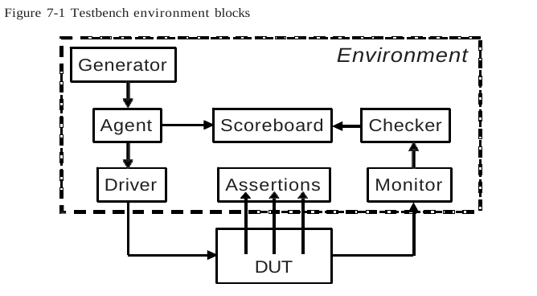
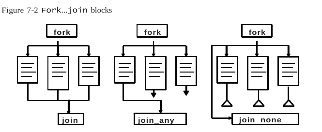
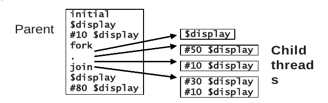

# Threads and interprocess comunication (IPC)

En **SystemVerilog**, los **threads** y la **comunicación entre procesos** juegan un papel clave en la creación de simulaciones complejas donde varios procesos deben ejecutarse de manera simultánea o coordinada. Los threads permiten dividir el flujo de ejecución en múltiples hilos concurrentes, lo que es especialmente útil cuando se quieren generar múltiples estímulos o realizar tareas en paralelo dentro de un testbench.

Además de la ejecución simultánea, SystemVerilog también proporciona herramientas para **sincronizar y coordinar** la interacción entre estos procesos concurrentes. Los **semáforos** son útiles para controlar el acceso a recursos compartidos, permitiendo que solo un número limitado de procesos acceda a ellos al mismo tiempo. Las **mailboxes** actúan como colas donde los procesos pueden intercambiar mensajes, facilitando la comunicación entre ellos. Finalmente, los **eventos** permiten que un proceso "espere" una señal de otro proceso antes de proceder, asegurando que las tareas se ejecuten en el orden deseado.




## a. Threads

SystemVerilog introduce dos nuevas variantes para crear hilos: **fork...join_none** y **fork...join_any**, como se ilustra en la siguiente figura.

El **testbench** utiliza una combinación de constructos tradicionales, como **events**, **@ event control**, y las declaraciones **wait** y **disable**, junto con nuevas características del lenguaje, como **semaphores** y **mailboxes**, para comunicar, sincronizar y gestionar estos hilos de manera efectiva.




### a.1 Uso de fork...join y begin...

Este bloque de código muestra cómo se utiliza la estructura **`fork...join`** en **SystemVerilog** para ejecutar varias partes del código en paralelo, mientras que otras partes se ejecutan de manera secuencial.

```verilog
Ejemplo 7.2
initial begin
    $display("@%0t: start fork...join example", $time);
    #10 $display("@%0t: sequential after #10", $time);
    fork
        $display("@%0t: parallel start", $time);
        #50 $display("@%0t: parallel after #50", $time);
        #10 $display("@%0t: parallel after #10", $time);
    begin
        #30 $display("@%0t: sequential after #30", $time);
        #10 $display("@%0t: sequential after #10", $time);
    end
    join
    $display("@%0t: after join", $time);
    #80 $display("@%0t: finish after #80", $time);
end
```
Salida del ejempo 7.2
~~~bash
# Sample 7.2 Output from begin...end and fork...join

@0: start fork...join example
@10: sequential after #10
@10: parallel start
@20: parallel after #10
@40: sequential after #30
@50: sequential after #10
@60: parallel after #50
@60: after join
@140: finish after #80
~~~

#### Explicación detallada del código:

1. **Inicio del bloque `initial`**:
   El código comienza con una instrucción `initial`, lo que significa que se ejecutará al inicio de la simulación.

2. **Ejecución secuencial antes del `fork...join`**:
   ```verilog
   $display("@%0t: start fork...join example", $time);
   #10 $display("@%0t: sequential after #10", $time);
   ```
   Aquí, se imprime el tiempo de simulación actual (`$time`) al inicio. Luego, se espera un retraso de 10 unidades de tiempo (`#10`), después de lo cual se imprime otro mensaje indicando que ha pasado el retraso de 10 unidades de tiempo.

3. **Inicio del bloque `fork...join`**:
   Después de la parte secuencial, se inicia un bloque **`fork...join`**, lo que permite que las siguientes declaraciones se ejecuten en **paralelo**:
   ```verilog
   fork
      $display("@%0t: parallel start", $time);
      #50 $display("@%0t: parallel after #50", $time);
      #10 $display("@%0t: parallel after #10", $time);
   begin
      #30 $display("@%0t: sequential after #30", $time);
      #10 $display("@%0t: sequential after #10", $time);
   end
   join
   ```

   En este bloque:
   - El primer mensaje se imprime inmediatamente: `"parallel start"`.
   - Luego, los hilos paralelos ejecutan sus retrasos y mensajes de forma concurrente:
     - Uno espera 50 unidades de tiempo antes de imprimir `"parallel after #50"`.
     - Otro espera 10 unidades de tiempo antes de imprimir `"parallel after #10"`.
     - También hay un bloque `begin...end` que se ejecuta de manera secuencial dentro del bloque paralelo, esperando 30 unidades de tiempo antes de imprimir `"sequential after #30"`, y luego espera 10 unidades más.

4. **Ejecución secuencial después del `join`**:
   Después de que todos los hilos paralelos dentro del bloque `fork...join` han terminado, el código secuencial fuera del bloque continúa:
   ```verilog
   $display("@%0t: after join", $time);
   #80 $display("@%0t: finish after #80", $time);
   ```
   Aquí se imprime `"after join"`, seguido de un retraso de 80 unidades de tiempo y el mensaje `"finish after #80"`.

#### Ejecución de la simulación:

- El bloque paralelo comenzará a ejecutarse inmediatamente, mientras que cada hilo esperará su propio retraso.
- Las declaraciones dentro del bloque `fork...join` se ejecutan simultáneamente, por lo que los tiempos de ejecución dependerán de las diferentes esperas (`#50`, `#10`, etc.).
- Una vez que el último hilo del bloque `fork...join` ha terminado, se ejecutará el código secuencial posterior.

#### Resumen:
- **`fork...join`** permite la ejecución concurrente de múltiples hilos.
- **Bloques secuenciales** dentro de `fork...join` pueden ejecutarse de manera organizada, aunque estén contenidos en un hilo paralelo.
  
Este enfoque es útil cuando se necesita generar múltiples señales o estímulos en paralelo para el diseño, asegurando que ciertos eventos ocurran de forma simultánea.




### a.2 Generación de hilos con fork...join_none

Un bloque **fork...join_none** programa cada declaración en el bloque, pero la ejecución continúa en el hilo principal.

Aquí tienes la versión con subtítulos utilizando `####` en lugar de `###`:

#### Explicación detallada del código:

1. **Inicio del bloque `initial`**:
   El código comienza con una instrucción `initial`, por lo que se ejecuta al inicio de la simulación:
   ```verilog
   $display("@%0t: start fork...join_none example", $time);
   #10 $display("@%0t: sequential after #10", $time);
   ```
   - Se imprime el tiempo de simulación actual (`$time`) indicando el inicio del ejemplo.
   - Luego hay un retraso de 10 unidades de tiempo (`#10`), seguido de otro mensaje.

2. **Inicio del bloque `fork...join_none`**:
   A continuación, se ejecuta el bloque **`fork...join_none`**:
   ```verilog
   fork
      $display("@%0t: parallel start", $time);
      #50 $display("@%0t: parallel after #50", $time);
      #10 $display("@%0t: parallel after #10", $time);
   begin
      #30 $display("@%0t: sequential after #30", $time);
      #10 $display("@%0t: sequential after #10", $time);
   end
   join_none
   ```
   - Dentro de este bloque, las declaraciones se ejecutan en paralelo. Específicamente, un hilo imprime un mensaje inmediatamente (`"parallel start"`) y los otros dos esperan diferentes tiempos (`#50` y `#10` respectivamente) antes de imprimir sus propios mensajes.
   - Un bloque adicional `begin...end` dentro del `fork` se ejecuta de manera secuencial: primero espera 30 unidades de tiempo y luego 10 unidades adicionales.

   Lo clave aquí es que **el bloque `fork` crea hilos en paralelo, pero el hilo principal no espera a que esos hilos terminen debido al uso de `join_none`**.

3. **Ejecución secuencial después de `join_none`**:
   Tras el bloque `fork...join_none`, el código del hilo principal continúa inmediatamente:
   ```verilog
   $display("@%0t: after join_none", $time);
   #80 $display("@%0t: finish after #80", $time);
   ```
   - Se imprime `"after join_none"` al mismo tiempo que las instrucciones paralelas se están ejecutando, es decir, el hilo principal no espera a que los hilos paralelos terminen.
   - Luego, hay un retraso de 80 unidades de tiempo antes de imprimir el mensaje final `"finish after #80"`.

#### Ejecución de la simulación:

- A diferencia de **`fork...join`**, donde el hilo principal esperaría a que todos los hilos paralelos terminen, con **`fork...join_none`** el hilo principal continúa inmediatamente.
- Esto provoca que el mensaje `"after join_none"` se imprima **antes** que los mensajes generados por las declaraciones paralelas.

#### Salida esperada (Sample 7.4):

```bash
@0: start fork...join_none example
@10: sequential after #10
@10: after join_none
@10: parallel start
@20: parallel after #10
@40: sequential after #30
@50: sequential after #10
@60: parallel after #50
@90: finish after #80
```

#### Resumen:

- **`fork...join_none`** permite crear hilos paralelos sin que el hilo principal espere a que estos hilos finalicen.
- **El hilo principal continúa su ejecución inmediatamente**, lo que significa que las instrucciones después de `join_none` se ejecutan en paralelo con las instrucciones dentro del bloque `fork`.
- En el ejemplo, el mensaje `"after join_none"` se imprime antes de que cualquier mensaje dentro del bloque `fork` (con la excepción del mensaje `"parallel start"`, que se imprime inmediatamente).

Este enfoque es útil cuando quieres lanzar tareas en paralelo pero no necesitas que el flujo principal de tu testbench se detenga hasta que esas tareas terminen.


### a.3 Sincronizar hilos con for...join_any

Un bloque fork...join_any programa cada declaración en el bloque. Luego, cuando la primera declaración se completa, la ejecución continúa en el hilo principal.

El ejemplo de **`fork...join_any`** ilustra cómo SystemVerilog maneja la ejecución concurrente de múltiples hilos en paralelo, pero en este caso el hilo principal se detiene **solo hasta que uno de los hilos paralelos termina**, en lugar de esperar a que todos finalicen, como ocurre con `fork...join`.

#### Descripción paso a paso del código:

1. **Inicio del bloque `initial`**:
   El bloque comienza con una serie de declaraciones secuenciales:
   ```verilog
   $display("@%0t: start fork...join_any example", $time);
   #10 $display("@%0t: sequential after #10", $time);
   ```
   - Imprime el mensaje de inicio y el tiempo actual (`$time`), indicando el comienzo de la simulación.
   - Luego, hay un retraso de 10 unidades de tiempo antes de imprimir `"sequential after #10"`.

2. **Inicio del bloque `fork...join_any`**:
   Dentro del bloque `fork`, se crean múltiples hilos que se ejecutan en paralelo:
   ```verilog
   fork
      $display("@%0t: parallel start", $time);
      #50 $display("@%0t: parallel after #50", $time);
      #10 $display("@%0t: parallel after #10", $time);
   begin
      #30 $display("@%0t: sequential after #30", $time);
      #10 $display("@%0t: sequential after #10", $time);
   end
   join_any
   ```
   - El primer hilo imprime el mensaje `"parallel start"` inmediatamente.
   - El segundo y tercer hilo tienen retardos de 50 y 10 unidades de tiempo respectivamente antes de imprimir sus mensajes.
   - El bloque `begin...end` se ejecuta secuencialmente, esperando 30 unidades de tiempo antes de imprimir su primer mensaje y luego 10 unidades más para el segundo mensaje.

   **`join_any`** asegura que el hilo principal se detiene **solo hasta que uno de los hilos paralelos ha terminado**. Después, el hilo principal continúa su ejecución.

3. **Continuación del hilo principal después de `join_any`**:
   Una vez que uno de los hilos del bloque paralelo se completa, el hilo principal continúa inmediatamente:
   ```verilog
   $display("@%0t: after join_any", $time);
   #80 $display("@%0t: finish after #80", $time);
   ```
   - Se imprime `"after join_any"` tan pronto como uno de los hilos paralelos haya finalizado.
   - Luego, el hilo principal espera 80 unidades de tiempo y finaliza con el mensaje `"finish after #80"`.

#### Salida esperada:

El comportamiento del código se puede entender mejor con la salida proporcionada en el **Sample 7.6**:

```
@0: start fork...join_any example
@10: sequential after #10
@10: parallel start
@10: after join_any
@20: parallel after #10
@40: sequential after #30
@50: sequential after #10
@60: parallel after #50
@90: finish after #80
```

#### Explicación de la salida:

- El primer mensaje `"start fork...join_any example"` se imprime en el tiempo `0`.
- Luego, después de un retraso de 10 unidades de tiempo, se imprime `"sequential after #10"` en el tiempo `10`.
- Inmediatamente después, los hilos paralelos comienzan a ejecutarse y se imprime `"parallel start"` también en el tiempo `10`.
- En este caso, el hilo que tiene un retraso de 10 unidades de tiempo (`#10`) es el primero en completarse, por lo que la instrucción después de `join_any` se ejecuta en ese mismo instante, imprimiendo `"after join_any"` en el tiempo `10`.
- El hilo que espera 10 unidades de tiempo imprime `"parallel after #10"` en el tiempo `20`.
- El bloque secuencial comienza a imprimir después de 30 unidades de tiempo, mostrando `"sequential after #30"` en el tiempo `40`.
- Posteriormente, el siguiente mensaje `"sequential after #10"` se imprime en el tiempo `50`.
- Finalmente, el último hilo paralelo imprime `"parallel after #50"` en el tiempo `60`, y después de un retraso adicional de 80 unidades de tiempo, el mensaje final `"finish after #80"` se muestra en el tiempo `90`.

#### Resumen:

- **`fork...join_any`** permite que el hilo principal continúe tan pronto como **cualquiera** de los hilos paralelos haya terminado, sin esperar a que todos terminen.
- En este ejemplo, el hilo principal continuó en el tiempo `10`, inmediatamente después de que el hilo con un retraso de `#10` unidades de tiempo terminó.
- Esto es útil cuando deseas que la ejecución principal siga su curso tan pronto como se complete al menos una de las tareas paralelas.


### a.4 Creando trheads en Clases

#### Explicación del uso de `fork...join_none` en el transactor

En este ejemplo, se utiliza un **`fork...join_none`** para iniciar un hilo que genera N paquetes de datos de manera concurrente sin bloquear el flujo principal del código. Este patrón es común en bancos de pruebas donde los **transactores** (como generadores, controladores, monitores) deben ejecutarse en paralelo. El código ilustra cómo se separa la creación del objeto del transactor del inicio de su ejecución.

El ejemplo utiliza una clase **`Gen_drive`** que tiene una tarea llamada `run` para generar los paquetes. La ejecución de esta tarea ocurre de manera concurrente, permitiendo que otras partes del banco de pruebas se ejecuten simultáneamente.

#### Código formateado

```verilog
// Ejemplo 7.7 Clase generador / driver con un run task

class Gen_drive;
    // Transactor que crea N paquetes
    task run(int n);
        Packet p;
        fork
            repeat (n) begin
                p = new();
                assert(p.randomize());
                transmit(p);
            end
        join_none
        // Se usa fork-join_none para que run() no bloquee
    endtask

    task transmit(input Packet p);
        // Código de transmisión...
    endtask
endclass

Gen_drive gen;

initial begin
    gen = new();
    gen.run(10);
    // Iniciar checker, monitor, y otros hilos
    ...
end
```

#### Explicación paso a paso

1. **Clase `Gen_drive`**:  
   Es la clase que define un transactor para generar y transmitir paquetes de datos. No inicia ningún proceso automáticamente en su constructor.

2. **Tarea `run`**:
   - Esta tarea toma como argumento un número `n` que indica cuántos paquetes se deben generar.
   - Se utiliza un bloque **`fork...join_none`** para que los paquetes se generen y transmitan en paralelo, sin bloquear el hilo principal.
   - La estructura `repeat(n)` asegura que se crean `n` paquetes, y cada uno se instancia con `new()`, luego se aleatorizan usando `randomize()` y finalmente se transmiten con la tarea `transmit`.

3. **Tarea `transmit`**:  
   Es la tarea que realiza la transmisión del paquete. El código específico de la transmisión se omite en este ejemplo.

4. **Inicialización y ejecución**:
   - En el bloque `initial`, se crea una instancia del generador `gen = new();` y luego se llama a la tarea `run(10)` para generar 10 paquetes.
   - La ejecución del transactor es concurrente gracias al uso de **`fork...join_none`**, lo que permite que otros componentes como el checker, monitor y otros hilos en el banco de pruebas también se ejecuten al mismo tiempo.

#### Detalles importantes

1. **Separación del constructor y la ejecución**:
   - El transactor **no se inicia en el constructor**. El propósito del constructor es simplemente inicializar variables. La separación entre la inicialización y la ejecución del transactor permite flexibilidad, como modificar variables o insertar errores antes de comenzar la generación de paquetes.

2. **Uso de `fork...join_none`**:
   - El uso de **`fork...join_none`** asegura que la tarea `run` no bloquee la ejecución del hilo principal, permitiendo que otros hilos del banco de pruebas continúen su ejecución en paralelo.
   
3. **Modularidad**:
   - Cada componente del banco de pruebas, como el generador, el monitor y el checker, se ejecuta de manera independiente en sus propios hilos. Esto permite probar y simular diferentes partes del diseño en paralelo, aumentando la eficiencia del testbench.

Este enfoque es ideal para simulaciones complejas donde se necesita ejecutar múltiples procesos de manera concurrente, asegurando que el flujo principal no se bloquee por la ejecución de tareas individuales.

### a.5 Threads dinámicos

El siguiente código ejemplifica cómo crear hilos dinámicamente en SystemVerilog utilizando bloques **`fork...join_none`**. En este caso, se crea un nuevo hilo cada vez que se llama a la tarea **`check_trans`**, la cual verifica si una transacción aleatoria coincide con una dirección en la **DUT (Device Under Test)**. 

Se utiliza un programa con la palabra clave **`automatic`**, lo que permite que las variables sean locales a cada instancia de la tarea y no compartidas entre diferentes ejecuciones. Esto es esencial para crear hilos dinámicos sin interferencias entre ellos.

~~~verilog
// Ejemplo 7.5 Creación de hilos dinámicos

program automatic test(bus_ifc.TB bus);
    // Código para la interfaz no mostrado
    
    task check_trans(Transaction tr);
        fork
            begin
                wait (bus.cb.addr == tr.addr);
                $display("@%0t: Addr match %d", $time, tr.addr);
            end
        join_none
    endtask

    Transaction tr;

    initial begin
        repeat (10) begin
            // Crear una transacción aleatoria
            tr = new();
            assert(tr.randomize());
            
            // Enviar transacción a la DUT
            transmit(tr); // Tarea no mostrada

            // Esperar la respuesta de la DUT
            check_trans(tr);
        end
        #100; // Esperar a que la última transacción termine
    end
endprogram
~~~

#### Explicación paso a paso

1. **Programa `test`**:
   - Se declara un programa automático llamado **`test`** que está asociado a la interfaz **`bus_ifc.TB`**, que representa el entorno de prueba de la DUT. Aquí, el código de la interfaz no se muestra, pero se presupone que tiene un campo `addr` que será verificado.

2. **Tarea `check_trans`**:
   - La tarea **`check_trans`** crea un nuevo hilo dinámico utilizando un bloque **`fork...join_none`**, lo que permite que se ejecute en paralelo sin bloquear el flujo principal.
   - En este hilo, se espera que la dirección del bus coincida con la dirección de la transacción **`tr.addr`**. Cuando ocurre una coincidencia, se muestra un mensaje en el simulador con la dirección y el tiempo de simulación.

3. **Tarea principal (`initial`)**:
   - En el bloque **`initial`**, se crea y se envía una transacción aleatoria a la DUT en cada iteración del ciclo **`repeat (10)`**.
   - Después de enviar la transacción con la tarea **`transmit`** (no mostrada), se llama a **`check_trans`** para verificar si la transacción fue recibida correctamente.
   - El proceso se repite 10 veces, creando una nueva transacción y verificándola cada vez.

4. **Esperar a la finalización**:
   - Después de procesar todas las transacciones, el código espera 100 unidades de tiempo para asegurarse de que la última transacción se complete antes de finalizar la simulación.

#### Uso de `fork...join_none`

- La clave del ejemplo es el uso de **`fork...join_none`** en la tarea **`check_trans`**, lo que permite que las verificaciones de las transacciones se ejecuten en paralelo. Esto es útil en simulaciones donde varias transacciones deben procesarse simultáneamente sin bloquear la ejecución de otras tareas.

Este patrón es fundamental en sistemas de prueba que simulan la concurrencia y permiten verificar múltiples eventos paralelos en tiempo de simulación, como ocurre en interfaces de bus o sistemas que manejan varias transacciones a la vez.


### a.6 Variables automáticas en threads

Un problema común pero sutil en la programación concurrente es no guardar el valor de las variables antes de cada iteración del bucle que crea hilos. Esto puede causar que varios hilos compartan la misma variable, lo que lleva a resultados inesperados. En SystemVerilog, el uso de variables automáticas es crucial para evitar este problema y garantizar que cada hilo trabaje con una copia independiente de la variable.

#### Ejemplo 7.9: Fork...join_none Dentro de un Bucle

El siguiente ejemplo muestra un caso en el que un bloque **`fork...join_none`** se usa dentro de un bucle **`for`**:

~~~verilog
// Ejemplo 7.9 
program no_auto;
    initial begin
        for (int j=0; j<3; j++)
            fork
                $write(j); // Error - imprime el valor final del índice
            join_none
        #0 $display("\n");
    end
endprogram
~~~

En este código, el bucle **`for`** crea múltiples hilos usando **`fork...join_none`**. Sin embargo, todos los hilos que se inician dentro del bucle usan la misma variable `j`. Debido a que el retraso **`#0`** hace que el hilo principal se reprograma para que comience más tarde, los hilos creados en el **`fork...join_none`** usan el valor final de `j` después de que el bucle ha terminado, lo que lleva a que todos los hilos impriman el mismo valor.

#### Ejemplo 7.10: Ejecución del Fork...join_none Dentro de un Bucle

El siguiente ejemplo muestra la salida del código anterior:

~~~bash
# Ejemplo 7.10
j Statement
0 for (j=0; ...
0 spawn $write(j) [thread 0]
1 j++             j=1
1 Spawn $write(j) [thread 1]
2 j++             j=2
2 Spawn $write(j) [thread 2]
3 j++             j=3
3 join_none
3 #0
3 $write(j)       [thread 0: j=3]
3 $write(j)       [thread 1: j=3]
3 $write(j)       [thread 2: j=3]
3 $display(\n)
~~~

El retraso **`#0`** en el hilo principal hace que el hilo actual se reprograma para el final del intervalo de tiempo actual. Por lo tanto, los hilos que se crean en el **`fork...join_none`** imprimen el valor final de `j` (que es 3) en lugar del valor que tenían durante la iteración del bucle.

#### Ejemplo 7.11: Uso de Variables Automáticas en Fork...join_none

Para evitar el problema descrito anteriormente, se debe usar la palabra clave **`automatic`** para garantizar que cada hilo tenga su propia copia de la variable. El siguiente código muestra cómo hacerlo correctamente:

~~~verilog
// Ejemplo 7.11
initial begin
    for (int j=0; j<3; j++)
        fork
            automatic int k = j;
            $write(k);
        join_none
    #0 $display;
end
~~~

En este ejemplo, cada iteración del bucle **`for`** crea una nueva variable **`k`** que se inicializa con el valor de `j`. De esta manera, cada hilo que se crea tiene su propia copia independiente de **`k`**, lo que evita que los hilos compartan y sobrescriban el mismo valor.

#### Ejemplo 7.12: Ejecución del Código con Variables Automáticas

El siguiente código muestra cómo se ejecutan las variables automáticas:

~~~verilog
# Ejemplo 7.12
j k0 k1 k2 Statement
0       for (j=0; ...
0 0     Crear k0, iniciar $write(k) [hilo 0]
1 0     j++
1 0 1   Crear k1, iniciar $write(k) [hilo 1]
2 0 1   j++
2 0 1 2 Crear k2, iniciar $write(k) [hilo 2]
3 0 1 2 j<3
3 0 1 2 join_none
3 0 1 2 #0
3 0 1 2 $write(k0)  [hilo 0]
3 0 1 2 $write(k1)  [hilo 1]
3 0 1 2 $write(k2)  [hilo 2]
3 0 1 2 $display("\n")
~~~

Cada hilo recibe una copia independiente de la variable **`k`** con el valor del índice en el momento de la creación del hilo, asegurando que el valor impreso sea el esperado.

#### Ejemplo 7.13: Variables Automáticas Sin Palabra Clave

Si el código está en un **`program`** o **`module`** que usa almacenamiento automático, no es necesario usar la palabra clave **`automatic`**. El siguiente ejemplo muestra cómo declarar la variable fuera del **`fork...join_none`** para lograr el mismo resultado:

~~~verilog
// Ejemplo 7.13
program automatic bug_free;
    initial begin
        for (int j=0; j<3; j++) begin
            int k = j; // Hacer una copia del índice
            fork
                $write(k); // Imprimir copia
            join_none
        end
        #0 $display;
    end
endprogram
~~~

En este caso, al declarar **`int k = j;`** dentro del bloque del bucle **`for`**, cada iteración crea una nueva copia de la variable **`k`**, que se utiliza en el **`fork...join_none`**.

En resumen, para evitar errores en la creación dinámica de hilos, siempre usa variables automáticas cuando trabajes con **`fork...join_none`** dentro de bucles o en contextos concurrentes. Esto garantiza que cada hilo tenga su propia copia independiente de las variables, evitando resultados inesperados.


### a.7 Esperando a que todos los hilos creados se terminen

En SystemVerilog, cuando todos los bloques **`initial`** en un **`program`** han terminado, la simulación se detiene automáticamente. Sin embargo, si tienes hilos que se han creado y podrían seguir ejecutándose después de que los bloques **`initial`** han finalizado, necesitas asegurarte de que estos hilos terminen antes de finalizar la simulación. Para hacer esto, puedes usar la declaración **`wait fork`**.

#### Ejemplo 7.14: Uso de wait fork para Esperar a que Terminen los Hilos Hijos

El siguiente ejemplo muestra cómo puedes usar **`wait fork`** para esperar a que todos los hilos creados en un bloque **`fork...join_none`** terminen antes de continuar o finalizar la simulación.

~~~verilog
// Ejemplo 7.14

task run_threads;               // Crear algunas transacciones
    fork    
        check_trans(tr1);   // Iniciar el primer hilo
        check_trans(tr2);   // Iniciar el segundo hilo
        check_trans(tr3);   // Iniciar el tercer hilo
    join_none
    ...                     // Realizar otro trabajo
    
    // Ahora esperar a que terminen los hilos anteriores
    wait fork;
endtask
~~~

#### Explicación del Código

1. **Creación de Hilos**:
   - Dentro del bloque **`fork`**, se crean tres hilos que ejecutan la tarea **`check_trans`** con diferentes transacciones (**`tr1`**, **`tr2`**, **`tr3`**).
   - **`fork`** y **`join_none`** permiten que estos hilos se ejecuten en paralelo sin bloquear el hilo principal. 

2. **Esperar a que Terminen los Hilos**:
   - La declaración **`wait fork;`** se usa para esperar a que todos los hilos creados por el bloque **`fork`** terminen su ejecución.
   - **`wait fork`** asegura que el código después de esta declaración no se ejecute hasta que todos los hilos hijos hayan terminado.

3. **Otro Trabajo**:
   - Puedes realizar otras tareas en el hilo principal mientras los hilos creados continúan su ejecución.
   - Una vez que hayas terminado el trabajo adicional, **`wait fork`** garantiza que esperes a que los hilos en paralelo completen antes de finalizar la tarea o continuar con la ejecución del testbench.

#### Importancia de `wait fork`

- **`wait fork`** es crucial en situaciones donde necesitas asegurarte de que todos los hilos que has creado hayan terminado su trabajo antes de continuar o finalizar la simulación.
- Esto es especialmente útil en entornos de verificación y en simulaciones complejas donde múltiples hilos están realizando operaciones que deben completarse para que la simulación sea precisa y completa.

En resumen, usar **`wait fork`** es una técnica útil para coordinar la finalización de múltiples hilos en una simulación de SystemVerilog, asegurando que todos los procesos concurrentes terminen antes de que la simulación se cierre o pase al siguiente estado.


### a.8 Compartiendo variables a través de threads

En SystemVerilog, cuando se trabaja con hilos concurrentes, es fundamental tener cuidado con el uso de variables para evitar errores sutiles. Esto se debe a que las variables en SystemVerilog pueden ser compartidas entre diferentes hilos si no se declaran correctamente en el ámbito más restringido.

#### Ejemplo 7.15: Error por Uso Compartido de Variables del Programa

El siguiente ejemplo ilustra un problema común que ocurre cuando una variable no se declara en el ámbito correcto, lo que resulta en que diferentes partes del código compartan inadvertidamente la misma variable.

~~~verilog
// Ejemplo 7.15
program bug;
    class Buggy;
        int data[10];
        task transmit;
            fork
                for (i=0; i<10; i++)
                    // i no está declarada aquí
                    send(data[i]);
            join_none
        endtask
    endclass

    int i; // Variable global en el programa
    Buggy b;
    event receive;

    // Variable i del nivel del programa, compartida
    initial begin
        b = new();
        for (i=0; i<10; i++)
            b.data[i] = i;
        b.transmit();

        // i no está declarada aquí
        for (i=0; i<10; i++)
            // i no está declarada aquí
            @(receive) $display(b.data[i]);
    end
endprogram
~~~

#### Explicación del Código

1. **Variables Globales y Locales**:
   - En el ejemplo, hay una variable global **`i`** definida en el nivel del programa **`bug`**.
   - La clase **`Buggy`** tiene un método **`transmit`** que usa una variable **`i`** en un bucle **`for`**.

2. **Uso de la Variable Global**:
   - Dentro de la clase **`Buggy`**, el bucle **`for`** en el método **`transmit`** usa **`i`** sin declararla localmente.
   - Debido a que **`i`** no está declarada en el ámbito de **`transmit`**, el compilador buscará **`i`** en ámbitos superiores, encontrando la **`i`** global del programa.

3. **Problemas con la Variable Compartida**:
   - Cuando el programa ejecuta el bucle **`for`** dentro del método **`transmit`**, **`i`** es la variable global compartida. Esto puede causar conflictos si dos hilos intentan modificar **`i`** al mismo tiempo.
   - El segundo bucle **`for`** en el bloque **`initial`** también usa la variable global **`i`**, lo que podría resultar en comportamientos inesperados si **`transmit`** está en ejecución.

#### Solución

Para evitar problemas de compartición de variables y errores sutiles:

1. **Declara Variables Locales en el Ámbito Correcto**:
   - Siempre declara variables en el ámbito más pequeño posible que abarque todos los usos de la variable. Por ejemplo, en el contexto de un bucle **`for`**, declara la variable de índice dentro del bucle.

2. **Uso de `foreach`**:
   - Utiliza la declaración **`foreach`** siempre que sea posible para iterar sobre arrays. **`foreach`** maneja automáticamente el ámbito de las variables de índice, evitando problemas con variables globales.

   Ejemplo usando `foreach`:
   ~~~verilog
   task transmit;
       fork
           foreach (data[i]) begin
               send(data[i]);
           end
       join_none
   endtask
   ~~~

En resumen, para evitar problemas con variables compartidas en hilos concurrentes, siempre declara variables en el ámbito más local posible y utiliza herramientas como **`foreach`** para iteraciones sobre arrays. Esto asegura que cada hilo tenga su propia copia de la variable y evita conflictos inesperados.


## b. Deshabilitando threads

La declaración **disable** de Verilog funciona en los hilos de SystemVerilog. Como su nombre lo indica, deshabilita el hilo.


### b.1 Deshabilitando un solo thread

**Descripción de la Estrategia de Vigilancia con Tiempo de Espera**

En el siguiente ejemplo 7.16 la tarea **`check_trans`** permite monitorear una condición mientras se ejecuta otro hilo en paralelo que actúa como un temporizador. La idea es que si se cumple una condición antes de que expire el tiempo de espera, se imprime un mensaje. De lo contrario, se dispara un error por tiempo excedido.

Este tipo de estructura es útil cuando se quiere observar alguna condición que puede ocurrir en un tiempo variable (por ejemplo, esperar a que una dirección del bus coincida con un valor específico), pero se necesita asegurar de que no se espere indefinidamente. Si la condición no se cumple dentro de un tiempo límite, se debe emitir una advertencia o error.

~~~verilog
// Ejemplo 7.16
parameter TIME_OUT = 1000;  // Define el tiempo máximo de espera
task check_trans(Transaction tr);  // Tarea para verificar la transacción
    fork
        begin
            // Bloque para esperar la respuesta o un tiempo máximo
            fork : timeout_block  // Bloque etiquetado
                begin
                    // Espera a que la dirección del bus coincida con la dirección de la transacción
                    wait (bus.cb.addr == tr.addr);
                    $display("@%0t: Addr match %d", $time, tr.addr);
                end
                
                // Hilo paralelo que genera un retraso (actúa como temporizador)
                #TIME_OUT $display("@%0t: Error: timeout", $time);
            join_any  // El join_any permite que cualquiera de los hilos termine y procede a la siguiente instrucción
            
            disable timeout_block;  // Detiene el otro hilo que aún esté activo
        end
    join_none  // Continúa sin esperar a que los hilos terminen
endtask
~~~

**Explicación Paso a Paso**

1. **Parámetro de Tiempo Máximo**:
   - **`TIME_OUT = 1000`** establece el tiempo máximo de espera en unidades de tiempo de simulación. Esto define cuánto tiempo esperamos antes de considerar que ha ocurrido un error de tiempo excedido.

2. **Inicio de la Tarea `check_trans`**:
   - La tarea **`check_trans`** se inicia con un bloque **`fork`**, lo que significa que varias actividades pueden ejecutarse en paralelo.

3. **Bloque `fork` con Etiqueta**:
   - Se crea un bloque etiquetado **`timeout_block`** que contiene dos hilos:
     - El **primer hilo** espera a que la dirección del bus (`bus.cb.addr`) coincida con la dirección de la transacción (`tr.addr`). Si la condición se cumple, se imprime un mensaje indicando la coincidencia de direcciones.
     - El **segundo hilo** es un temporizador que espera el tiempo máximo definido por **`TIME_OUT`**. Si se alcanza el tiempo límite antes de que el primer hilo se complete, se imprime un mensaje de error por tiempo excedido.

4. **`join_any`**:
   - La construcción **`join_any`** asegura que tan pronto como uno de los dos hilos (el de la coincidencia de direcciones o el temporizador) finalice, el programa continúa a la siguiente instrucción. No es necesario que ambos hilos terminen.

5. **`disable timeout_block`**:
   - Después de que uno de los hilos finalice, la declaración **`disable timeout_block`** desactiva el bloque etiquetado **`timeout_block`**, lo que mata el otro hilo si todavía está en ejecución. Si el hilo que verifica la coincidencia de direcciones termina primero, el hilo del temporizador será desactivado; si el temporizador termina primero, el hilo que espera la coincidencia será desactivado.

6. **`join_none`**:
   - La construcción **`join_none`** significa que la tarea continuará sin esperar a que los hilos en el bloque **`fork`** principal terminen.

**Comportamiento del Código**

- **Si la dirección del bus coincide con la dirección de la transacción antes de que el tiempo máximo se cumpla**:
  - Se imprime el mensaje de coincidencia de direcciones, se ejecuta **`join_any`** y el hilo del temporizador es desactivado.
  
- **Si el tiempo máximo se cumple antes de que la dirección del bus coincida**:
  - Se imprime un mensaje de error por tiempo excedido, **`join_any`** se ejecuta y el hilo que espera la coincidencia de direcciones es desactivado.

### b.2 Deshabilitando múltiples threads con `disable fork`

SystemVerilog introduce la declaración **`disable fork`**, que permite detener todos los hilos hijos creados desde el hilo actual. Sin embargo, es importante tener cuidado al usarlo, ya que podría detener más hilos de los que deseas, incluidos los que han sido creados dentro de tareas o funciones en curso.

Para evitar esto, se recomienda **limitar el alcance de la declaración `disable fork`** rodeando los bloques de código objetivo con un **`fork...join`**, de manera que la desactivación solo afecte a los hilos creados dentro de ese bloque específico.

En el siguiente **Ejemplo 7.17**, se muestra cómo limitar el alcance del `disable fork` para que solo afecte a un conjunto específico de hilos (threads) creados en un bloque.

~~~verilog
// Ejemplo 7.17
initial begin
    check_trans(tr0);  // Hilo 0
    // Crear un fork...join para limitar el alcance del disable fork
    fork
        // Hilo 1
        begin
            check_trans(tr1);  // Hilo 2
            // Otro fork...join para crear más hilos
            fork
                check_trans(tr2);  // Hilo 3
            join  // Hilos 2 y 3 finalizan aquí
            // Después de un tiempo, desactivar los hilos 1-4
            #(TIME_OUT/2) disable fork;
        end
    join  // Finaliza el bloque de hilos
end
~~~

#### Explicación:

1. **Hilo 0**: Se llama a la tarea **`check_trans(tr0)`**, que ejecuta el hilo principal fuera del bloque **`fork...join`**, lo que significa que no será afectado por el `disable fork`.

2. **Hilo 1**: Dentro de un bloque **`fork...join`**, se crea un nuevo hilo que ejecuta **`check_trans(tr1)`**.

3. **Hilo 2**: Dentro de **Hilo 1**, se crea otro bloque **`fork...join`** que inicia el hilo **`check_trans(tr2)`**, junto con otros hilos adicionales.

4. **`disable fork`**: Después de un retraso de **`TIME_OUT/2`**, la declaración **`disable fork`** detiene todos los hilos hijos de **Hilo 1** y sus descendientes (Hilos 2 y 3). Sin embargo, **Hilo 0** permanece intacto porque está fuera del alcance del **`fork...join`** que contiene el `disable fork`.

Este ejemplo asegura que solo los hilos dentro del bloque afectado por **`fork...join`** sean desactivados, dejando el hilo inicial intacto.

#### **Uso de Etiquetas para Desactivar Hilos Específicos**

En el siguiente **Ejemplo 7.18**, se introduce una manera más controlada y robusta de desactivar hilos específicos mediante el uso de **etiquetas** (labels). Esto proporciona un control más preciso sobre qué hilos deseas detener, evitando posibles problemas al desactivar más hilos de los deseados.

~~~verilog
// Ejemplo 7.18: Desactivar hilos usando etiquetas
initial begin
    check_trans(tr0);  // Hilo 0
    fork
        // Hilo 1
        begin : threads_inner  // Etiqueta para identificar este bloque
            check_trans(tr1);  // Hilo 2
            check_trans(tr2);  // Hilo 3
        end
    // Después de un tiempo, desactivar los hilos etiquetados
    #(TIME_OUT/2) disable threads_inner;
    join
end
~~~

#### Explicación:

1. **Hilo 0**: Similar al ejemplo anterior, el hilo **`check_trans(tr0)`** se ejecuta fuera del bloque etiquetado, por lo que no será afectado por el `disable`.

2. **Etiqueta `threads_inner`**: El bloque que contiene **`check_trans(tr1)`** y **`check_trans(tr2)`** está etiquetado como **`threads_inner`**, lo que significa que podemos referirnos específicamente a este bloque para desactivar sus hilos.

3. **`disable threads_inner`**: Después de un retraso, se llama a **`disable threads_inner`**, que detiene específicamente los hilos creados dentro del bloque etiquetado. Esto garantiza que solo los hilos **Hilo 2** y **Hilo 3** sean desactivados, dejando **Hilo 0** intacto.

### Consideraciones Adicionales:

- Desactivar hilos de manera asíncrona puede causar comportamientos inesperados, ya que los hilos pueden detenerse a mitad de ejecución. Esto puede resultar en el uso incompleto de recursos o en un estado inconsistente del sistema.
- En lugar de simplemente desactivar hilos, una **mejor práctica** sería diseñar algoritmos que verifiquen interrupciones en puntos estables, permitiendo que los recursos sean liberados de manera ordenada.


## c. Interprocess communication (IPC)

La **comunicación entre procesos** (IPC, por sus siglas en inglés) es fundamental en el diseño de bancos de pruebas en **SystemVerilog**, especialmente cuando varios hilos (threads) necesitan interactuar y coordinarse. Dado que un banco de pruebas puede tener múltiples hilos ejecutándose en paralelo, como generadores de estímulos, monitores, agentes y verificadores, se hace necesario gestionar la **sincronización** y el **intercambio de datos** entre estos hilos de manera eficiente.

### Tipos de Comunicación entre Procesos en SystemVerilog

SystemVerilog proporciona tres principales mecanismos para realizar IPC:

1. **Events (Eventos)**
2. **Semaphores (Semáforos)**
3. **Mailboxes (Buzones)**

#### 1. **Events (Eventos)**

Los **eventos** son una forma básica de sincronización entre hilos. Son útiles cuando un hilo necesita notificar a otro que ha ocurrido una condición o que un proceso ha terminado. Los eventos no pueden almacenar datos, simplemente sirven como **señales** que permiten que un hilo espere a otro o despierte a otro hilo.

- Un evento es declarado como `event` en SystemVerilog.
- Los hilos pueden **esperar** que ocurra un evento con `@event_name;`.
- Los eventos son **disparados** con `-> event_name;`.

Ejemplo:
~~~verilog
event data_ready;

initial begin
    // Hilo 1: Espera a que el evento data_ready ocurra
    @data_ready;
    $display("Data ready event occurred!");
end

initial begin
    // Hilo 2: Dispara el evento después de un retardo
    #10 -> data_ready;
end
~~~

#### 2. **Semaphores (Semáforos)**

Los **semáforos** son útiles para la **gestión de recursos compartidos**, como un bus o cualquier otro recurso que solo puede ser utilizado por un hilo a la vez. Un semáforo funciona como un contador que puede incrementar o decrementar, y controla el acceso a un recurso permitiendo que solo cierto número de hilos lo usen simultáneamente.

- Los semáforos se declaran como `semaphore`.
- Se usa `get()` para tomar un "ticket" de semáforo y `put()` para devolverlo.
- Si no hay tickets disponibles, el hilo espera hasta que uno sea liberado.

Ejemplo:
~~~verilog
semaphore bus_lock;

initial begin
    bus_lock = new(1);  // Solo un acceso permitido al recurso
end

// Hilo 1: Intenta acceder al bus
initial begin
    bus_lock.get();  // Obtiene acceso al bus
    $display("Hilo 1 usando el bus");
    #20;  // Usa el bus por 20 unidades de tiempo
    bus_lock.put();  // Libera el acceso al bus
end

// Hilo 2: Intenta acceder al bus
initial begin
    bus_lock.get();  // Espera si el bus está en uso
    $display("Hilo 2 usando el bus");
    #10;  // Usa el bus por 10 unidades de tiempo
    bus_lock.put();  // Libera el acceso al bus
end
~~~

#### 3. **Mailboxes (Buzones)**

Los **buzones** permiten el intercambio de datos entre hilos. Se usan para **almacenar y transferir objetos** (como transacciones) de un hilo a otro. A diferencia de los eventos, los buzones pueden **almacenar información** (no solo notificar), lo que los hace ideales para pasar transacciones entre un generador y un agente, por ejemplo.

- Un buzón se declara como `mailbox`.
- Los hilos pueden **enviar** datos al buzón con `put()`.
- Otros hilos pueden **recibir** datos del buzón con `get()`, y si no hay datos disponibles, el hilo espera.

Ejemplo:
~~~verilog
mailbox trans_mailbox;

initial begin
    trans_mailbox = new();
end

// Hilo 1: Generador de transacciones
initial begin
    trans_mailbox.put("Transaction 1");
    $display("Hilo 1 envió una transacción");
end

// Hilo 2: Agente que recibe transacciones
initial begin
    string trans;
    trans_mailbox.get(trans);  // Recibe la transacción del buzón
    $display("Hilo 2 recibió: %s", trans);
end
~~~

### Aplicación de IPC en un Banco de Pruebas

En un entorno de verificación, estos mecanismos de IPC se usan de diversas formas para coordinar las actividades:

- **Events** se pueden usar para señalar cuando un generador ha terminado de crear estímulos o cuando una transacción ha sido completada.
- **Semaphores** son útiles cuando varios hilos quieren acceder a un bus compartido o a un recurso limitado, asegurando que solo uno lo use a la vez.
- **Mailboxes** son ideales para transferir transacciones del generador a los drivers o monitores, asegurando que los hilos intercambien datos de manera sincronizada.


## d. Events Seguir en la pagina 233

