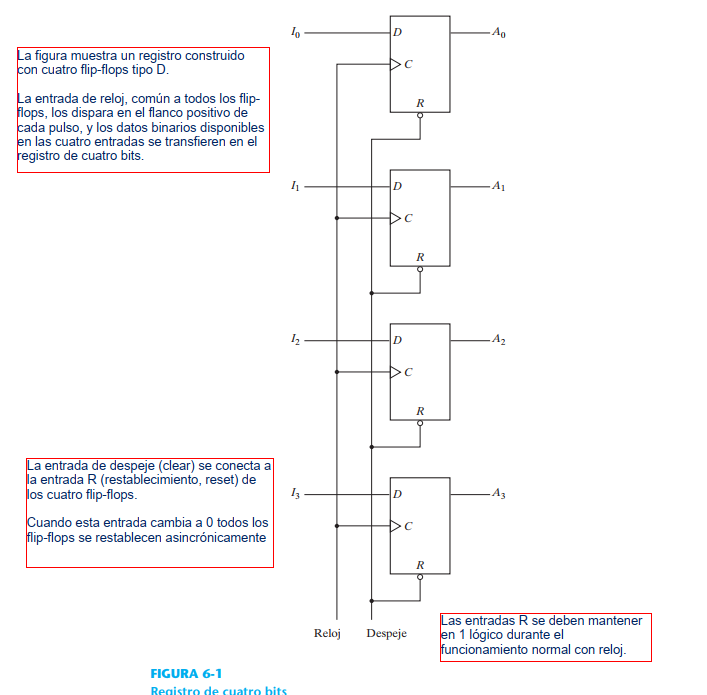
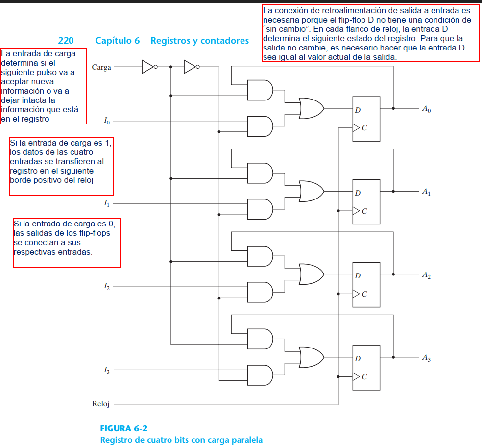
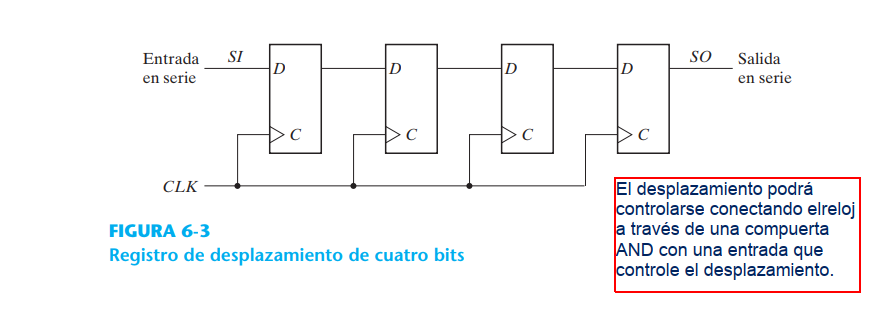
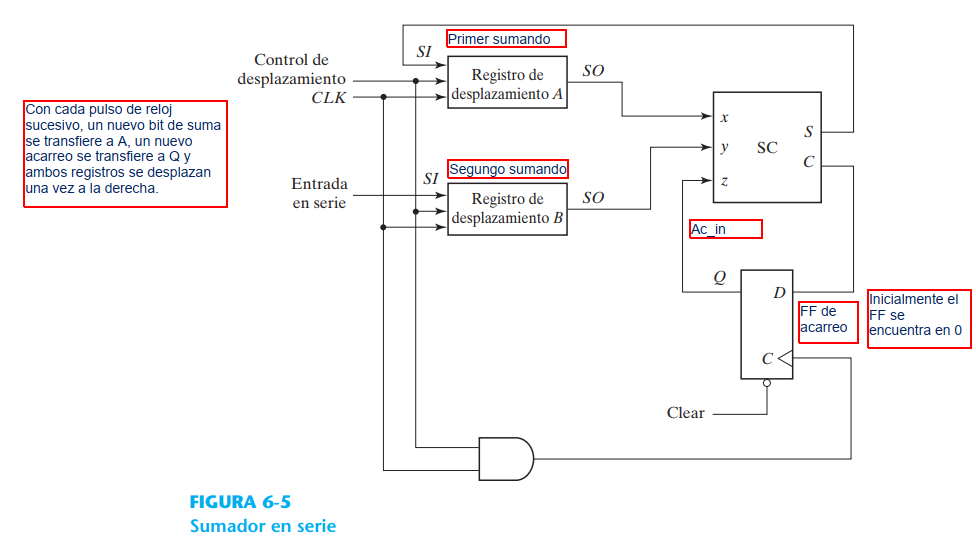
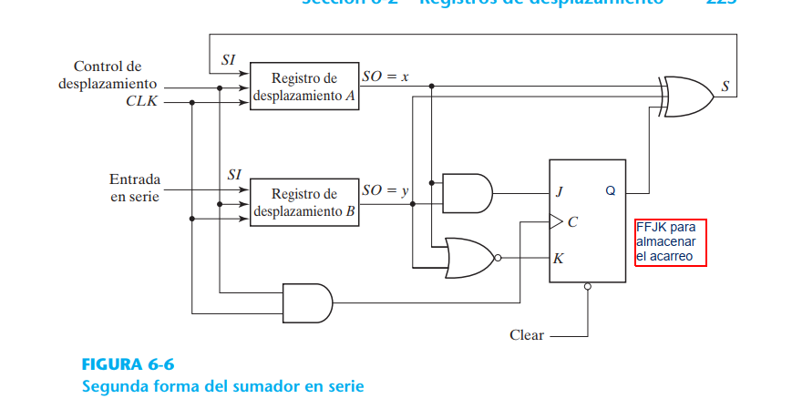
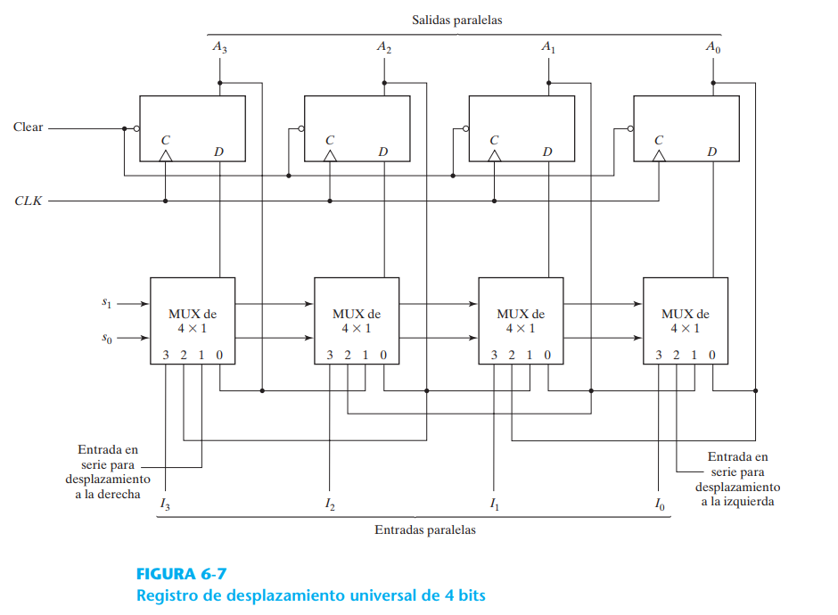

# Circuitos Secuenciales síncronos / Resgitros

## Circuito 1. Regitro de 4 bits con carga paralela

> Reg_4bits_pipo_with_FFD

## Circuito 2. Registro de 4 bits con carga paralela con entrada de control

> Reg_4bits_pipo_with_FFD_load_control

## Circuito 3. Registro de desplzamiento 4bits

> Shift_reg_4bits

## Circuito 4. Sumador completo usando registros de desplazamientos y FFD

> Sumador_completo_usando_registros

<!-- ## Circuito 4. Sumador completo usando registros de desplazamientos y FFJK

> Sumador_completo_usando_registros

 -->

<!-- ## Circuito 5. Registro de desplazamiento Universal 

> Univeral_shift_Reg_with_FFD_n_mux

 -->
